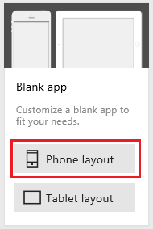

<properties	pageTitle="Add a data connection to an app | Microsoft PowerApps"
	description="Add a data connection to an existing app or a blank app"
	services=""
	suite="powerapps"
	documentationCenter="na"
	authors="archnair"
	manager="erikre"
	editor=""
	tags=""/>

<tags
   ms.service="powerapps"
   ms.devlang="na"
   ms.topic="article"
   ms.tgt_pltfrm="na"
   ms.workload="na"
   ms.date="06/23/2016"
   ms.author="archanan"/>

# Add a data connection #
Add a connection to SharePoint Online, Salesforce, OneDrive, or [another data source](connections-list.md), and then display and manage data in that source from your app, as in these examples:

- Connect to OneDrive, and manage data in an Excel workbook in your app.
- Connect to Twilio, and send an SMS message from your app.
- Connect to SQL Azure, and update a table from your app.

You can add a connection in PowerApps Studio, as this topic describes, or on [powerapps.com](https://web.powerapps.com), as [Manage connections](add-manage-connections.md) describes.

**Prerequisites**

1. [Sign up](signup-for-powerapps.md) for PowerApps, [install](http://aka.ms/powerappsinstall) it, open it, and then sign in by providing the same credentials that you used to sign up.
1. Click or tap **New** on the **File** menu (near the left edge).
1. Under **Create an app**, click or tap **Phone layout** on the **Blank app** tile.

	

## Connect to data ##
1. In the right-hand pane, click or tap the **Data sources** tab to open it, and then click or tap **Add data source**.

	

1. If you've already created a connection that you want to use, click or tap it to add it to your app, and then skip to the next procedure. Otherwise, skip to the next step.

1. Click or tap **Add connection** to display a list of connectors, click or tap the data source that you want to add, and then click or tap **Connect**.  

	Some connectors, such as **Microsoft Translator**, require no additional steps, and you can skip to the next procedure. Other connectors require steps such as providing credentials and specifying a particular set of data. The rest of this procedure demonstrates the steps for adding a connection to **SharePoint Online**.

1. Under **Connect to a SharePoint site**, click or tap an entry in the **Recent sites** list, or type or paste the URL for the site that you want to use.

	

1. Select the check box for one or more tables that you want to use, and then click or tap **Connect**:  

	

	The data sources are added to your app.

	

## Next steps ##
- To show and update data in a source such as Excel, SharePoint, Azure SQL, or Dynamics CRM, [add a form](add-form.md).
- For data in other sources, use connector-specific functions such as those for [Office 365 Outlook](connection-office365-outlook.md), [Twitter](connection-twitter.md), and [Microsoft Translator](connection-microsoft-translator.md).
