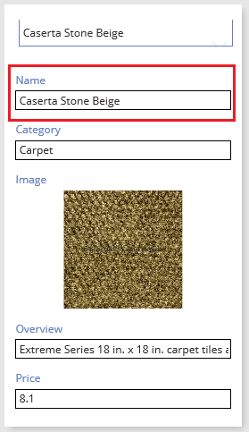
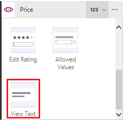

<properties
    pageTitle="Show, edit, or add a record from a table | Microsoft PowerApps"
    description="Use a form to show, edit, or add a record from a table in your data source."
    services=""
    suite="powerapps"
    documentationCenter="na"
    authors="sarafankit"
    manager="anneta"
    editor=""
    tags=""/>
<tags
    ms.service="powerapps"
    ms.devlang="na"
    ms.topic="article"
    ms.tgt_pltfrm="na"
    ms.workload="na"
    ms.date="10/16/2016"
    ms.author="ankitsar"/>

# Show, edit, or add a record from a table in PowerApps #
To show all fields in a record, add and configure a **[Display form](controls/control-form-detail.md)** control. To edit any field in a record (or to add a record) and save your changes back to a data source, add and configure an **[Edit form](controls/control-form-detail.md)** control.

**Prerequisites**

- Learn how to [add and configure a control](add-configure-controls.md) in PowerApps.
- Download [this Excel file](https://az787822.vo.msecnd.net/documentation/get-started-from-data/FlooringEstimates.xlsx), which contains sample data for this tutorial.
- Upload the Excel file to a [cloud-storage account](cloud-storage-blob-connections.md), such as OneDrive for Business.
- In a new or existing app, [add a connection](add-data-connection.md) to the **FlooringEstimates** table in the Excel file.
- If you're using an existing app, [add a screen](add-screen-context-variables.md) to it.

## Add a form, and show data ##
1. Add a **[Drop down](controls/control-drop-down.md)** control, name it **ChooseProduct**, and set its **[Items](controls/properties-core.md)** property to this value:

	**FlooringEstimates.Name**

	**Note**: If you're not sure how to add a control, rename it, or set a property, see [Add and configure controls](add-configure-controls.md).

	The list shows names of flooring products from the data source.

1. Add an **Edit Form** control, move it below **ChooseProduct**, and resize the form to cover most of the screen.

    

	**Note**: This topic describes the **Edit form** control, but similar principles apply to the **Display form** control.

1.  Set the **[DataSource](controls/control-form-detail.md)** property of the form to **FlooringEstimates** and the **[Item](controls/control-form-detail.md)** property of the form to this formula:

	**First(Filter(FlooringEstimates, Name=ChooseProduct.Selected.Value))**

    This formula specifies that, after you finish configuring the form, it will show the record that the user selects in **ChooseProduct**.

1. In the right-hand pane, click or tap the eye icon for each field to show it.

	

1. In the right-hand pane, drag the **Name** entry to the top of the list.

	

	The **Edit form** control reflects your change.

	

## Set the card type for a field ##
1. With the form selected, click or tap the card selector for **Price** in the right-hand pane.

	

1. Scroll down, and then click or tap the **View text** option to make the field read-only.

	

	The form reflects your change.

	  

## (Edit form only) Save changes ##
1. Select the form by clicking or tapping its scrollbar, and then rename the form **EditForm**.

1. Add a **[Button](controls/control-button.md)** control, and set its **[Text](controls/properties-core.md)** property to **Save**.

	  

1.  Set the **[OnSelect](controls/properties-core.md)** property of the **Save** button to this formula:

	**SubmitForm(EditForm)**

1. Open Preview mode by selecting the play button near the upper-right corner (or by pressing F5).

	  

1. Change the name of a product, and then click or tap the **Save** button that you created.

	The **[SubmitForm](functions/function-form.md)** function saves your changes to the data source with which you configured the form.

1. (optional) Select the close icon to close Preview (or press Esc).

	

## Next steps ##
- Learn more about working with [forms](working-with-forms.md) and [formulas](working-with-formulas.md).
