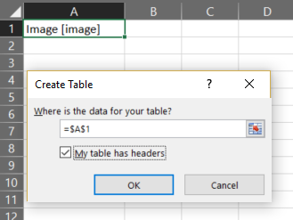
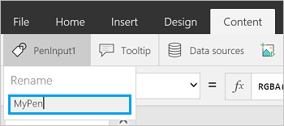
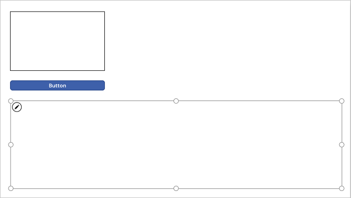

<properties
	pageTitle="Embed multimedia files into an app and upload | Microsoft PowerApps"
	description="Show multimedia files in an app, and upload them to a data source"
	services=""
	suite="powerapps"
	documentationCenter=""
	authors="RickSaling"
	manager="anneta"
	editor=""/>

<tags
   ms.service="powerapps"
   ms.devlang="na"
   ms.topic="article"
   ms.tgt_pltfrm="na"
   ms.workload="na"
   ms.date="01/17/2017"
   ms.author="ricksal"/>

# Using multimedia files in PowerApps

This topic shows you how to embed multimedia files in your app, upload pen drawings to a data source, and show images from a data source in your app. The data source used in this topic is an Excel file in OneDrive for Business.

## Prerequisites

[Sign up](../articles/signup-for-powerapps.md) for PowerApps, and [install](http://aka.ms/powerappsinstall) it. When you open PowerApps, sign in using the same credentials that you used to sign up.

## Add media from a file ##
You can choose which kind of media file to add (for example, images, video, or audio).

1. On the **Content** tab, select **Media**.

2. Under **Media**, select **Images**, **Videos**, or **Audio**, and then select **Browse**:

	![][1]

3. Select the file that you want to add, and then select **Open**.

	The **Pictures** folder on your computer opens, and you can select an image from there or navigate to another folder.

4. When you finish adding files, press Esc to return to the default workspace.

5. On the **Insert** tab, select **Media**, and then select **Image**, **Video**, or **Audio**:

	![][8]

	- If you added an image control, set its **[Image](controls/properties-visual.md)** property to the file that you added:  

		

	**Note** Specify the file name only, without the extension, inside single quotes.

	- If you added a video or audio control, set its **Media** property to the file that you added:  

		![Set Media property][10]

	**Note** Play a YouTube video by setting the **Media** property of a video control to the appropriate URL, enclosed in double quotation marks.

## Add images from the cloud to your app

In this scenario, you save images in a cloud storage account, OneDrive for Business. You use an Excel table to contain the path to the images, and you display the images in a gallery control in your app.

This scenario uses the [CreateFirstApp.zip](http://pwrappssamples.blob.core.windows.net/samples/CreateFirstApp.zip) that contains some .jpeg files.

**NOTE**: The path to these images in the Excel file must use forward slashes. When PowerApps saves image paths in an Excel table, the path uses backslashes. If you use image paths from such a table, change the paths in the Excel table to use forward slashes instead of backslashes. Otherwise, the images won't display.  

1. Download [CreateFirstApp.zip](http://pwrappssamples.blob.core.windows.net/samples/CreateFirstApp.zip), and extract the **Assets** folder to your cloud storage account.

2. Rename the **Assets** folder to **Assets_images**.

3. In an Excel spreadsheet, create a one-column table, and fill it with the following data:

	

4. Name the table **Jackets**, and name the Excel file **Assets.xlsx**.

5. In your app, add the **Jackets** table as a data source.  

6. Add an **Image only** control (**Insert** tab > **Gallery**), and set its **Items** property to `Jackets`:  

	

	The gallery is automatically updated with the images:  

	

	When you set the **Items** property, a column named __PowerAppsId__ is automatically added to the Excel table.

	In the Excel table, the image path can also be the URL to an image. An example is the [Flooring Estimates](http://pwrappssamples.blob.core.windows.net/samples/FlooringEstimates.xlsx) sample file. You can download it to your cloud storage account, add the `FlooringEstimates` table as a data source in your app, and then set the gallery control to `FlooringEstimates`. The gallery is automatically updated with the images.

## Upload pen drawings to the cloud ##
In this scenario, you learn how to upload pen drawings to your data source, OneDrive for Business, and examine how the drawings are stored there.

1. In Excel, add **Image [image]** to cell A1.

2.	Create a table using the following steps:    

	a. Select cell A1.

	b. On the **Insert** ribbon, select **Table**.

	c. In the dialog box, select **My table has headers**, and then select **OK**.

	

	Your Excel file is now in a table format. See [Format the data as a table](https://support.office.com/en-us/article/Format-an-Excel-table-6789619F-C889-495C-99C2-2F971C0E2370) for more information about table formatting in Excel.

	d. Name the table **Drawings**:

	

3. Save the Excel file to OneDrive for Business as **SavePen.xlsx**.

4.	In PowerApps, create a [blank app](get-started-create-from-blank.md).

5.	In your app, add the OneDrive for Business account as a [data source](add-data-connection.md):

	a.	Click or tap the **Content** tab, and then click or tap **Data sources**.

	

	b.	Click or tap **Add data source**, and then click or tap **OneDrive for Business**.

	

	c.	Click or tap **SavePen.xlsx**.

	d.	Select the **Drawings** table, and then click or tap **Connect**.

	  

	Now, the Drawings table is listed as a data source.

6.  On the **Insert** tab, select **Text**, and then select **Pen input**.

1. Rename the new control **MyPen**:  

	

7. On the **Insert** tab, add a **Button** control, and set its **OnSelect** property to this formula:

	```Patch(Drawings, Defaults(Drawings), {Image:MyPen.Image})```

8.	Add an **Image gallery** control (**Insert** tab > **Gallery**), and set its **Items** property to `Drawings`. The **Image** property of the gallery control is automatically set to `ThisItem.Image`.

	Arrange the controls so that your screen resembles the following:  

	

8.	Press F5, or select Preview (  ).

9. Draw something in MyPen, and then select the button.

	The first image in the gallery control displays what you drew.

10. Add something else to your drawing, and select the button.

	The second image in the gallery control displays what you drew.

11.	Close the preview window by pressing Esc.

	In your cloud storage account, a **SavePen_images** folder has been automatically created. This folder contains your saved images with IDs for their file names. To show the folder, you may need to  refresh the browser window by, for example, pressing F5.

	In **SavePen.xlsx**, the **Image** column specifies the path to the new images.


## For more information

Be sure to test your app on different platforms, including in [a browser window](https://home.dynamics.com/) and on a phone.

For information about more advanced scenarios that involve uploading multimedia directly to a different data source, see [image capture pro tips](https://powerapps.microsoft.com/blog/image-capture-pro-tips/) and [custom api for image upload](https://powerapps.microsoft.com/blog/custom-api-for-image-upload/).

Another way to upload files to a data source is to use the [Patch](functions/function-patch.md) function.


[1]: ./media/add-images-pictures-audio-video/add-image-video-audio-file.png
[3]: ./media/add-images-pictures-audio-video/add-intro-sound.png
[4]: ./media/add-images-pictures-audio-video/add-picture.png
[5]: ./media/add-images-pictures-audio-video/camera-gallery.png
[6]: ./media/add-images-pictures-audio-video/audio-gallery.png
[7]: ./media/add-images-pictures-audio-video/pen-gallery.png
[8]: ./media/add-images-pictures-audio-video/mediaoptions.png
[9]: ./media/add-images-pictures-audio-video/imageproperty.png
[10]: ./media/add-images-pictures-audio-video/mediaproperty.png
[11]: ./media/add-images-pictures-audio-video/renamecamera.png
