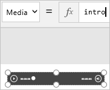
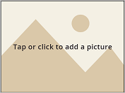
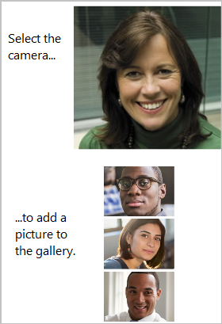
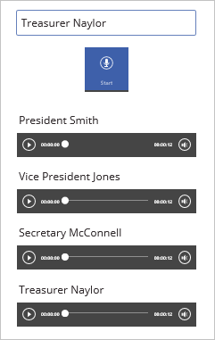
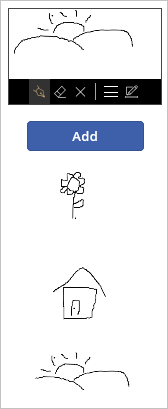

<properties
	pageTitle="Add an image, a video, or a sound | Microsoft PowerApps"
	description="Show an image file, play a video file, take a picture with a camera, draw a picture with a pen, or record and play an audio file"
	services=""
	suite="powerapps"
	documentationCenter=""
	authors="aftowen"
	manager="dwrede"
	editor=""/>

<tags
   ms.service="powerapps"
   ms.devlang="na"
   ms.topic="article"
   ms.tgt_pltfrm="na"
   ms.workload="na"
   ms.date="02/03/2015"
   ms.author="anneta"/>

# Add an image, a video, or a sound in PowerApps

Make your app stand out by adding multimedia elements such as images, videos, and sounds. Upload one or more existing files, create content on the fly by using your device's camera or microphone, or draw with a pen on a virtual whiteboard.

**Prerequisites**

Learn how to [add and configure controls](add-configure-controls.md).

## Add media from a file ##

1. On the **Content** tab, select **Media**.
1. Select **Images**, **Videos**, or **Audio**, and then select **Browse**.

	

1. Select the file that you want to add, and then select **Open**.
1. When you finish adding files, press Esc to return to the default workspace.
1. Add an image, video, or audio control, and then follow either of these steps:
	- If you added an image control, set its **Image** property to the file that you added.

		

	- If you added a video or audio control, set its **Media** property to the file that you added.

		

	**Note**: Play a YouTube video by setting the **Media** property of a video control to the appropriate URL, enclosed in double quotation marks.

## Add a user picture ##
When users run your app, they can add their own images from existing files. In a real-estate app, for example, users might upload pictures of houses they want to sell. In an insurance app, users might upload pictures of damage from car accidents so that estimators can respond.

1. Add an **Add Picture** control, and then press F5.

	The control appears as if another user were running the app.

	

1. Tap or click the control, select the file that you want to add, and then select **Open**.
1. Press Esc to return to the default workspace.

**Important:** To retain the image after the app is closed, use the [SaveData](function-savedata-loaddata.md) function to save it locally, or use the [Patch](function-patch.md) function to save it to a data source.

## Take a set of pictures
Take multiple pictures with the camera on your computer or mobile device, and then show them in a gallery.

1. Add a camera control, rename it **MyCamera**, and set its **OnSelect** property to this formula:

	**Collect(MyImages, {SinglePicture:MyCamera!Photo})**

1. Add an image gallery, and set its **Items** property to **MyImages**.

1. Select the image control for the first item in the gallery, and set its **OnSelect** property to this formula:

	**Remove(MyImages, ThisItem)**

1. Press F5, and select **MyCamera** one or more times.

	Each time you select **MyCamera**, an image is added to the gallery.

	

1. Select an image in the gallery to remove that image.

1. When you finish adding and removing images from the gallery, press Esc to return to the default workspace.

**Important:** To retain the images after the app is closed, use the [SaveData](function-savedata-loaddata.md) function to save them locally, or use the [Patch](function-patch.md) function to save them to a data source.

## Record a set of sounds
1. Add a text-input control, and rename it **Description**.
1. Add a microphone, rename it **MyMicrophone**, and set its **OnStop** property to this formula:

	**Collect(Interviews, {Recordings:MyMicrophone!Audio, Notes:Description!Text})**  

	By using this formula, you create a collection named **Interviews**, which contains a column named **Recordings** and a column named **Notes**. Each row contains a sound file that you create by using the microphone and any text in the **Description** box when you stop recording.

1. Add a custom gallery, and set its **Items** property to **Interviews**.

1. Select the first item in the gallery, add an audio control to it, and then set the **Media** property for the audio control to **ThisItem!Recordings**.  
	**Note:** You can save visual space by shrinking the audio control so that only the play button appears.

1. Select the first item in the gallery, add a text box to it, and set the **Text** property of the text box to **ThisItem!Notes**.

1. Press F5, type a phrase in the **Description** box, and then select **MyMicrophone** to start recording.

1. When you finish recording, select **MyMicrophone** again to stop recording.

	Your description appears in the first item of the gallery, and your recording plays if you click the play button in the audio control.

1. Type something else in the **Description** box, make another recording, and repeat as many times as you want.

	Each description and recording appears in the gallery.

	

1. Press Esc to return to the default workspace.

**Important:** To retain the sounds after the app is closed, use the [SaveData](function-savedata-loaddata.md) function to save them locally, or use the [Patch](function-patch.md) function to save them to a data source.

## Draw a picture ##
Create multiple drawings (or simulate a whiteboard), and show the results in a gallery.

1. Add a pen-input control, rename it **Sketches**, and set its **ShowControls** property to **true**.
1. Add a button, set its **Text** property to **Add**, and set its **OnSelect** property to this formula:

	**Collect(Creativity, {Captures:Sketches!Image})**

1. Add an image-only gallery, and set its **Items** property to **Creativity**.

1. Select the first item in the gallery, and set its **OnSelect** property to this formula:

	**Remove(Sketches, ThisItem)**

1. Press F5, draw or write something in **Sketches**, and then select the **Add** button.

	The contents of the pen control appear in the first item of the gallery.

1. Select the clear button (with the "x") in **Sketches**, write or draw something else in it, and then select the **Add** button again.

	The contents of the pen control appear in the second item in the gallery.

	

	**Tip:** To remove a sketch, select it in the gallery.

1. Repeat these steps as many times as you want, and then press Esc to return to the default workspace.

	**Important:** To retain the images after the app is closed, use the [SaveData](function-savedata-loaddata.md) function to save them locally, or use the [Patch](function-patch.md) function to save them to a data source.

1. (optional) Convert written text to typed text:

	1. Add a text box, and set its **Text** property to **Sketches!RecognizedText**.
	1. Press F5, and then write a word in the pen control.

	The label shows the word as typed text.
