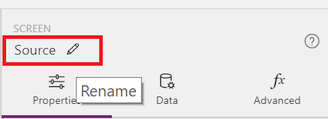

<properties
	pageTitle="Add a screen and navigate between screens | Microsoft PowerApps"
	description="Add a screen to an app and use next and back arrows to go between screens in PowerApps"
	services=""
	suite="powerapps"
	documentationCenter="na"
	authors="AFTOwen"
	manager="erikre"
	editor=""
	tags=""/>

<tags
   ms.service="powerapps"
   ms.devlang="na"
   ms.topic="article"
   ms.tgt_pltfrm="na"
   ms.workload="na"
   ms.date="04/20/2016"
   ms.author="anneta"/>

# Add a screen and navigate between screens #

Create an app with multiple screens, and add ways for users to navigate between them.

## What you need to get started ##

- Sign in to PowerApps or the [PowerApps portal][1].
- Create an app from a [template](get-started-test-drive.md), from [data](get-started-create-from-data.md), or from [scratch](get-started-create-from-blank.md).
- Learn how to [configure a control](add-configure-controls.md).

## Add and rename a screen ##
1. In your app, go to the **Home** tab, and rename the default screen (Screen1) to **Source**:  

	

1. On the **Home** tab, select **New Screen**:  

	

	The navigation bar shows the default screen, which you renamed **Source**, and the new screen that you added:  

	

1. Rename the new screen to **Target**.

## Add navigation to your screens ##

1. On the **Source** screen, go to the **Insert** tab, select **Shapes**, and then select the **Next** arrow:  

	

1. (optional) Move the arrow so it appears in the lower-left corner of the screen.

1. With the arrow still selected, go to the **Action** tab, and select **Navigate**. When you do this, the **[OnSelect](controls/properties-core.md)** property for the arrow is automatically set to the following:  

	

	So when a user selects the Next arrow, the **Target** screen fades in.

1. On the **Target** screen, add a **Back** arrow, and set its **[OnSelect](controls/properties-core.md)** property to the following formula:  

	`Navigate(Source, ScreenTransition.Fade)`

1. **Preview** ( or press F5), and then switch between the screens by selecting the arrows that you added.

1. Press **Esc** to return to the default workspace.

<!--Reference links in article-->
[1]: https://web.powerapps.com
