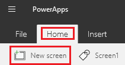
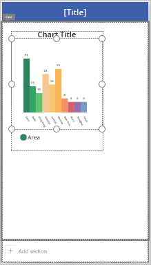
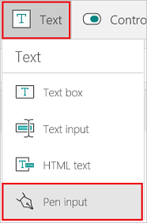
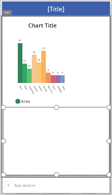
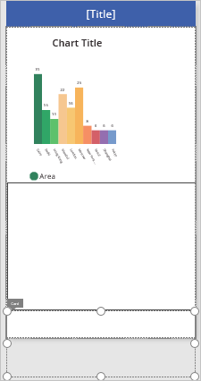
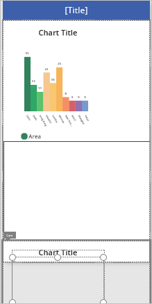
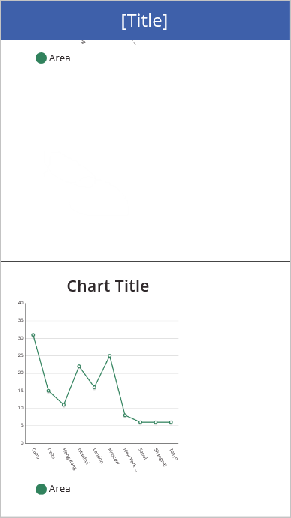

<properties
	pageTitle="Add a scrolling screen | Microsoft PowerApps"
	description="Create a screen that users can scroll to show more types of content than the screen can show at a time."
	services=""
	suite="powerapps"
	documentationCenter="na"
	authors="aftowen"
	manager="dwrede"
	editor=""
	tags=""/>
<tags
	ms.service="powerapps"
	ms.devlang="na"
	ms.topic="article"
	ms.tgt_pltfrm="na"
	ms.workload="na"
	ms.date="11/18/2015"
	ms.author="anneta"/>

# Add a scrolling screen in PowerApps #
Create a screen that users can scroll to show more types of content than the screen can show at a time. For example, you might want to juxtapose multiple charts, videos, or other kinds of data from different sources on the same screen while keeping each element big enough to see clearly. If you add controls to multiple sections, the relative position of each element is maintained, even if the screen orientation changes between portrait and landscape.  

[What is PowerApps?](http://www.powerapps.com)

**Prerequisites**

- [Install PowerApps](http://aka.ms/installpowerapps)

- Learn how to [configure a control](get-started-test-drive.md#configure-a-control) in PowerApps

## Create a scrolling screen, and add an element
1. Open PowerApps, and then do one of the following:

	- [Add a screen](add-screen-context-variables.md) to an app.

	

	- Create an app from scratch by selecting **New** in the **File** menu (near the left edge of the screen) and then selecting **Get started** under **Start from scratch**.

	

1. On the **Home** tab, select **Layouts**, and then select the option to add an infinite scrolling canvas.

	

	The canvas is added to the screen.

	

1. Select **Insert a visual**, select **Charts** on the **Insert** tab, and then select **Column Chart**.

	

	A column chart appears in the first card on the screen.

	

1. On the **Insert** tab, select **Text** and then select **Pen**.

	

1. Move the pen control below the chart, and resize the pen control to cover the bottom of the card.

	

## Add a section ##

1. Near the bottom of the screen, select **Add section**.

	

	A card is added to the screen

	

1. With the card still selected, add a line chart, which is too big to appear on the screen with the other controls.

	

1. Press F5 to display the app in Preview, and then scroll to display the line chart.

	
