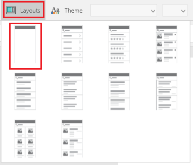
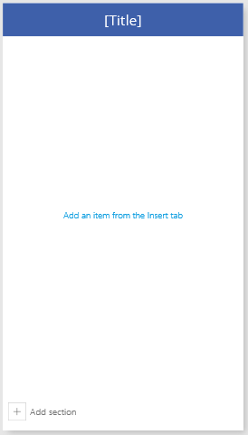
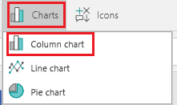

<properties
   pageTitle="Add a scrolling screen | Microsoft PowerApps"
   description=""
   services="na"
   documentationCenter="na"
   authors="aftowen"
   manager="dwrede"
   editor=""
   tags=""/>
<tags
   ms.service="powerapps"
   ms.devlang="na"
   ms.topic="article"
   ms.tgt_pltfrm="na"
   ms.workload="na"
   ms.date="11/18/2015"
   ms.author="anneta"/>

# Add a scrolling screen #
Create a screen that users can scroll to show more types or instances of content. Just as users can scroll through a gallery to show more items, users can Just as users can scroll a gallery to show more items than can fit on a screen at once, that users scroll to show more items, a scrolling screen contains  

**Prerequisites**
- [Install PowerApps](http://aka.ms/installpowerapps)

[What are PowerApps?](http://www.powerapps.com)

1. Do one of the following:

	-[Add a screen]() to a PowerApp.

	

	-Create a PowerApp from scratch. (Select **New** in the **File** menu, and then select **Get started** under **Start from scratch**.)

	

1. On the **Home** tab, select **Layouts**, and then select the option to add an infinite scrolling canvas.

	

	The canvas is added to the screen.

	

1. Select **Insert a visual**, and then add one or more controls.

	For example, select **Charts** on the **Insert** tab, and then select **Column Chart**.

	
1.
