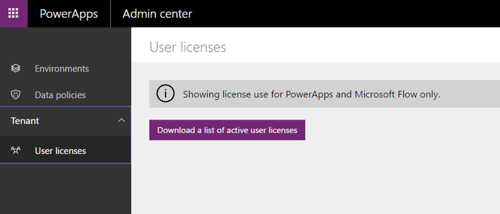

<properties
    pageTitle="View user license | Microsoft PowerApps"
    description="An admin can view user licenses related to PowerApps and Microsoft Flow"
    services=""
    suite="powerapps"
    documentationCenter="na"
    authors="manasma"
    manager="anneta"
    editor=""
    tags=""/>
<tags
    ms.service="powerapps"
    ms.devlang="na"
    ms.topic="article"
    ms.tgt_pltfrm="na"
    ms.workload="na"
    ms.date="05/02/2017"
    ms.author="manasma"/>

# Administrators can identify PowerApps and Microsoft Flow users in their org #

If you’re an Office 365 Global admin or an Azure Active Directory tenant admin, you can download a list of users in your organization who not only are licensed to use PowerApps, Microsoft Flow, or both but also have accessed either of those products. The list contains each user’s name, email address, license type, and other information. For example, a user might have:

•	a trial license for PowerApps or Microsoft Flow

•	access to both products through an Office 365 license

•	access to both products through a Dynamics 365 license

•	access from PowerApps and Microsoft Flow plans

## Download the list of users ##
In the PowerApps admin center, click or tap User licenses near the left edge (only available to O365 Global admins or AAD tenant admins)

Click or tap Download a list of active user licenses.

The file might take a few minutes to download. Wait a few minutes for the .csv file to download, and then open it in Excel.

Note: If you close the window before the file finishes downloading, you might have to restart the process.

This example shows two users who have licenses to both PowerApps and Microsoft Flow through different means. Jane Doe has access through a subscription to Office 365, and John Doe got a trial license for each product.

Both users have accessed PowerApps or Microsoft Flow. There might be more users in the organization who have license to access PowerApps and Microsoft Flow, but have never accessed these products. These users will not appear in this list. You can view all the user licenses from [Office 365 admin center][1].
If a user has left the organization, the list will show Unknown in columns such as User name and Email address. If the list shows Unknown but nobody has left the organization, download the list again after several minutes.
If you want to add more user licenses, then you can do so from [Office 365 admin center][1].

<!--Reference links in article-->
[1]:https://support.office.com/article/Assign-or-remove-licenses-for-Office-365-for-business-997596b5-4173-4627-b915-36abac6786dc
