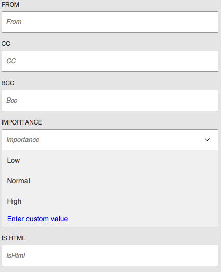
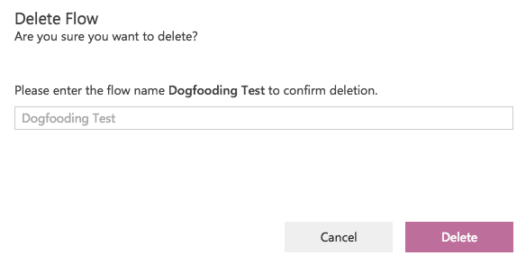

<properties
    pageTitle="PowerFlows: Add an advanced parameter and multiple actions"
    description="Expand an existing PowerFlow to include an advanced parameter, such as setting email to high priority, and add another action for the same trigger."
    services="powerapps"
    documentationCenter="na"
    authors="AFTOwen"
    manager="dwrede"
    editor=""
    tags=""/>

<tags
   ms.service="powerapps"
   ms.devlang="na"
   ms.topic="article"
   ms.tgt_pltfrm="na"
   ms.workload="na"
   ms.date="10/21/2015"
   ms.author="anneta"/>

# Add an advanced parameter and multiple actions to a PowerFlow #
Customize a PowerFlow by adding one or more advanced parameters and multiple actions for the same trigger. For example, add an advanced parameter that sends an email message as high priority. In addition to sending mail when an item is added to a SharePoint list, create a file in Dropbox that contains the same information.

**Prerequisites**

- [Create a PowerFlow](get-started-powerflow.md).

## Add an advanced parameter

1. In Chrome, open [the PowerApps portal](https://portal.kratosapps.com/), and then click **Flows** in the left navigation bar.

2. In the list of PowerFlows, click the edit icon, which looks like a pencil, next to the PowerFlow that you want to edit.

3. Near the bottom of the **Send email** form, click the **...** icon to show advanced parameters.

    

4. In the **Importance** list, click **High**, and then click the **...** icon again to hide the advanced parameters.

6. Near the bottom of the screen, click **Done** to save your change.

    

## Add another action ##

In this procedure, you'll add an action in the middle of the flow. This action will save a file in your Dropbox, archiving the item in the list.

1. In your PowerFlow, collapse the trigger and the action by clicking the down arrow in each title bar.

    

1. Click the **SharePoint** action to select it, click the "+" button, and then click **Add action**.

    

  An action is inserted between the trigger and the **Send email** action.

3. In the list of possible actions, search for **Create file**, and then click **Dropbox - Create File**.

1. If prompted, provide your Dropbox credentials.

4. In the form that appears, type or paste a path to a folder, or type a forward slash (**/**) to create files in the root of your account.

5. Give the file a name. To ensure that each file name is unique to a list item, click a placeholder. (Otherwise each new file will override the existing one.)

6. Add whatever content you want in the file, including as many placeholders as you want, and then click **Done**.

    

8. To test the flow:
  1. In SharePoint Online, click **new item** on the main page for the list.

    

  1. Specify data in each field, and then click **Save**.

    Within a minute, you should see a new file in your Dropbox account.

## Delete your PowerFlow ##

Delete a PowerFlow from the portal if you're done with that PowerFlow and no longer want to get notifications from it.

1. Open the PowerApps portal, and then click **Flows** in the left navigation bar.

2. In the list of PowerFlows, click the delete icon, which looks like a trash can, next to the PowerFlow that you want to delete.

    

3. In the confirmation dialog box, type the full name of your PowerFlow into the text box, and then click **Delete**.
