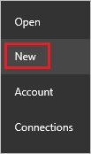

<properties
   pageTitle="Create an app to manage data from SharePoint | Microsoft PowerApps"
   description="Create an app to manage data, such as account information, from SharePoint"
   services=""
   suite="powerapps"
   documentationCenter="na"
   authors="jamesol-msft"
   manager="erikre"
   editor=""
   tags=""/>

<tags
   ms.service="powerapps"
   ms.devlang="na"
   ms.topic="article"
   ms.tgt_pltfrm="na"
   ms.workload="na"
   ms.date="05/03/2016"
   ms.author="jamesol"/>

# Create an app to manage data from SharePoint #
Create an app for adding, updating, and deleting data in a SharePoint list. Specify the list, create the app automatically, and then specify which data you want to show. Test the app by displaying, sorting, filtering, and updating data.

## Prerequisites

- [Sign up](signup-for-powerapps.md) for PowerApps and [install](http://aka.ms/powerappsinstall) PowerApps. When you open PowerApps, sign in using the same credentials that you used to sign up.
- A SharePoint list that contains only supported types of columns. For more information, see [Known issues](connection-sharepoint-online.md#known-issues).

The list in this tutorial contains these columns:  

## Create an app ##
1. In PowerApps, select **New** (near the left edge of the screen).  

	

2. On the **SharePoint** tile, select **Phone layout**.  

	

3. If you haven't connected to SharePoint before, select **Connect** when prompted, and then provide your credentials.  

	

4. Under **Connect to a SharePoint site**, type or paste the URL of the SharePoint site that you want to use, and then select **Go**.  

	

5. Under **Choose a list**, select the list that you want to use and then select **Connect**.  

	

	PowerApps builds an app that has three screens:  

	- **BrowseScreen1** shows a list of all items and some information about the items, so that users can easily browse for the item they want.  
	- **DetailScreen1** shows all information about a single item.  
	- **EditScreen1** provides an **[Edit form](add-form.md)** control for adding an item or updating information about an item.  

## Customize the app ##
When an app is built automatically, heuristics suggest the best layout and content based on the data. You might need to change the app for your needs.

1. If you haven't used PowerApps before, take the intro tour by reading each description before selecting **Next** (and then selecting **Done**), or select **Skip**.

2. On the **Home** tab of the ribbon, select **Layouts**, and then select an option that suits your data.  

	

	The layout of **BrowseScreen1** changes to reflect your selection.  

	

	**Note**: If you open the **Layout** tab with **DetailScreen1** or **EditScreen1** showing, you can choose different options, which reflect the data on that screen.

1. Click or tap any element, such as the **Image** control, in the first item of the gallery.

	

1. In the right-hand pane, specify the data that you want to show in each control.

	

	The screen changes to reflect your selections.

	

1. Open **DetailsScreen1**, and then change the cards that appear by clicking or tapping the eye icon for each card in the right-hand pane.

	

1. Change the order in which the cards appear by clicking or tapping a card and then dragging its title bar up or down.

	

## Run the app ##
As you customize the app, you can test your changes by running the app in **Preview** mode.

1. In the list of thumbnails, select **BrowseScreen1**, and then open preview by selecting the **Preview** icon near the upper-right corner (or by pressing **F5**).  

	

2. On **BrowseScreen1**, select the arrow for a record to show details about that record.  

	

3. On **DetailsScreen1**, select the edit icon (in the upper-right corner) to edit the record.  

	

4. On **EditScreen1**, change the information in one or more fields, and then select the check mark in the upper-right corner to save your changes.  

	

5. Editing the item in the app will update the record in the SharePoint Online list.  

	

## Next steps ##
- Press Ctrl-S to save your app so that you can run it from other devices.
- Customize your app further, as [Create an app from scratch](get-started-create-from-blank.md) describes.
- [Share the app](share-app.md) so that other people can run it.
