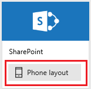

<properties
   pageTitle="Generate an app to manage data in a SharePoint list | Microsoft PowerApps"
   description="Generate a three-screen app to manage data in a SharePoint list, whether the site is on-premises or in the cloud."
   services=""
   suite="powerapps"
   documentationCenter="na"
   authors="aftowen"
   manager="erikre"
   editor=""
   tags=""/>

<tags
   ms.service="powerapps"
   ms.devlang="na"
   ms.topic="article"
   ms.tgt_pltfrm="na"
   ms.workload="na"
   ms.date="09/03/2016"
   ms.author="anneta"/>

# Generate an app to manage data in a SharePoint list #
In PowerApps, generate a three-screen app automatically to manage data in a SharePoint list, whether the site is on-premises or in the cloud. After the app is generated, [customize it](customize-layout-sharepoint.md) to suit your needs.

If you're unfamiliar with PowerApps, see [Introduction to PowerApps](getting-started.md).

As of this writing, PowerApps supports lists but not libraries. In addition, you can show data in some types of columns, such as **Choice** and **Picture**, but you can't update that data. For more information, see [Known issues](connection-sharepoint-online.md#known-issues).

## Connect to SharePoint ##
1. If you haven't already signed up, [sign up for PowerApps](signup-for-powerapps.md).

1. Sign in to [powerapps.com](https://web.powerapps.com).

1. In the left navigation bar, click or tap **Manage** and then click or tap **Connections**.

	

1. Near the upper-right corner, click or tap **New connection**.

	

1. In the list of connections, click or tap **SharePoint**.

	

1. To connect to a SharePoint Online site:

	1. Click or tap **Connect directly (cloud services)**, and then click or tap **Add connection**.

		

	1. Proceed to [Specify a site and a list](app-from-sharepoint.md#specify-a-site-and-a-list) later in this topic.

1. To connect to an on-premises site:

	1. Click or tap **Connect using on-premises data gateway**.

		

	1. Specify your user name and your password. If your credentials include a domain name, specify it as *Domain\Alias*.

		

	1. If you don't have an on-premises data gateway installed, [install one](gateway-reference.md), and then click or tap the icon to refresh the list of gateways.

		

	1. Under **Choose a gateway**, click or tap the gateway that you want to use, and then click or tap **Add connection**.

		

## Specify a site and a list ##
1. Open PowerApps in *either* of these ways:

	- [Install PowerApps Studio for Windows](http://aka.ms/powerappsinstall), open it, and then sign in using the same credentials that you used to sign up. Near the left edge, click or tap **New**.

		

	- [Open PowerApps Studio for the web](https://create.powerapps.com/api/start) in a browser.

		For a list of supported browsers and limitations in the preview release of PowerApps Studio for the web, see [Create or edit apps in a browser](create-app-browser.md).

1. If the SharePoint tile appears under **Create an app from your data**, click or tap **Phone layout**, and then skip to the next procedure.

	

	Otherwise, proceed to the next step.

1. Under **Create an app from your data**, click or tap the arrow after the row of tiles.

	

1. Above the list of connectors, click or tap **New connection**.

	

1. Click or tap the **SharePoint** tile.

	

1. Under **Connect to a SharePoint site**, type or paste the URL to the site that contains the list that you want to use, and then click or tap **Go**.

	**Note**: Don't include a specific list in the URL.

	

1. Under **Choose a list**, click or tap the name of the list that you want to use.

	

	In the search box, you can type or paste at least one letter to show only those lists of which their names contain the letter or letters that you specify. You can also click or tap the sort-order icon to toggle between sorting the list in ascending or descending order.

	

1. Click or tap **Connect** to generate the app.

## Next steps ##
If you're prompted to take the intro tour, click or tap **Next** to get familiar with key areas of the PowerApps interface (or click or tap **Skip**).

You can always take the tour later by clicking or tapping the question-mark icon near the upper-right corner and then clicking or tapping **Take the intro tour**.

By default, every generated app has a screen for browsing records, a screen for showing details of a record, and a screen for creating or updating records. Heuristics suggest the best layout and content for each screen, but you'll probably need to customize the app to suit your needs.

- To save the app that you've just generated, press Ctrl-S.
- To customize the browse screen (which appears by default), see [Customize a layout](customize-layout-sharepoint.md).
- To customize the details or edit screens, see [Customize a form](customize-form-sharepoint.md).
