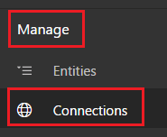
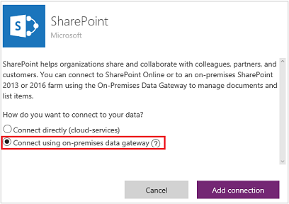
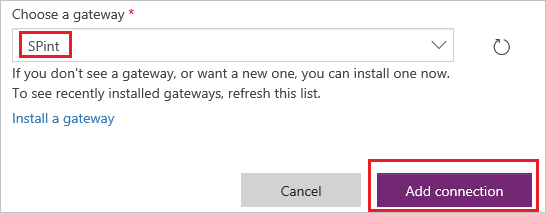

<properties
   pageTitle="Connect to SharePoint | Microsoft PowerApps"
   description="In powerapps.com, create a connection to SharePoint, for use in generating an app automatically or building one from scratch."
   services=""
   suite="powerapps"
   documentationCenter="na"
   authors="aftowen"
   manager="erikre"
   editor=""
   tags=""/>

<tags
   ms.service="powerapps"
   ms.devlang="na"
   ms.topic="article"
   ms.tgt_pltfrm="na"
   ms.workload="na"
   ms.date="09/03/2016"
   ms.author="anneta"/>

# Connect from PowerApps to SharePoint #
In powerapps.com, create a connection to SharePoint, for use in generating an app automatically or building one from scratch.

If you're unfamiliar with PowerApps, see [Introduction to PowerApps](getting-started.md).

As of this writing, PowerApps supports lists but not libraries. In addition, you can show data in some types of columns, such as **Choice** and **Picture**, but you can't update that data. For more information, see [Known issues](connection-sharepoint-online.md#known-issues).

## Specify a SharePoint connection##
1. If you haven't already signed up, [sign up for PowerApps](signup-for-powerapps.md).

1. Sign in to [powerapps.com](https://web.powerapps.com).

1. In the left navigation bar, click or tap **Manage** and then click or tap **Connections**.

	

1. Near the upper-right corner, click or tap **New connection**.

	

1. In the list of connections, click or tap **SharePoint**.

	

**Important**: In the dialog box that appears, you specify what kind of SharePoint connection you want to make. Each choice has a corresponding procedure later in this topic. Follow only one of those procedures.

## Connect to a SharePoint Online site ##
- Click or tap **Connect directly (cloud services)**, and then click or tap **Add connection**.

	

## Connect to an on-premises SharePoint site ##
1. Click or tap **Connect using on-premises data gateway**.

	

1. Specify your user name and your password. If your credentials include a domain name, specify it as *Domain\Alias*.

	

1. If you don't have an on-premises data gateway installed, [install one](gateway-reference.md), and then click or tap the icon to refresh the list of gateways.

	

1. Under **Choose a gateway**, click or tap the gateway that you want to use, and then click or tap **Add connection**.

	

## Next steps ##
- [Generate an app automatically](app-from-sharepoint.md) based on a list that you specify. The app will have three screens by default: one each for browsing records, displaying details about a single record, and creating or updating a record.
- [Build an app from scratch](get-started-create-from-blank.md). This topic was written for Excel, but the same principles apply to SharePoint.
