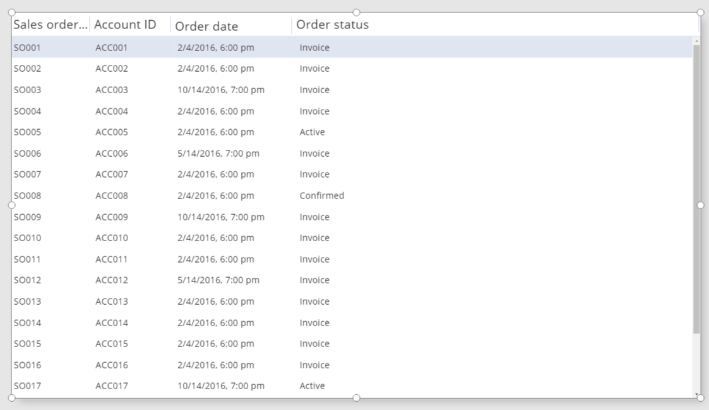
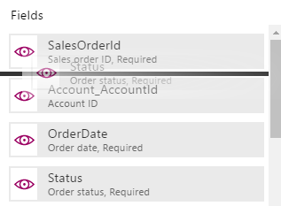
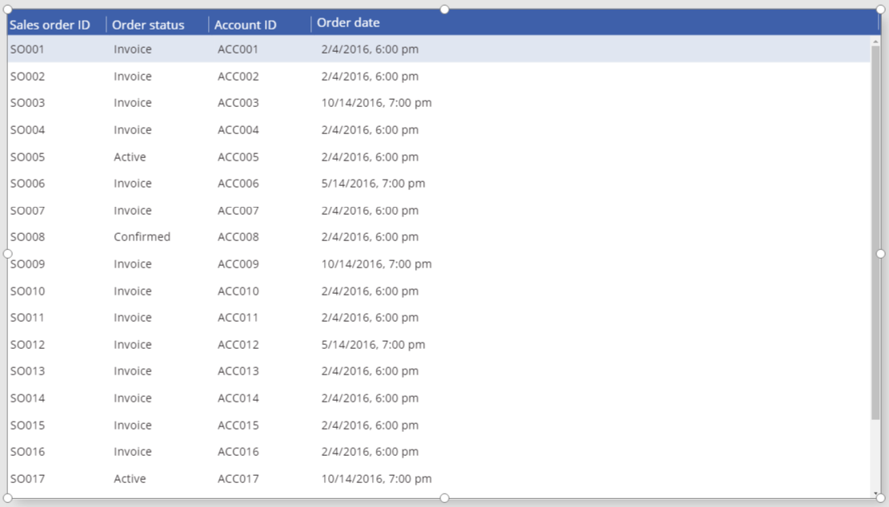
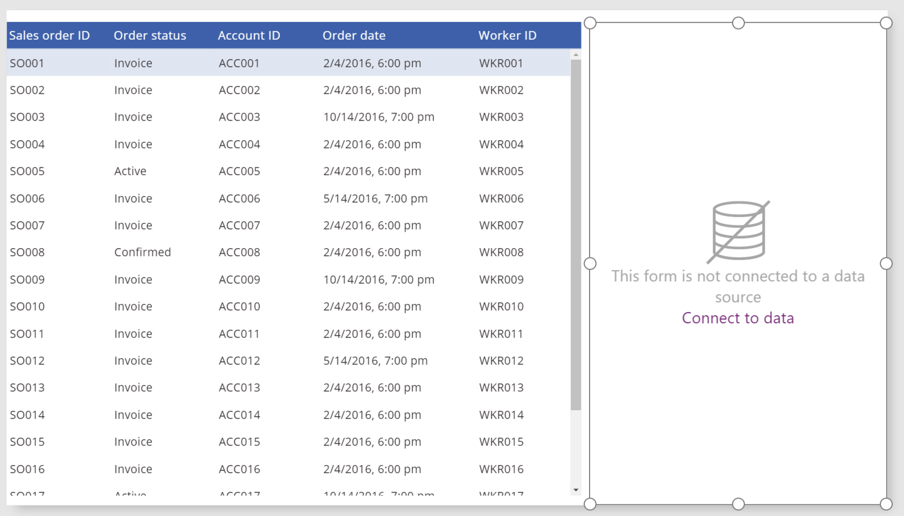
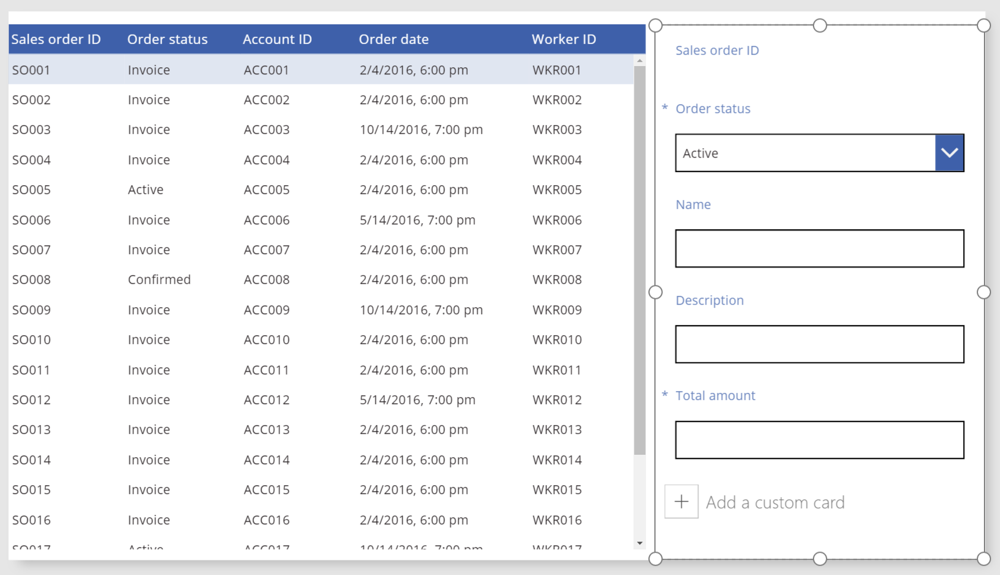
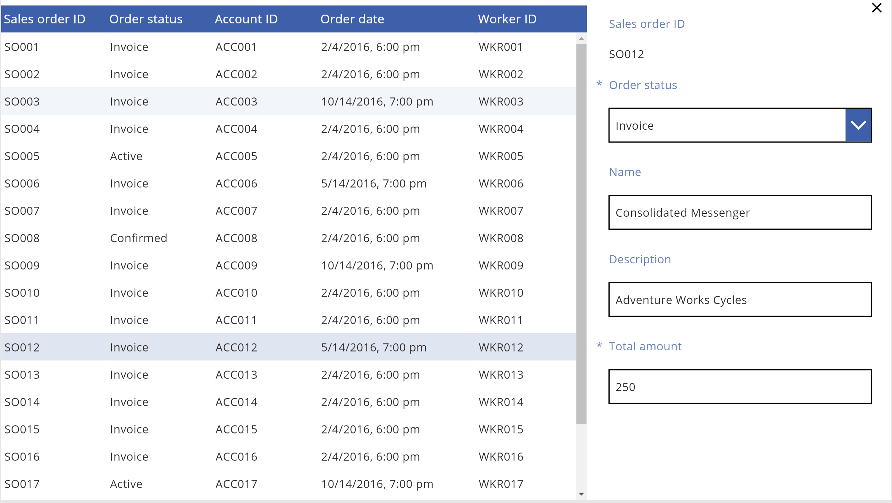

<properties
	pageTitle="Data table control in PowerApps"
	description="This topic provides information about the Data table control in Microsoft PowerApps."
	services="powerapps"
	documentationCenter="na"
	authors="jasongre"
	manager="kfend"
	editor=""
	tags=""/>

<tags
   ms.service="powerapps"
   ms.devlang="na"
   ms.topic="article"
   ms.tgt_pltfrm="na"
   ms.workload="na"
   ms.date="05/04/2017"
   ms.author="kfend"/>
   
# Data table control in PowerApps

The Data table control in Microsoft PowerApps is a control that shows a set of data in a tabular format.

## Description
The Data table control lets you show a dataset in a tabular format that includes column headers for each field that is visualized. As the maker, you have full control over the fields that are shown from the data source and the order that the fields appear in. The Data table control maintains a **Selected** property that, like the Gallery, points to the single row that is currently selected. Therefore, the Data table can be linked to other controls.
 
## Key properties

+ [**Items**](articles/controls/properties-core) – The source of data that appears in the control.
+ **Selected** – The selected row in the Data table.

## Other properties

+ **NoDataText** – The message that the user receives when there are no records to show in the Data table.
+ **SelectedFill** – The background color of the selected row.
+ **SelectedColor** – The color of the text in the selected row.
+ [**HoverFill**](articles/controls/properties-color-border) – The background color of the row that the mouse pointer is currently pointing at.
+ [**HoverColor**](articles/controls/properties-color-border) – The text color for the row that the mouse pointer is currently pointing at.
+ **HeadingFont** – The font of the column headings.
+ **HeadingSize** – The font size of the column headings.
+ **HeadingFontWeight** – The font weight of the column headings.
+ **HeadingFill** – The background color of the column headings.
+ **HeadingColor** – The text color for the column headings.
+ [**Fill**](articles/controls/properties-color-border) – The default background color for all data rows.
+ [**Color**](articles/controls/properties-color-border) – The default text color for all data rows.
+ [**BorderColor**](articles/controls/properties-color-border") – The color of the Data table’s border.
+ [**BorderStyle**](articles/controls/properties-color-border) – The style of the Data table’s border. The options are **Solid**, **Dashed**, **Dotted**, and **None**.
+ [**BorderThickness**](articles/controls/properties-color-border) – The thickness of the Data table’s border.
+ [**Font**](articles/controls/properties-text) – The default font for all data rows.
+ [**FontWeight**](articles/controls/properties-text) – The default font weight for all data rows.
+ [**Size**](articles/controls/properties-text) – The default font size for all data rows.
+ [**X**](articles/controls/properties-size-location) – The distance between the left edge of the Data table and the left edge of its parent container (or the left edge of the screen if there is no parent container).
+ [**Y**](articles/controls/properties-size-location) – The distance between the top edge of the Data table and the top edge of its parent container (or the top edge of the screen if there is no parent container).
+ [**Width**](articles/controls/properties-size-location) – The distance between the Data table’s left and right edges.
+ [**Height**](articles/controls/properties-size-location) – The distance between the Data table’s top and bottom edges.
+ [**Visible**](articles/controls/properties-core) – A value that determines whether the Data table appears or is hidden.

## Related functions

+ [**Filter(DataSource, Formula)**](powerapps-content-pr/articles/functions/function-filter-lookup.md)
+ [**Search(DataSource, SearchString, Column)**](powerapps-content-pr/articles/functions/function-filter-lookup.md)
+ [**Lookup(DataSource, Formula)**](powerapps-content-pr/articles/functions/function-filter-lookup.md)

## Examples
### Basic Data table usage

1. Create a blank Tablet app.
2. On the **Insert** tab, click or tap **Data table**.

   

   A Data table control is added to the screen.

3. Rename the Data table control **SalesOrderTable**, and resize it so that it covers the whole screen.
4. In the right pane, click or tap the down arrow next to the **No data source selected** text, and then click or tap **Add a data source**.

   

5. In the list of connections, click or tap the connection for your database.

   

6. In the list of entities, click or tap **Sales order**, and then click or tap **Connect**. 

   

   The Data table is now attached to the **Sales order** data source. However, no data will be shown until you select fields.

7. In the right pane, select the fields to show. For this example, select **SalesOrderId**, **Account**, **OrderDate**, and **Status**.

   The Data table is filled with data that is based on the selected fields.

   

8. Reorder the fields by dragging them in the right pane.

   

   The Data table is updated to show the fields in the new order.

   

### Restyle the Data table header

1. In the right pane, click the **Advanced** tab.-
2. Click or tap the field for the **HeadingFill** property, and change the value to **RGBA(62,96,170,1)**.
3. Click or tap the field for the **HeadingColor** property, and change the value to **White**.
4. Click or tap the field for the **HeadingSize** property, and change the value to **14**.

   

### Connect a Data table to another control

1. Add an **Edit** form to the screen.
2. Resize the Data table and the **Edit** form so that the Data table uses the left part of the screen and the **Edit** form uses the right part of the screen.

   

3. Connect the **Edit** form to the Sales order data source.
4. In the right pane, select the fields to show in the **Edit** form. For this example, select **SalesOrderId**, **Status**, **Name**, **Description**, and **Total amount**.

   

3. In the right pane, click the **Advanced** tab.
4. Set the **Item** property for the **Edit** form to **SalesOrderTable.Selected**, so that the **Edit** form shows information from the row that is selected in the Data table.

   
