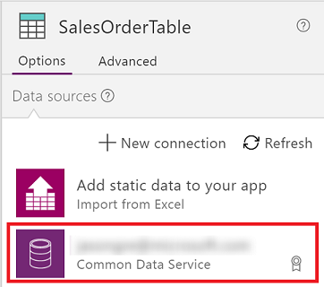
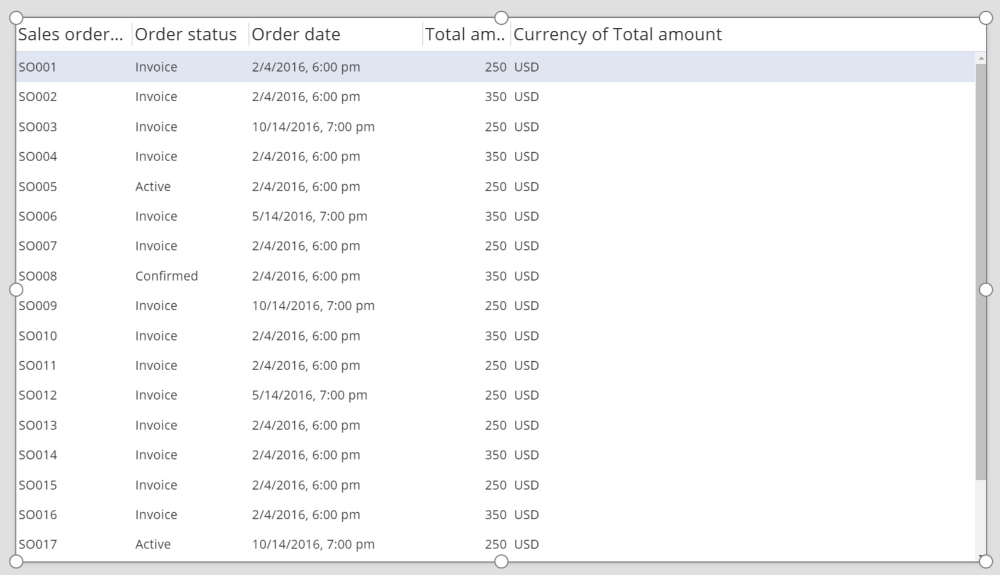
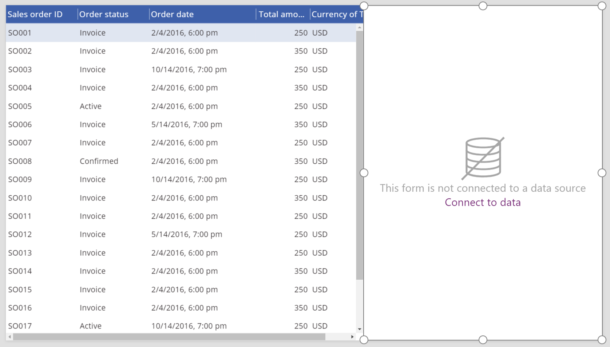
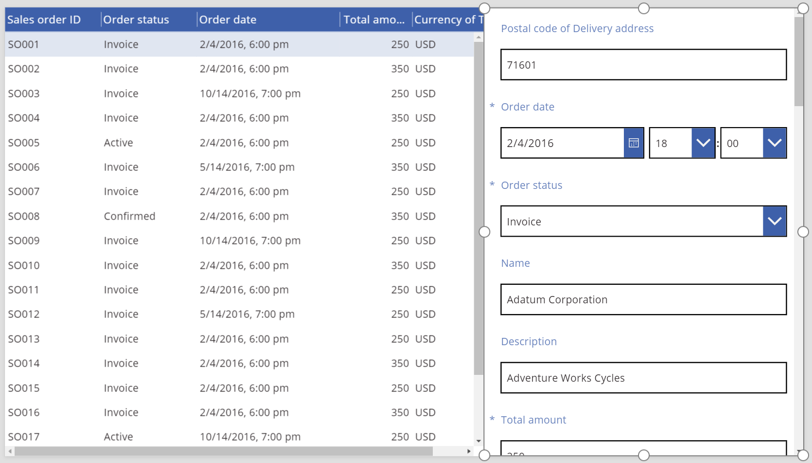

<properties
	pageTitle="Data table control: reference | Microsoft PowerApps"
	description="Information, including properties and examples, about the Data table control"
	services="powerapps"
	documentationCenter="na"
	authors="jasongre"
	manager="kfend"
	editor=""
	tags=""/>

<tags
   ms.service="powerapps"
   ms.devlang="na"
   ms.topic="article"
   ms.tgt_pltfrm="na"
   ms.workload="na"
   ms.date="05/17/2017"
   ms.author="kfend"/>

# Data table control in PowerApps #
The Data table control in Microsoft PowerApps is a control that shows a set of data in a tabular format.

## Description ##
The **Data table** control shows data in a format that includes column headers for each field that the control shows. You can specify which fields to show and in which order. This control maintains a **Selected** property that, like the **Gallery** control, points to the single row that the user selected. Therefore, you can link the **Data table** control to other controls.

## Capabilities ##
The Data table control is a relatively recent addition to PowerApps and will be evolving its capabilities over time. This section will highlight items that are supported as well as those that are known not to be currently supported based on the latest release.

### Supported functionality ###
The following is a list of the functionality that is currently supported:
- Read-only data
- Single row selection
- Connected data sources

### Functionality not supported ###
The following is a list of functionality that isn't currently supported but is in planning for future releases.
- Support for static data sources
- Support for customizing a column, including column widths, texts, and styling
- Support for hyperlinks inside the Data table
- Ability for users to change column widths while running the app
- Use of Data table inside Form controls
- Ability to change the height of all the rows
- Copy/paste of the Data table control
- Support for showing images in the Data table
- Ability to show fields from related entities
- Built-in filter/sort support from the Data table column headings
- Use of Data table inside the Gallery control
- Editing data in the Data table
- Selection of multiple rows

### Known issues ###
- Use of the FirstN function in the Data table Items property
- Resetting of the field list after modifying the Items property
- Losing connection to the data source after modifying the Items property for some connectors

## Key properties ##
+ [**Items**](properties-core.md) – The source of data that the control shows.

+ **Selected** – The selected row.

## Other properties
+ [**BorderColor**](properties-color-border.md) – The color of the control’s border.

+ [**BorderStyle**](properties-color-border.md) – The style of the control's border. The options are **Solid**, **Dashed**, **Dotted**, and **None**.

+ [**BorderThickness**](properties-color-border.md) – The thickness of the control's border.

+ [**Color**](properties-color-border.md) – The default text color for all data rows.

+ [**Fill**](properties-color-border.md) – The default background color for all data rows.

+ [**Font**](properties-text.md) – The default font for all data rows.

+ [**FontWeight**](properties-text.md) – The default font weight for all data rows.

+ **HeadingColor** – The text color of the column headings.

+ **HeadingFill** – The background color of the column headings.

+ **HeadingFont** – The font of the column headings.

+ **HeadingFontWeight** – The font weight of the column headings.

+ **HeadingSize** – The font size of the column headings.

+ [**Height**](properties-size-location.md) – The distance between the control’s top and bottom edges.

+ [**HoverColor**](properties-color-border.md) – The text color of the row on which the user keeps the mouse pointer.

+ [**HoverFill**](properties-color-border.md) – The background color of the row on which the user keeps the mouse pointer.

+ **NoDataText** – The message that appears if the control can show no records.

+ **SelectedColor** – The color of the text in the selected row.

+ **SelectedFill** – The background color of the selected row.

+ [**Size**](properties-text.md) – The default font size for all data rows.

+ [**Visible**](properties-core.md) – A value that determines whether the control appears or is hidden.

+ [**Width**](properties-size-location.md) – The distance between the control’s left and right edges.

+ [**X**](properties-size-location.md) – The distance between the left edge of the control and the left edge of its parent container (or the left edge of the screen if there is no parent container).

+ [**Y**](properties-size-location.md) – The distance between the top edge of the control and the top edge of its parent container (or the top edge of the screen if there is no parent container).

## Related functions

+ [**Filter**](function-filter-lookup.md)(*DataSource*, *Formula*)

+ [**Search**](function-filter-lookup.md)(*DataSource*, *SearchString*, *Column*)

+ [**Lookup**](function-filter-lookup.md)(*DataSource*, *Formula*)

## Examples
### Basic usage
1. Create a blank app for a tablet.

2. On the **Insert** tab, click or tap **Data table**.

   

   A **Data table** control is added to the screen.

3. Rename the new control **SalesOrderTable**, and resize it so that it covers the whole screen.

4. In the right-hand pane, click or tap the down arrow next to **No data source selected**, and then click or tap **Add a data source**.
   
   
5. In the list of connections, click or tap the connection for your Common Data Service database.
   

6. In the list of entities, click or tap **Sales order**, and then click or tap **Connect**.
   
   

   **SalesOrderTable** is now attached to the **Sales order** data source. However, no data will appear until you select fields.

7. In the right-hand pane, click or tap the eye icon for each field that you want to show.

	For this example, show **SalesOrderId**, **Account**, **OrderDate**, and **Status**.

   **SalesOrderTable** shows data from the fields that you specified.
   

8. Reorder the fields by dragging them up or down in the right-hand pane.
   
   

   **SalesOrderTable** shows the fields in the order that you specified.

   

### Restyle the header ###
1. With the **Data table** control selected, click or tap the **Advanced** tab in the right-hand pane.

2. Click or tap the field for the **HeadingFill** property, and then change the value to **RGBA(62,96,170,1)**.

3. Click or tap the field for the **HeadingColor** property, and change the value to **White**.

4. Click or tap the field for the **HeadingSize** property, and then change the value to **14**.
   

### Connect a **Data table** control to another control
1. Add an **Edit form** control to the screen.

2. Resize the **Data table** and the **Edit form** controls so that the **Data table** control appears in the left part of the screen and the **Edit form** control appears in the right part of the screen.

   
3. Connect the **Edit form** control to the **Sales order** data source.
4. In the right-hand pane, show the **SalesOrderId**, **Status**, **Name**, **Description**, and **Total amount** in the **Edit form** control.

   
3. In the right-hand pane, click or tap the **Advanced** tab.
4. Set the **Item** property for the **Edit form** control to **SalesOrderTable.Selected**.

	The **Edit form** control shows information from the row that's selected in the **Data table** control.

   
