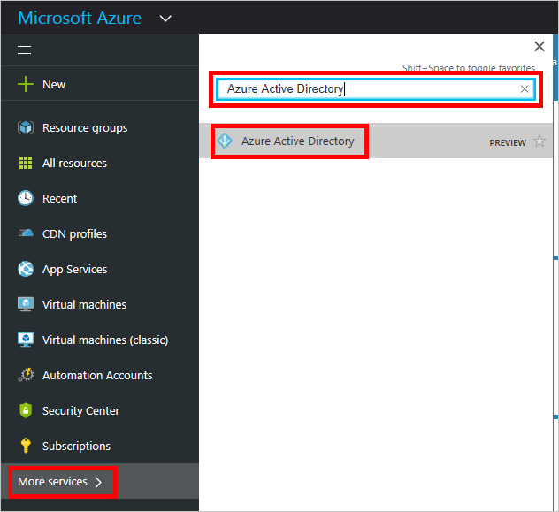
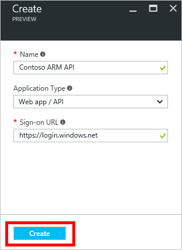
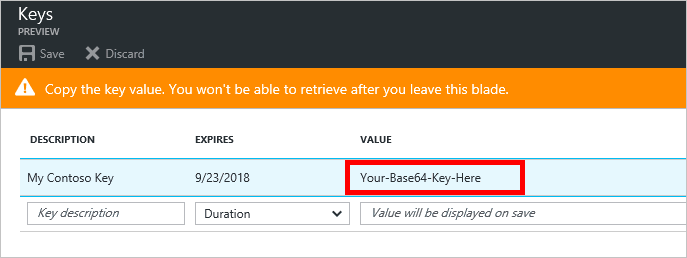
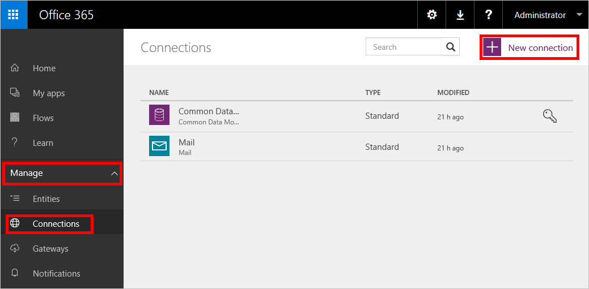
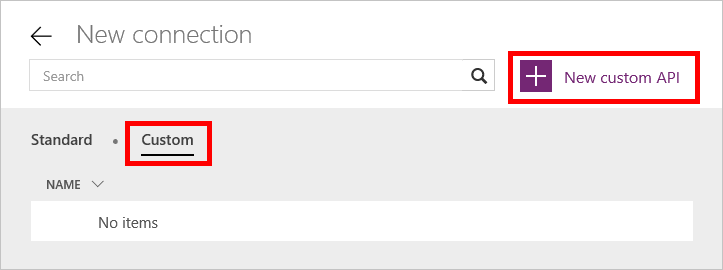
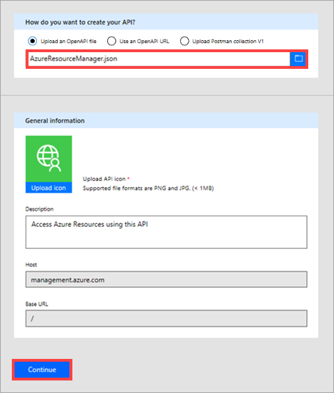

<properties
	pageTitle="Tutorial: Create a custom API using Azure Resource Manager in PowerApps and Microsoft Flow | Microsoft Azure"
	description="Learn how to create a custom Azure Resource Manager API in PowerApps and Microsoft Flow"
	services=""
    suite="powerapps"
	documentationCenter=""
	authors="camsoper"
	manager="AFTOwen"
	editor=""/>

<tags
   ms.service="powerapps"
   ms.devlang="na"
   ms.topic="article"
   ms.tgt_pltfrm="na"
   ms.workload="na"
   ms.date="09/23/2016"
   ms.author="casoper"/>

# Tutorial: Create a custom API using Azure Resource Manager in PowerApps and Microsoft Flow

This tutorial demonstrates how to register a Swagger file describing an [Azure Resource Manager (ARM) API](https://msdn.microsoft.com/library/azure/dn790568.aspx) and then connect to it in PowerApps.

## Prerequisites

- An [Azure subscription](https://azure.microsoft.com/en-us/free/)
- A [PowerApps account](https://powerapps.microsoft.com)
- The [sample Swagger file](http://pwrappssamples.blob.core.windows.net/samples/AzureResourceManager.json) used in this tutorial.

## Enable authentication in Azure Active Directory

First, we need to create an Azure Active Directory (AAD) application that will perform the authentication when calling the ARM API endpoint.

1. Sign in to the [Azure portal](https://portal.azure.com).  If you have more than one Azure Active Directory tenant, make sure you're logged into the correct directory by looking at your username in the upper right corner.

    

2. On the left-hand menu, click **More services**.  In the **Filter** textbox, type **Azure Active Directory**, then click on **Azure Active Directory**.

    

    The Azure Active Directory blade opens.   

3. In the menu on the Azure Active Directory blade, click **App registrations**.

    

4. In the list of registered applications, click **Add**.

       

5. Enter a name for your application, leave **Web app / API** selected, and then for **Sign-on URL** enter `https://login.windows.net`.  Click Create.  

    

6. Click on the new application in the list.

    

    The Registered app blade opens.  Make a note of the **Application ID**.  We'll need it later.

7. The Settings blade should have opened, as well.  If it didn't, click the **Settings** button.

    

8. In the Settings blade, click **Reply URLs**. In the list of URLs, add `https://msmanaged-na.consent.azure-apim.net/redirect` and click **Save**.

    

9. Back on the Settings blade, click **Required permissions**.  On the Required permissions blade, click **Add**.

    

    The Add API access blade opens.

10. Click **Select an API**. In the blade that opens, click the option for an Azure Service Management API and click **Select**.

    

11. Click **Select permissions**.  Under *Delegated permissions*, click **Access Azure Service Management as organization users**, then click **Select**.

    

12. On the Add API access blade, click **Done**

13. Back on the Settings blade, click **Keys**.  In the Keys blade, type a description for your key, select an expiration period, and then click **Save**.  Your new key will be displayed.  Make note of the key value, as we will need that later, too.  You may now close the Azure portal.

    

## Add the connection in PowerApps

Now that the AAD application is configured, let's add the custom API.

1. In the [PowerApps web portal](https://web.powerapps.com), in the menu on the left, click **Manage** to expand it, then click **Connections**. Then click **New connection** in the top right corner.

    >[AZURE.TIP] If you can't find the menu, it may be under a hamburger button in the upper left in mobile browsers.

    

2. Click **Custom** to display your list of custom connections, then click **New custom API**.

    

3. Enter a Name for your connection, then upload the [sample ARM Swagger file](http://pwrappssamples.blob.core.windows.net/samples/AzureResourceManager.json).  Click **Next**.  

    

4. On the next screen, since the Swagger file uses our AAD application for authentication, we need to give PowerApps some information about our application.  Under **Client id**, enter the AAD **Application ID** you noted earlier.  For client secret, use the **key**.  And finally, for **Resource URL**, enter `https://management.core.windows.net/`.

    >[AZURE.IMPORTANT] Be sure to include the Resource URL exactly as written above, including the trailing slash.

    

5. Your custom API is now registered, and can be consumed within your PowerApps or Flow.

    

>[AZURE.NOTE] The sample Swagger does not define the full set of ARM operations, and currently only contains the [List all subscriptions](https://msdn.microsoft.com/library/azure/dn790531.aspx) operation.  You can edit this Swagger or create new Swagger files using the [online Swagger editor](http://editor.swagger.io/).
>
>This process can be used to access any RESTful API authenticated using AAD.

## Next steps

For more detailed information about how to create an app, see [Create an app from data](get-started-create-from-data.md).

For more detailed information about how to use a flow in an app, see [Start a flow in an app](using-logic-flows.md).

To ask questions or make comments about custom APIs, [join our community](https://aka.ms/powerapps-community).
