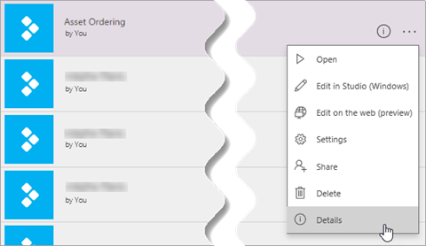
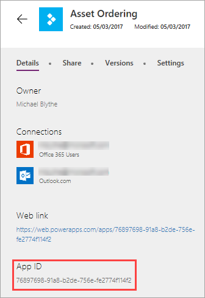
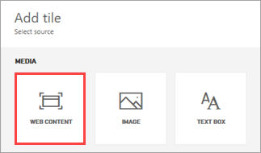

<properties
   pageTitle="Integrate PowerApps into websites and Power BI dashboards | Microsoft PowerApps"
   description="Embed apps in websites and Power BI dashboards."
   services=""
   suite="powerapps"
   documentationCenter="na"
   authors="mgblythe"
   manager="anneta"
   editor=""
   tags=""/>

<tags
   ms.service="powerapps"
   ms.devlang="na"
   ms.topic="article"
   ms.tgt_pltfrm="na"
   ms.workload="na"
   ms.date="05/04/2016"
   ms.author="mblythe"/>

# Integrate PowerApps into websites and Power BI dashboards

The apps you build are often most useful when they're available right where people are doing their work. PowerApps enables you to embed apps in an iframe so that you can integrate those apps into websites and Power BI dashboards.

In this topic, we'll show you how to set parameters for app embedding; then we'll embed our Asset Ordering app in a website and a dashboard.


**Note** : Only PowerApps users in the same tenant can access the embedded app.

You can also integrate PowerApps into SharePoint Online (without using an iframe). For more information, see [Generate an app from within SharePoint using PowerApps](generate-app-from-sharepoint-list-interface.md).

## Set URI parameters for your app

If you have an app you want to embed, the first step is to set parameters for the Uniform Resource Identifier (URI), so that the iframe knows where to find the app. The URI is in the following form:

```
https://web.powerapps.com/webplayer/iframeapp?hideNavBar=true&source=iframe&appId=/providers/Microsoft.PowerApps/apps/[AppID]
```

The only thing you have to do is substitute the ID of your app for [AppID] in the URI. We'll show you how to get that value shortly, but first here are all the parameters available in the URI:

- **appID** - is in the format `/providers/Microsoft.PowerApps/apps/[AppID]`. It provides the ID of the app to run.
- **hideNavBar** - is a Boolean (true/false) value that controls whether the Dynamics 365 header for the app is visible or not. We recommend a value of `true` if this is the only app you will embed in your site.
- **screenColor** - is used to provide a better app loading experience for your users. This parameter is in the format [RGBA (red value, green value, blue value, alpha)](function-colors.md) and controls the screen color while the app loads. It is best set it to the same color as your app's icon.
- **source** - does not affect the app, but we suggest you add a descriptive name to refer to the source of the embedding.
- Lastly, you can add any custom parameters you want using the [Param() function](function-param.md), and those values can be consumed by your app. They are added to the end of the URI, such as `[AppID]&amp;param1=value1`. These parameters are read only during launch of the app; if you need to change them, you need to re-launch the app.


### Get the App ID

The app ID is available on powerapps.com. For the app you want to embed:

1. In [powerapps.com](https://powerapps.microsoft.com), on the **Apps** tab, click or tap the ellipsis ( **. . .** ), then **Details**.

    

2. Copy the **App ID**.

    

3. Substitute the `[AppID]` value in the URI. For our Asset Ordering app, the URI looks like this:

    ```
    https://web.powerapps.com/webplayer/iframeapp?hideNavBar=true&source=iframe&appId=/providers/Microsoft.PowerApps/apps/76897698-91a8-b2de-756e-fe2774f114f2
    ```


## Embed your app in a website

Embedding your app is now as simple as adding the iframe to the HTML code for your site:

```
<iframe width="[W]" height="[H]" src="https://web.powerapps.com/webplayer/iframeapp?hideNavBar=true&source=website&screenColor=rgba(165,34,55,1)&appId=/providers/Microsoft.PowerApps/apps/[AppID]"/>
```

Specify values for the iframe width and height, and substitute the ID of your app for `[AppID]`.

The following image shows the Asset Ordering app embedded in a Contoso sample website.


Keep the following points in mind for authenticating users of your app:

- If your website uses Azure Active Directory (AAD) based authentication, no additional sign-in is required.
- If your website uses any other sign-in mechanism or is not authenticated, your users see a sign-in prompt on the iframe. After they sign-in, they will be able to run the app as long as the author of the app has shared it with them.


## Embed your app in a Power BI dashboard

In line with our vision of measure, act, and automate, we think the best place to use an app is often in the context of the data you measure and the reports you monitor.

In this example, we've created a Power BI dashboard to monitor the sales of products for our company. We keep an eye on computer hardware sales trends in this dashboard, and we order new hardware inventory directly within the dashboard, from the embedded app. Embedding the app allows our inventory specialists to go to one place to do their work, and they're happy to stay in the Power BI dashboard that they're used to.

In the following image, you see the Asset Ordering app embedded directly in the dashboard, alongside sales figures that provide context for the hardware ordering process.


To embed an app in a Power BI dashboard, follow these steps:

1. Create the URI as shown earlier:

    ```
    https://web.powerapps.com/webplayer/iframeapp?hideNavBar=true&source=powerbi&appId=/providers/Microsoft.PowerApps/apps/76897698-91a8-b2de-756e-fe2774f114f2
    ```

2. Add the URI to an iframe. In this case we set the width and height to 98% to avoid having scroll bars on our tile:

    ```
    <iframe width="98%" height="98%" src=" https://web.powerapps.com/webplayer/iframeapp?hideNavBar=true&source=powerbi&appId=/providers/Microsoft.PowerApps/apps/76897698-91a8-b2de-756e-fe2774f114f2"/>
    ```

3. Go to the Power BI dashboard where you want to embed the app.
4. In the dashboard, in the top menu bar, click or tap **Add Tile**. Depending on space limitations, you might see only the plus (+) sign.

    

5. Click or tap **WEB CONTENT** , then **Next**.

    

6. Paste the iframe code into the **Embed code** field, then click or tap **Apply**.

    

7. The tile should now appear on the dashboard, and you can move it where you want to, just like other tiles. For more information about adding tiles to a dashboard, see [Add image, text, video, and more to your dashboard](https://powerbi.microsoft.com/documentation/powerbi-service-add-a-widget-to-a-dashboard/).

As you can see, embedding apps is simple and powerful. Embedding enables you to bring apps right to the places you and your customers work – in websites and in Power BI dashboards.

