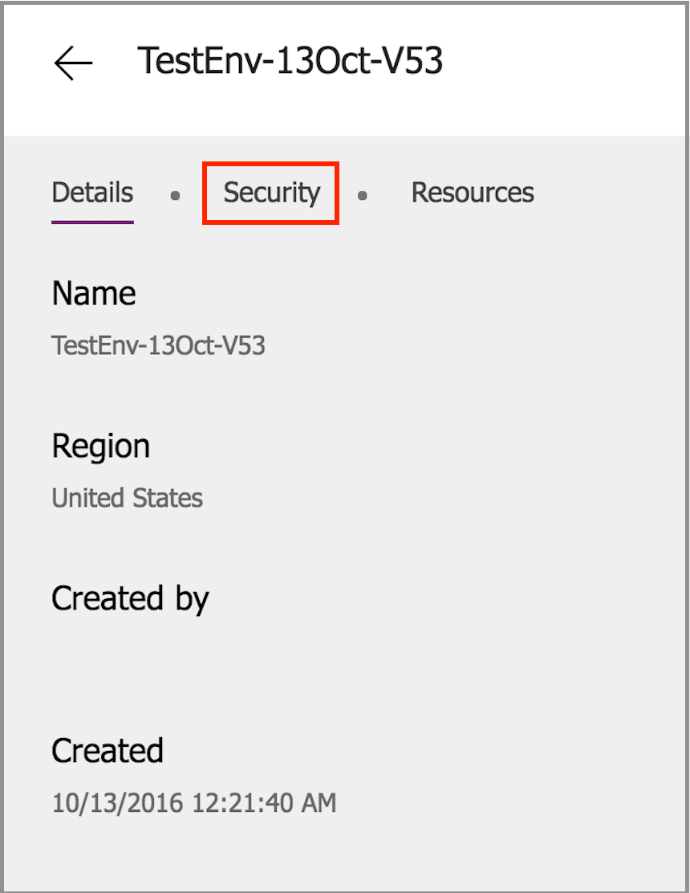

<properties
	pageTitle="How to administer environments | Microsoft PowerApps"
	description="How to administer environments"
	services=""
	suite="powerapps"
	documentationCenter="na"
	authors="RickSaling"
	manager="anneta"
	editor=""
	tags=""/>

<tags
   ms.service="powerapps"
   ms.devlang="na"
   ms.topic="article"
   ms.tgt_pltfrm="na"
   ms.workload="na"
   ms.date="10/17/2016"
   ms.author="ricksal"/>

# Environments Administration
Here you learn how to perform administrative tasks for environments.

## How to create an environment

1.	In the PowerApps admin center,  where any existing environments are displayed press or click **New environment**.

	

2. Enter the following info:

	| Property | Description |
	|------|------------------|
	| Name | Enter the name of your environment, such as Dev/Test, or Sandbox. |
	| Location | Choose the location to host your environment. We recommend using a location closest to your users. For example, if your app users are in London, then choose a Europe location. If your app users are in New York, then choose a U.S. location. |
	| Create database automatically | Check this setting to create the Common Data Model. The Common Data Model is available with some licenses. So if you don't see this property, then it's not included with your license. |

	

3.	Select Create. Your new environment is listed.

## Manage your environments

1.	In the PowerApps admin center, select an environment to open its properties. The General properties show more details, including who "owns" each environment, its geographic location, and when it was created. You can also upgrade your plan in these properties.

	

2. In the details page, press or click **Security**.

	

3.	In the Access properties, Admin and Maker are listed. Use these properties to give users Admin privileges, or Maker privileges to the environment.

	| Task | Maker | Admin |
	|------|--------|-------|
	| Create Flows | ✔ | ✔ |
	| Delete Flows | ✔ | ✔ |

	And so on...

[TBD] adapt or eliminate the rest of this

4. In Resources, all the items within the environment are listed, including Flows, Connections, Custom APIs, Gateways, and PowerApps.

## Frequently asked questions
Can I migrate a Flow in my U.S. environment, to a Europe environment?

No, flows cannot be moved between environments. Currently, recreate the flow in the new environment.

Which license includes Common Data Model?

Office 365 Business Premium (Plan P2)

Can the Common Data Model be used outside of an environment?

No. Common Data Model requires an environment.

What regions include Microsoft Flow?

Microsoft Flow supports all the same regions that Office 365 supports. Microsoft does not publicly advertise all datacenters, but the Office 365 datacenter map provides more information.

How do I create my own custom environment?

Office 365 Business (Plan P1) and Office 365 Business Premium (Plan P2) license users can create their own environments, in addition to the default environment. Other Office 365 licenses, such as Free, cannot create their own environments
