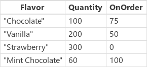

<properties
	pageTitle="Filter and LookUp functions | Microsoft PowerApps"
	description="Reference information, including syntax and examples, for the Filter and LookUp functions in PowerApps"
	services=""
	suite="powerapps"
	documentationCenter="na"
	authors="gregli-msft"
	manager="dwrede"
	editor=""
	tags=""/>

<tags
   ms.service="powerapps"
   ms.devlang="na"
   ms.topic="article"
   ms.tgt_pltfrm="na"
   ms.workload="na"
   ms.date="10/21/2015"
   ms.author="gregli"/>

# Filter and LookUp functions in PowerApps #

Finds one or more [records](working-with-tables.md#records) in a [table](working-with-tables.md).

## Description ##

The **Filter** function finds records in a table that satisfy a formula.  Use **Filter** to find a set of records that match one or more criteria and to discard those that don't.

The **LookUp** function finds the first record in a table that satisfies a formula.  Use **LookUp** to find a single record that matches one or more criteria.

For both, the formula is evaluated for each record of the table.  Records that result in *true* are included in the result.  [Columns](working-with-tables.md#columns) of the table can be used in the formula, as well as control properties and other values from throughout your app.  

**Filter** returns a table that contains the same columns as the original table and the records that match the criteria.  **LookUp** returns only the first record found, after applying a formula to reduce the record to a single value.  If no records are found, **Filter** returns an [empty](function-isblank-isempty.md) table, and **LookUp** returns *blank*.  

Tables are a value in PowerApps, just like a string or number.  They can be passed to and returned from functions.  **Filter** and **LookUp** don't modify a table. Instead, they take a table as an argument and return a table, a record, or a single value from it. See [working with tables](working-with-tables.md) for more details.

## Syntax ##

**Filter**( *Table*, *Formula1* [, *Formula2*, ... ] )

- *Table* - Required. Table to search.
- *Formula(s)* - Required. This formula is evaluated for each record of the table, and the result includes those records that result in **true**.  You can reference columns within the table.  If you supply more than one formula, the results of all formulas are combined with the **[And](function-logicals.md)** function.

**LookUp**( *Table*, *Formula* [, *ReductionFormula* ] )

- *Table* - Required. Table to search.
- *Formula* - Required. This formula is evaluated for each record of the table, and the first record that results in **true** is returned.  You can reference columns within the table.  
- *ReductionFormula* - Optional. This formula is evaluated over the record that was found, reducing the record to a single value.  You can reference columns within the table.  If this parameter is not supplied, the function returns the full record from the table.  

## Examples ##

The following examples use the **IceCream** [data source](working-with-data-sources.md):

| Formula | Description | Result |
|---------|-------------|--------|
| **Filter( IceCream, OnOrder > 0 )** | Returns records where **OnOrder** is greater than zero. |   |
| **Filter( IceCream, Quantity + OnOrder > 225 )** | Returns records where the sum of **Quantity** and **OnOrder** columns is greater than 225. |  |
| **Filter( IceCream, "chocolate" in Lower( Flavor ) )** | Returns records where the word "chocolate" appears in the **Flavor** name, independent of uppercase or lowercase letters. |  |
| **Filter( IceCream, Quantity < 10  && OnOrder < 20 )** | Returns records where the **Quantity** is less than 10 and **OnOrder** is less than 20.  No records match these criteria, so an empty table is returned. |  |
| **LookUp( IceCream, Flavor = "Chocolate", Quantity )** | Searches for a record with **Flavor** equal to "Chocolate", of which there is one.  For the first record that's found, returns the **Quantity** of that record. | 100 |
| **LookUp( IceCream, Quantity > 150, Quantity + OnOrder )** | Searches for a record with **Quantity** greater than 100, of which there are multiple.  For the first record that's found, which is "Vanilla" **Flavor**, returns the sum of **Quantity** and **OnOrder** columns. | 250 |
| **LookUp( IceCream, Flavor = "Pistachio", OnOrder )** | Searches for a record with **Flavor** equal to "Pistachio", of which there are none.  Because none were found, **Lookup** returns *blank*. | *blank* |
| **LookUp( IceCream, Flavor = "Vanilla" )** | Searches for a record with **Flavor** equal to "Vanilla", of which there is one.  Since no reduction formula was supplied, the entire record is returned. | { Flavor: "Vanilla", Quantity: 200, OnOrder: 75 } |

