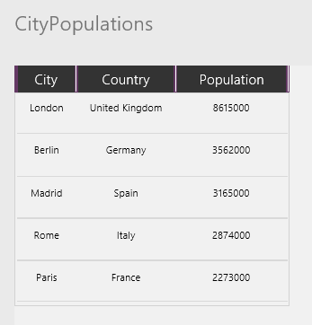
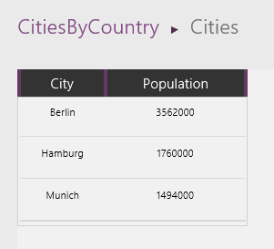

<properties
	pageTitle="GroupBy and Ungroup functions | Microsoft PowerApps"
	description="Reference information, including syntax and examples, for the GroupBy and Ungroup functions in PowerApps"
	services=""
	suite="powerapps"
	documentationCenter="na"
	authors="gregli-msft"
	manager="dwrede"
	editor=""
	tags=""/>

<tags
   ms.service="powerapps"
   ms.devlang="na"
   ms.topic="article"
   ms.tgt_pltfrm="na"
   ms.workload="na"
   ms.date="11/07/2015"
   ms.author="gregli"/>

# GroupBy and Ungroup functions in PowerApps #

Groups and ungroups [records](working-with-tables.md#records) of a [table](working-with-tables.md).

## Description ##

The **GroupBy** function returns a table with records grouped together based on the values in one or more [columns](working-with-tables.md#columns). Records in the same group are placed into a single record, with a column added that holds a nested table of the remaining columns.   

The **Ungroup** function reverses the **GroupBy** process. This function returns a table, breaking into separate records any records that were grouped together.

You can group records by using **GroupBy**, modify the table that it returns, and then ungroup records in the modified table by using **Ungroup**. For example, you can remove a group of records by following this approach:

- Use **GroupBy**.
- Use **[Filter](function-filter-lookup.md)** to remove the entire group of records.
- Use **Ungroup**.  

**Ungroup** tries to preserve the original order of the records that were fed to **GroupBy**.  This isn't always possible (for example, if the original table contains *blank* records).

A table is a value in PowerApps, just like a string or a number. You can specify a table as an argument for a function, and a function can return a table. **GroupBy** and **Ungroup** don't modify a table; instead they take a table as an argument and return a different table. See [working with tables](working-with-tables.md) for more details.

## Syntax ##

**GroupBy**( *Table*, *ColumnName1* [, *ColumnName2*, ... ], *GroupColumnName* )

- *Table* - Required. Table to be grouped.
- *ColumnName(s)* - Required.  The column names in *Table* by which to group records.  These columns become columns in the resulting table.
- *GroupColumnName* - Required.  The column name for the storage of record data not in the *ColumnName(s)*.

**Ungroup**( *Table*, *GroupColumnName* )

- *Table* - Required. Table to be ungrouped.
- *GroupColumnName* - Required.  The column that contains the record data setup with the **GroupBy** function.

## Examples ##

### Create a collection ###

1. Add a button, and set its **Text** property so that the button shows **Original**.

1. Set the **OnSelect** property of the **Original** button to this formula:

	**ClearCollect(CityPopulations, {City:"London", Country:"United Kingdom", Population:8615000}, {City:"Berlin", Country:"Germany", Population:3562000}, {City:"Madrid", Country:"Spain", Population:3165000}, {City:"Rome", Country:"Italy", Population:2874000}, {City:"Paris", Country:"France", Population:2273000}, {City:"Hamburg", Country:"Germany", Population:1760000}, {City:"Barcelona", Country:"Spain", Population:1602000}, {City:"Munich", Country:"Germany", Population:1494000}, {City:"Milan", Country:"Italy", Population:1344000})**

1. Press F5, select the **Original** button, and then press Esc.

	You just created a [collection](working-with-data-sources.md#collections), named **CityPopulations**, that contains this data:

	

1. To display this collection, select **Collections** on the **File** menu.

	

	The first five records in the collection appear.

	

### Group records ###

1. Add another button, and set its **Text** property so that the button shows **Group**.

1. Set **OnSelect** property of the **Group** button to this formula:

	**ClearCollect( CitiesByCountry, GroupBy( CityPopulations, "Country", "Cities" ) )**

1. Press F5, select the **Group** button, and then press Esc.

	You just created a collection, named **CitiesByCountry**, in which the records of the previous collection are grouped by the **Country** column.

	

1. To display the first five records in this collection, select **Collections** on the **File** menu.

	

1. To display the populations of cities in a country, select the table icon in the **Cities** column for that country (for example, Germany):

	

### Filter and ungroup records ###

1. Add another button, and set its **Text** property so that the button shows **[Filter](function-filter-lookup.md)**.

1. Set the **OnSelect** property of the **[Filter](function-filter-lookup.md)** button to this formula:

	**ClearCollect( CitiesByCountryFiltered, Filter( CitiesByCountry, "e" in Country ))**

1. Press F5, select the button that you added, and then press Esc.

	You just created a third collection, named **CitiesByCountryFiltered**, that includes only those countries that have an "e" in their names (that is, not Spain or Italy).

	

1. Add one more button, and set its **Text** property so that the button shows **Ungroup**.

1. Set the **OnSelect** property of the **Ungroup** button to this formula:

	**ClearCollect (CityPopulationsUngrouped, Ungroup( CitiesByCountryFiltered, "Cities" ))**

	
