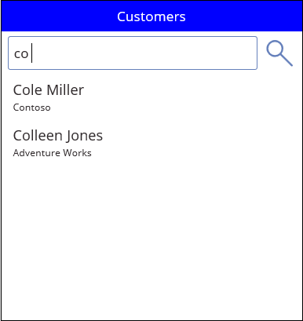

<properties
	pageTitle="StartsWith function | Microsoft PowerApps"
	description="Reference information, including syntax and examples for the StartsWith function in PowerApps"
	services=""
	suite="powerapps"
	documentationCenter="na"
	authors="gregli-msft"
	manager="anneta"
	editor=""
	tags=""/>

<tags
   ms.service="powerapps"
   ms.devlang="na"
   ms.topic="article"
   ms.tgt_pltfrm="na"
   ms.workload="na"
   ms.date="02/05/2017"
   ms.author="gregli"/>

# StartsWith function in PowerApps #

Tests whether a text string begins another text string.

## Description ##

The **StartsWith** function tests whether one text string begins with another.  The test is case insensitive.  The return value is a boolean **true** or **false**.  

Use the **[in](operators.md#in-and-exactin-operators)** operator to test if one text string appears anywhere within another.  

Use **StartsWith** with the **[Filter](function-filter-lookup.md)** function to provide search over the data within your app.  Other options include using the **in** operator or **[Search](function-fitler-lookup.md)** function to look anywhere within text strings and not just at the beginning.  Your choice of functions will depend on the needs of your app and which of these functions can be [delegated](../delegation-overview.md) for your particular data source.  If one of these functions cannot be delegated, a blue dot will appear at authoring time to warn you of this limitation.
 
## Syntax ##

**StartsWith**( *Text*, *StartText* )

- *Text* – Required.  The text to test.
- *StartText* – Required.  The text to search for at the beginning of *Text*.  If *StartText* is an empty string, **StartsWith** returns *true*.

## Examples ##

| Formula | Description | Result |
|---------|-------------|--------|
| **StartsWith( "Hello World", "hello" )** | Tests if **"Hello World"** begins with **"hello"**.  The test is case insensitive. | **true** | 
| **StartsWith( "Good bye", "hello" )** | Tests if **"Good bye"** begins with **"hello"**. | **false** | 
| **StartsWith( "Always say hello", "hello" )** | Tests if **"Always say hello"** begins with **"hello"**.  Although **"hello"** appears in the text, it does not appear at the beginning. | **false** |

### Search user experience ###

In many apps you will find a search box used to look for specific records in a large data set.  As the user types characters, the list of results is automatically filtered to those records that match the search criteria.
 
In this example, we will display the results of searching a **Customers** list which contains:

To create this data source as a collection, create a **[Button](../controls/control-button.md)** control and set its **OnSelect** property to:

**ClearCollect( Customers, Table( { Name: "Fred Garcia", Company: "Northwind Traders" }, { Name: "Cole Miller", Company: "Contoso" }, { Name: "Glenda Johnson", Company: "Contoso" }, { Name: "Mike Collins", Company: "Adventure Works" }, { Name: "Colleen Jones", Company: "Adventure Works" } ) )**

Imagine we have a screen in our app which displays the results of our search in a [**Gallery control**](../controls/control-gallery.md) shown here at the bottom of the screen.  The search text to apply is provided by the user as a text string in the **SearchInput** [**Text input**](../controls/control-text-input.md) shown at the top of the screen:

As the user types characters in the text box, the results in the gallery are automatically filtered.  As the user types **co** in the search box, the results become: 

To filter based on the **Name** column, we can use one of the following patterns.  These formulas are used with the **Items** property of the gallery control:

| Formula | Description | Result |
|--------|--------|---------|
| **Filter( Customers, StartsWith( Name, SearchInput.Text ) )** | Filters the **Customers** data source for records that have a **Name** that starts with **"co"**.  The test is case insensitive which brings in **"Colleen Jones"** to the result.  Since we are only testing the beginning of the strings, **"Mike Collins"** is not in the result. |  |
| **Filter( Customers, SearchInput.Text in Name )** | Filters the **Customers** data source for records that have a **Name** that contain **"co"**.  The test is case insensitive which brings in **"Colleen Jones"** to the result.  Since we are searching throughout the strings, **"Mike Collins"** is also in the result. |  |
| **Search( Customers, SearchInput.Text, "Name" )** | Similar to using the **in** operator, the **Search** function searches for any match within the **Name** column of each record. Note that the column name must be enclosed in double quotes.  Since the column name is a text string, you can provide a control for the user to change this.   |  |

We can expand our search to include the **Company** column as well as the **Name** column:

| Formula | Description | Result |
|--------|--------|---------|
| **Filter( Customers, StartsWith( Name, SearchInput.Text ) &#124;&#124; StartsWith( Company, SearchInput.Text ) )** | Filters the **Customers** data source for records that have a **Name** or **Company** that starts with **"co"**.  The [**&#124;&#124;** operator](operators.md) is *true* if either **StartsWith** function is *true*. |  |
| **Filter( Customers, SearchInput.Text in Name &#124;&#124; SearchInput.Text in Company )** | Filters the **Customers** data source for records that have a **Name** or **Company** that contains **"co"** anywhere within them. |  |
| **Search( Customers, SearchInput.Text, "Name", "Company" )** | Similar to using the **in** operator, the **Search** function searches the **Customers** data source for records that have a **Name** or **Company** that contains **"co"** anywhere within them.  Especially with multiple columns, the **Search** function is easier to read and write than **Filter** with multiple **in** operators.  Note that the column names must be enclosed in double quotes.  Since the column names are text string, you can provide controls for the user to change this. |  |