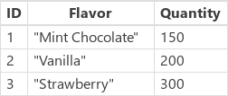
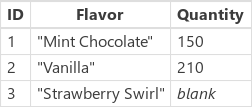

<properties
	pageTitle="PowerApps: Test2 functions"
	description="Reference information for the Test2 functions in PowerApps, including syntax and examples"
	services=""
	suite="powerapps"
	documentationCenter="na"
	authors="gregli-msft"
	manager="dwrede"
	editor=""
	tags=""/>

<tags
   ms.service="powerapps"
   ms.devlang="na"
   ms.topic="article"
   ms.tgt_pltfrm="na"
   ms.workload="na"
   ms.date="10/21/2015"
   ms.author="gregli"/>

# Test2 functions in PowerApps #

Updates [records](working-with-tables.md#records) in a [data source](working-with-data-sources.md).

## Description ##

### Update function ###

Use the **[Update](function-update-updateif.md)** function to replace specific records in a data source.  The entire record is replaced and not modified as is done with **[UpdateIf](function-update-updateif.md)** and the **[Patch](function-patch.md)** function.

For [collections](working-with-data-sources.md#collections), the entire record must match.  There may also be more than one record that matches as duplicate records are allowed.  You can use the **All** argument to update all copies of a record, otherwise only one copy of the record is updated. 

If a column's value is automatically generated by the data source, the value of that [column](working-with-tables.md#columns) must be reaffirmed.

### UpdateIf function ###

Use the **[UpdateIf](function-update-updateif.md)** function to modify records based on a condition.  The condition can be any formula that results in a **true** or **false** and can reference columns of the data source by name.  The condition is evaluated individually for each record, and if the result is **true** modifications are applied to the record.  

Modifications are specified using a change record containing new property values.  When this change record is provided inline with curly braces, property formulas can reference properties of the record being modified.  You can use this behavior to make modifications to records based on a formula.

Similar to **[UpdateIf](function-update-updateif.md)**, you can also use the **[Patch](function-patch.md)** function to change specific columns of a record without affecting other columns.

Both **[Update](function-update-updateif.md)** and **[UpdateIf](function-update-updateif.md)** return the modified data source as a [table](working-with-tables.md).  Both functions can only be used in [behavior formulas](working-with-formulas-in-depth.md#behavior-formulas). 

## Syntax ##

**[Update](function-update-updateif.md)**( *DataSource*, *OldRecord*, *NewRecord* [, **All** ] )

- *DataSource* – Required. The data source that contains the record that you want to replace.

- *OldRecord* – Required. The record to replace.

- *NewRecord* – Required. The replacement record.  This is not a change record, the entire record is replaced, missing properties will result in *blank*.

- **All** – Optional. In a collection, the same record may appear more than once.  You can add the **All** argument on the end to remove all copies of the record.

**[UpdateIf](function-update-updateif.md)**( *DataSource*, *Condition1*, *ChangeRecord1* [, *Condition2*, *ChangeRecord2*, ... ] )

- *DataSource* – Required. The data source that contains the records that you want to modify.

- *Condition(s)* – Required. A formula that evaluates to **true** for records that you want to modify.  You can use column names of *DataSource* in the formula.  

- *ChangeRecord(s)* - Required.  For each corresponding condition, a change record of new property values to be apply to records of *DataSource* which satisfy the condition.  If the record is provided inline with the **[UpdateIf](function-update-updateif.md)** using curly braces, property values of the existing record can be used in the property formulas.

## Examples ##

### Update records ###

In these examples, you'll replace or modify records in a data source that's named **IceCream**. The data source begins with this data:

| Formula | Description | Result |
|---------|-------------|--------|
| **Update(&nbsp;IceCream, First(&nbsp;Filter(&nbsp;IceCream,&nbsp;Flavor="Chocolate"&nbsp;)&nbsp;), {&nbsp;ID:&nbsp;1,&nbsp;Flavor:&nbsp;"Mint&nbsp;Chocolate",&nbsp;Quantity:150&nbsp;} )** | Replaces a record from the data source.|  The **IceCream** data source has been modified. |
| **UpdateIf(&nbsp;IceCream, Quantity > 175, {&nbsp;Quantity:&nbsp;Quantity&nbsp;+&nbsp;10&nbsp;} )** | Modifies records that have a **Quantity** that is greater than 150.  Only the **Quantity** field is modified, which is incremented by 10. |  The **IceCream** data source has been modified. |
| **Update(&nbsp;IceCream, First(&nbsp;Filter(&nbsp;IceCream,&nbsp;Flavor="Strawberry"&nbsp;)&nbsp;), {&nbsp;ID:&nbsp;3,&nbsp;Flavor:&nbsp;"Strawberry Swirl"} )** | Replaces a record from the data source.  As the **Quantity** property has not been supplied in the replacement record, it will be *blank* in the result.|  The **IceCream** data source has been modified. |
| **UpdateIf(&nbsp;IceCream, true, {&nbsp;Quantity:&nbsp;0&nbsp;} )** | Modifies all records in the data source with a new **Quantity** of 0.|  The **IceCream** data source has been modified. |

| Formula | Description | Result |
|---------|-------------|--------|
| **Update(&nbsp;IceCream, First(&nbsp;Filter(&nbsp;IceCream,&nbsp;Flavor="Chocolate"&nbsp;)&nbsp;), {&nbsp;ID:&nbsp;1,&nbsp;Flavor:&nbsp;"Mint&nbsp;Chocolate",&nbsp;Quantity:150&nbsp;} )** | Replaces a record from the data source.|   The **IceCream** data source has been modified. |
| **UpdateIf(&nbsp;IceCream, Quantity > 175, {&nbsp;Quantity:&nbsp;Quantity&nbsp;+&nbsp;10&nbsp;} )** | Modifies records that have a **Quantity** that is greater than 150.  Only the **Quantity** field is modified, which is incremented by 10. |   The **IceCream** data source has been modified. |
| **Update(&nbsp;IceCream, First(&nbsp;Filter(&nbsp;IceCream,&nbsp;Flavor="Strawberry"&nbsp;)&nbsp;), {&nbsp;ID:&nbsp;3,&nbsp;Flavor:&nbsp;"Strawberry Swirl"} )** | Replaces a record from the data source.  As the **Quantity** property has not been supplied in the replacement record, it will be *blank* in the result.|  The **IceCream** data source has been modified. |

### Step by step ###

1. Import or create a collection named **Inventory**, and show it in a gallery as [Show data in a gallery](../show-images-text-gallery-sort-filter.md) describes.

1. Name the gallery **ProductGallery**.

1. Add a slider named **UnitsSold**, and set its **Max** property to this expression: **ProductGallery!Selected!UnitsInStock**

1. Add a button, and set its **OnSelect** property to this expression: **UpdateIf(Inventory, ProductName = ProductGallery!Selected!ProductName, {UnitsInStock:UnitsInStock-UnitsSold!Value})**

1. Press F5, click a product in the gallery, specify a value with the slider, and then click the button. The number of units in stock for the product you specified decreases by the amount that you specified.