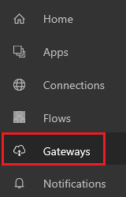

<properties
    pageTitle="Manage your On-Premises Data Gateway | Microsoft PowerApps"
    description="Manage your On-Premises Data Gateway and connections on the Gateway"
    services=""
    suite="powerapps"
    documentationCenter="na"
    authors="archnair"
    manager="erikre"
    editor=""
    tags=""/>
<tags
    ms.service="powerapps"
    ms.devlang="na"
    ms.topic="article"
    ms.tgt_pltfrm="na"
    ms.workload="na"
    ms.date="06/28/2016"
    ms.author="archanan"/>

# Manage your On-Premises data Gateway #

The on-premises data gateway acts as a bridge, providing quick and secure data transfer between on-premises data (data that is not in the cloud) and PowerApps.

If you installed a Gateway or if you were added as an Admin on another Gateway, you will be able to view and manage the Gateway.

**Prerequisites**

- [Sign up](signup-for-powerapps.md) for PowerApps and then sign in.
- You are an Admin on a Gateway (you can either install a Gateway or you can be added as an Admin on another Gateway)

## Install a Gateway ##
1. In the left navigation bar, click or tap Manage, and then click or tap Gateways.

   

1. If you have no Gateway installed or you are not an Admin on any Gateway, you will be able to install a new Gateway by clicking on the "Install a gateway now" link

   

1. For the detailed Gateway installation instructions, click [here]().

**Note**: You can also install a Gateway by clicking or tapping on the **New Gateway** button on the top right of the page.

   

## View and Manage Permissions on the Gateway ##
1. In the left navigation bar, click or tap **Manage**, and then click or tap **Gateways**. Select a Gateway you want to view or manage.

1. Switch to the **Users** tab to add new users to the Gateway. You can specify one of these permission levels for the users:

  Placeholder for Image: Gateways tab and permissions

- Admin: Adminstrator of the Gateway. Has full control.
- Can use: User of the Gateway. Can create new connections on the Gateway.
- Can use + share: User of the Gateway. Can create new connections on the Gateway and has permission to implicitly share the Gateway with other users as a part of app sharing.

## View and Manage Connections on the Gateway ##
1. In the left navigation bar, click or tap **Manage**, and then click or tap **Gateways**. Select a Gateway you want to view or manage.

1. Switch to **Connections** tab to view connections created on the Gateway.

  Placeholder for Image: Connections tab

1. You can select a connection to view details, edit or modify it. You can also choose to share the connection by switching to the **Share** tab and add/remove users to it. See [Manage Connections](./add-manage-connections.md) for more details about connection management.

**Note**: Not all connections are sharable. You can only share "sharable" connections such as SQL.

# Next Steps #
- Create an app using [SQL Server]() or [SharePoint]() on-premises connections
- [Share an app]() that uses on-premises connections
