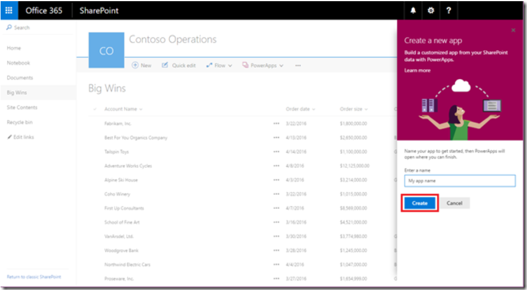
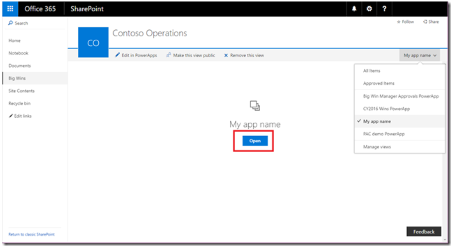
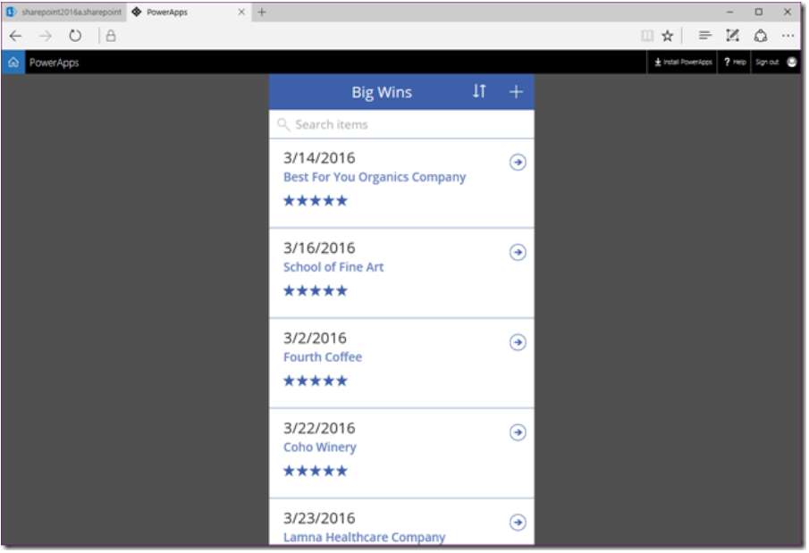

<properties
   pageTitle="Generate an app to manage data from a SharePoint Online list | Microsoft PowerApps"
   description="Generate a three-screen app to manage data from a SharePoint online list, whether the site is on-premises or in the cloud."
   services=""
   suite="powerapps"
   documentationCenter="na"
   authors="RickSaling"
   manager="erikre"
   editor=""
   tags=""/>

<tags
   ms.service="powerapps"
   ms.devlang="na"
   ms.topic="article"
   ms.tgt_pltfrm="na"
   ms.workload="na"
   ms.date="09/29/2016"
   ms.author="ricksal"/>

# Generate an app from the SharePoint Online list interface#
In a SharePoint Online list, create a three-screen app automatically to manage the list.

Last week, the SharePoint team announced the [roll-out of their new modern experience](https://blogs.office.com/2016/07/25/modern-sharepoint-lists-are-here-including-integration-with-microsoft-flow-and-powerapps/) for SharePoint Online ("SPO") lists that will be released to Office 365 First Release customers starting on the first week in August 2016.

As a part of this new modern interface, you will now have the option to **Create a new app** using PowerApps from the command bar of any SPO custom list.

## Prerequisites

If you're unfamiliar with PowerApps, see [Introduction to PowerApps](getting-started.md).

As of this writing, PowerApps supports custom lists but not libraries. In addition, you can show data in some types of columns, such as **Choice** and **Picture**, but you can't update that data. For more information, see [Known issues](connection-sharepoint-online.md#known-issues).

## Create new app
1. If you haven't already created a [connection to SharePoint](connect-to-sharepoint.md), create one.

2. Open your SharePoint Online site.

    

3. Selecting **Create a new app** will open a panel in SharePoint that allows you to enter a name for your app and kick-off the app creation process.

    

4. Selecting **Create** will launch the PowerApps Studio for web in a new browser tab, which will create a default app automatically based the list’s schema and data.  For details on how can you customize and test apps created from SharePoint lists please check out the [Create an app from a SharePoint list tutorial](https://powerapps.microsoft.com/en-us/tutorials/app-from-sharepoint/).

    

5. Apps that are created through this flow will show up as views within the new SharePoint modern list experience.  This will allow you to leverage PowerApps to build custom, mobile-optimized views of your existing lists and share them with your co-workers.  Furthermore, since PowerApps is a cross-platform service, you are able to run the apps you create across all of your devices including Windows, iOS, Android, and the web browser.

    

6. Selecting **Open** from the app’s list view will launch the app in a new tab in the browser.

## Next steps ##
- To save the app that you've just generated, press Ctrl-S.
- To customize the browse screen (which appears by default), see [Customize a layout](customize-layout-sharepoint.md).
- To customize the details or edit screens, see [Customize a form](customize-forms-sharepoint.md).
