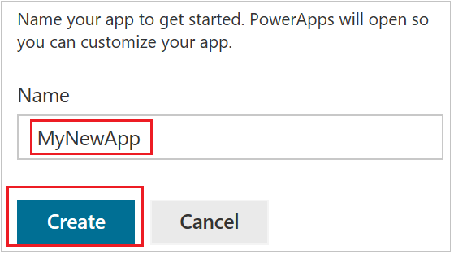
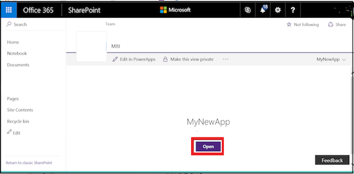
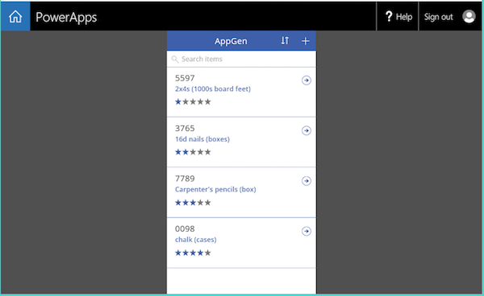

<properties
   pageTitle="Generate an app to manage data from a SharePoint list | Microsoft PowerApps"
   description="Generate a three-screen app to manage data from a SharePoint list, whether the site is on-premises or in the cloud."
   services=""
   suite="powerapps"
   documentationCenter="na"
   authors="RickSaling"
   manager="anneta"
   editor=""
   tags=""/>

<tags
   ms.service="powerapps"
   ms.devlang="na"
   ms.topic="article"
   ms.tgt_pltfrm="na"
   ms.workload="na"
   ms.date="10/18/2016"
   ms.author="ricksal"/>

# Generate an app from the SharePoint Online list interface #

[AZURE.VIDEO nb:cid:UUID:639d7eaf-bae5-447c-a34b-ec539a01a15c]

In a SharePoint Online list, generate a three-screen app that manages the list.

You can **Create an app** using PowerApps from the command bar of any SharePoint Online custom list. Apps generated through this flow show up as views within the new SharePoint modern list experience.  This allows you to leverage PowerApps to build custom, mobile-optimized views of your existing lists and share them with your co-workers. Because PowerApps is a cross-platform service, you can run the apps you generate across all of your devices including Windows, iOS, Android, and the web browser.

For information about what kinds of SharePoint data PowerApps supports, see [Known issues](connection-sharepoint-online.md#known-issues).

## Prerequisites ##
If you're unfamiliar with PowerApps, see [Introduction to PowerApps](getting-started.md).

## Generate an app ##

1. Open a custom list in SharePoint Online, select **PowerApps** on the command bar, and then select **Create an app**.

    

3. In the panel that appears, enter your app name, and then select **Create**.

    

	PowerApps Studio for web opens a new browser tab and creates a default app automatically based on the list’s schema and data.

      

6. Select **Open** from the original SharePoint tab.

	**Note**: You might need to refresh the browser window (for example, by pressing F5) before the app will open.

    

	The app opens in a separate browser tab.

  

## Manage the app ##

- If you click or tap **Edit in PowerApps**, the app opens in a separate browser tab so that you can update the app in PowerApps Studio for the web.
- If you click or tap **Make this view public**, other people in your organization will be able to see it. By default, only you can see views that you create. If you want other people to be able to edit this app, you need to [share it with them](share-app.md) and grant **Contributor** permissions.
- If you click or tap **Remove this view**, you'll remove the view from SharePoint, but the app will still be in PowerApps unless you [delete it](delete-app.md).

## Next steps ##

- [Add and update items in the list](open-app-embedded-in-sharepoint.md).
- To customize the browse screen (which appears by default), see [Customize a layout](customize-layout-sharepoint.md).
- To customize the details or edit screens, see [Customize a form](customize-forms-sharepoint.md).
- If you want to delete this kind of app, remove the view from SharePoint, and [delete the app](delete-app.md) itself from PowerApps.
