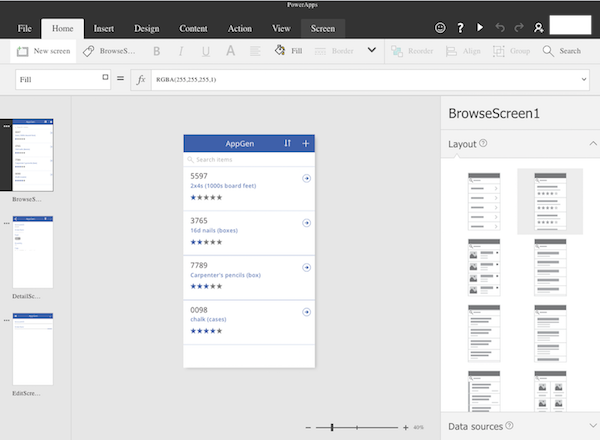

<properties
   pageTitle="Generate an app to manage data from a SharePoint list | Microsoft PowerApps"
   description="Generate a three-screen app to manage data from a SharePoint list, whether the site is on-premises or in the cloud."
   services=""
   suite="powerapps"
   documentationCenter="na"
   authors="RickSaling"
   manager="anneta"
   editor=""
   tags=""/>

<tags
   ms.service="powerapps"
   ms.devlang="na"
   ms.topic="article"
   ms.tgt_pltfrm="na"
   ms.workload="na"
   ms.date="10/05/2016"
   ms.author="ricksal"/>

# Generate an app from the SharePoint Online list interface

In a SharePoint Online list, generate a three-screen app that manages the list.

You can **Create an app** using PowerApps from the command bar of any SharePoint Online custom list. Apps generated through this flow show up as views within the new SharePoint modern list experience.  This allows you to leverage PowerApps to build custom, mobile-optimized views of your existing lists and share them with your co-workers.  Since PowerApps is a cross-platform service, you can run the apps you generate across all of your devices including Windows, iOS, Android, and the web browser.

As of this writing, PowerApps supports custom lists but not libraries. In addition, you can show data in some types of columns, such as **Choice** and **Picture**, but you can't update that data. For more information, see [Known issues](connection-sharepoint-online.md#known-issues).

## Prerequisites

If you're unfamiliar with PowerApps, see [Introduction to PowerApps](getting-started.md).

## Generate a new app

1. Open your SharePoint Online list.

2. Select **Power Apps** and then **Create an app** to open a panel in SharePoint that allows you to enter a name for your app and start the app creation process.

    

3. Enter your app name, then select **Create** to launch the PowerApps Studio for web in a new browser tab, which creates a default app automatically based on the list’s schema and data.

    

4. Your app is generated, and appears in a PowerApps Studio browser tab.

      

6. Select **Open** from the original SharePoint tab to launch the app in a separate browser tab.

    

7. Press Ctrl-S to save the generated app.

  

## Next steps

- To customize the browse screen (which appears by default), see [Customize a layout](customize-layout-sharepoint.md).
- To customize the details or edit screens, see [Customize a form](customize-forms-sharepoint.md).
