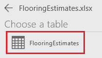

<properties
	pageTitle="Create an app from a set of data | Microsoft PowerApps"
	description="Create an app automatically based on an existing set of data that you specify and then customize the UI to better suit your needs."
	services=""
	suite="powerapps"
	documentationCenter="na"
	authors="AFTOwen"
	manager="dwrede"
	editor=""
	tags=""/>

<tags
   ms.service="powerapps"
   ms.devlang="na"
   ms.topic="get-started-article"
   ms.tgt_pltfrm="na"
   ms.workload="na"
   ms.date="01/06/2015"
   ms.author="anneta"/>

# Create an app from a set of data

[AZURE.VIDEO nb:cid:UUID:d20c445d-1500-80c4-9ad5-f1e5b4e0b87b]

Create an app automatically based on data that you specify, explore how the app works by default, and then customize it to better fit how you work.

**Prerequisites**

- Install [PowerApps](http://aka.ms/powerappsinstall).
- Learn how to [configure a control](get-started-test-drive.md#configure-a-control) in PowerApps.
- Download this [spreadsheet](https://pwrappssamples.blob.core.windows.net/samples/FlooringEstimates.xlsx), and save it in **your** Dropbox account.

For this tutorial, the data source is a table, named **FlooringEstimates**, in an Excel workbook uploaded to a Dropbox account. You can just as easily create an app based on a SharePoint list, a Dynamics CRM table, or a SQL database.

## Specify your data ##

1. Open PowerApps.

	If you haven't opened PowerApps before, select the right-pointing arrow near the lower-right corner to advance through the opening screens, and then sign in.

1. In PowerApps, select **Connections** on the **File** menu (near the left edge of the screen).

	

1. Select **Add connection**.

	

1. Select the kind of data source you want to use, and then select **Connect**.

	

1. Provide your credentials, and then select **Sign in**.

	

1. On the **File** menu, select **New**.

	

1. Under **Start from your data**, select **Get started**.

	

1. Specify the data source that you want to use, as in this example:  

	a. Under **My Connections**, select **Dropbox**.  

	  

	b. Under **Select an Excel file**, select the flooringestimates.xlsx file, and then select **Connect**.  

	  

	c. Under **Select a table**, select the **FlooringEstimates** table, and then select **Connect**.  

	  

Your app is built. Simple? Absolutely.

## Customize the app ##
When an app is built automatically, heuristics are used to suggest the best layout and content based on the data. You might need to adjust the default settings to optimize the app for your needs.

1. If **BrowseScreen1** isn't already showing, show it by selecting its thumbnail in the left navigation pane.

	

1. If the **Quick tools** pane isn't already showing, show it by selecting **Quick tools** near the lower-right corner.

	

1. In the **Quick tools** pane, select the **Layout** tab, and then select the option that includes icons.

	

	The layout of **BrowseScreen1** changes to reflect your selection.

	

	**Note:** If you open the **Layout** tab with **DetailScreen1** or **EditScreen1** showing, you can select different options, which reflect the data on that screen.

1. In the **Quick tools** pane, select the **Content** tab.

1. Select **Name** in the **Heading1** list, select **ImageURL** in the **Image1** list, and select **Category** in the **Subtitle1** list.

	

	The content of **BrowseScreen1** changes to reflect your selections.

	

	**Note:** By default, you can scroll through the list (called a gallery) by using a mousewheel or by swiping up and down. To show the scrollbar, [set the gallery's **ShowScrollbar** property](get-started-test-drive.md#configure-a-control) to **true**. 

1. In the **Quick tools** pane, select the **Theme** tab, and then select a different theme, such as **Lavender**.

	

	As the thumbnails in the left navigation bar show, each screen in the app changes to reflect your selection.

	

## Run the app ##
1. With **BrowseScreen1** showing, open Preview by pressing F5 or by selecting the Preview icon near the upper-right corner.

	

1. On **BrowseScreen1**, select the arrow for a record to show details about that record.

	

1. On **DetailsScreen1**, select the edit icon (in the upper-right corner) to edit the record.

	

1. On **EditScreen1**, change the information in one or more fields, and then select the checkmark in the upper-right corner to save your changes.

	

## Next steps ##

- You can further customize your app by performing similar tasks to those that [Create an app from scratch](get-started-) describes.
- [Save and share your app](get-started-test-drive.md#save-and-share-your-powerapp) with other people.
