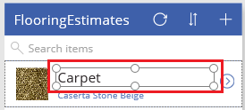
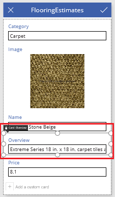

<properties
	pageTitle="Generate an app from Excel data | Microsoft PowerApps"
	description="Create an app automatically based on an Excel file in the cloud, customize the app, and then explore how it works."
	services=""
	suite="powerapps"
	documentationCenter="na"
	authors="sarafankit"
	manager="anneta"
	editor=""
	tags=""/>

<tags
   ms.service="powerapps"
   ms.devlang="na"
   ms.topic="get-started-article"
   ms.tgt_pltfrm="na"
   ms.workload="na"
   ms.date="10/16/2016"
   ms.author="ankitsar"/>

# Generate an app from Excel data #
Create an app based on data stored in an Excel file in the cloud. After the app is generated, you can customize it and then run it to make sure it works the way you want.

This topic describes how to create an app by using PowerApps Studio for Windows, but the steps are similar if you open [PowerApps Studio in a browser](create-app-browser.md).

**Note**: You can also generate an app based on a [custom SharePoint list](app-from-sharepoint).

# Prerequisites #
- [Sign up](signup-for-powerapps.md) for PowerApps, [install](http://aka.ms/powerappsinstall) it, and sign in using the same credentials that you used to sign up.

- Download this [Excel file](https://az787822.vo.msecnd.net/documentation/get-started-from-data/FlooringEstimates.xlsx). The steps in this tutorial are based on using this file.

	**Important**: If you decide to use your own Excel file, make sure that the data is formatted as a table. For more information, see [Create an Excel table in a worksheet](https://support.office.com/en-us/article/Create-an-Excel-table-in-a-worksheet-E81AA349-B006-4F8A-9806-5AF9DF0AC664).

- Upload the Excel file to a [cloud storage account](cloud-storage-blob-connections.md), such as OneDrive. The steps in this tutorial show how to use OneDrive, but the process is similar for other type of cloud storage accounts.

By default, every app that PowerApps creates has three screens:

- **BrowseScreen1** shows a subset of one or more fields, a search bar, and a sort button that lets users easily find a specific record.
- **DetailsScreen1** shows more or all fields for a specific record.
- **EditScreen1** provides UI elements that let users create or update a record and save the changes.

## Create an app ##
1. In PowerApps Studio, click or tap **New** on the **File** menu (near the left edge).

	

2. Follow any of these steps:
	- If a tile for your cloud account appears under **Start with your data**, click or tap **Phone layout**.

 	

	- If your cloud storage account doesn't appear under **Start with your data** or in the row of connections, click or tap **New connection**, and then click or tap the entry for your cloud account. Click or tap **Connect** and follow the prompts to configure the connection.

	

3. Under **Choose an Excel file**, browse to **FlooringEstimates.xlsx**, and then click or tap it.

	  

	**Note**: If you created your own Excel file, browse to the location of that file, and then click or tap it.

4. Under **Choose a table**, click or tap **FlooringEstimates**.  

	

5. Click or tap **Connect** to generate the app.

6. If you're prompted to take an introductory tour, click or tap **Next** to get familiar with key areas of the PowerApps user interface (or click or tap **Skip**).

	

	**Note**: You can always take the tour later by clicking or tapping the question-mark icon near the upper-right corner and then clicking or tapping **Take the intro tour**.

## Change the app layout ##
When a new app is created, it automatically applies a layout based by the Excel data you provided. You can always customize the layout of the app to fit your needs.

1. In the left navigation bar, click or tap the top thumbnail to ensure that the browse screen (**BrowseScreen1**) is selected.

2. In the right pane, with the **Layout** tab open, click or tap the layout you want to use.

	

3. Select the layout that includes headers, pictures, and descriptions.

	

	The layout of the app changes to show a header, picture, and description for each record.

	

## Change the data that appears ##
1.  Under **Search items** in the app you're creating, click or tap **Carpet** to select the **Text box** control and the associated list in the right pane.

	

2. In the right pane, open the highlighted list, and then click or tap **Name** in the dropdown list.

	

3. Open the bottom list (closest to the bottom of the screen), and then click or tap **Category**.

	

	**Browsescreen1** changes to show the name and category for each record.

	

	**Note**: By default, you can scroll through the list (called a gallery) by using a mouse wheel or by swiping up and down. To use a trackpad (or, a mouse without a wheel), select the gallery, click or tap **Show Scrollbar** in the property list, and replace **false** with **true** in the formula bar.

## Change the order of fields in a form ##
1. Click or tap the middle thumbnail in the left navigation bar to open the details screen (**DetailsScreen1**).

	

2. Click or tap the image to show options that are available to customize the form.

	

3. In the right pane, drag the **Name** field to the top of the list.

	

	The screen updates to reflect the changes you made.

	

## Change a control ##
1. In the left navigation bar, click or tap the bottom thumbnail to open the edit screen (**EditScreen1**).

	

2. Click or tap **Overview**.

	This step selects the Overview card on the screen. Each card contains text that describes the purpose of the card. You can also customize the controls on a card.

	

3. In the right pane, click or tap the down arrow for the card, scroll down, and then click or tap **Edit multi-line text**.

	This step shows an overview of each product in a control that's large enough to display the text.

	

**Note**: For more information, see [Card control in PowerApps](controls/control-card.md).

## Run the app ##
As you customize an app, you can test your changes by running the app in Preview mode.

1. In the left navigation bar, click or tap the top thumbnail to open the browse screen (**BrowseScreen1**).

2. Open Preview mode by pressing F5, or by clicking or tapping the **Play** button near the upper-right corner.

	

3. On **BrowseScreen1**, click or tap the arrow to the right of a record to show the record on the details screen (**DetailsScreen1**).

	

4. On **DetailsScreen1**, in upper-right corner, click or tap the pencil icon to show the record on the edit screen (**EditScreen1**).

	

5. On **EditScreen1**, change the information in one or more fields, and then click or tap the check mark to save your changes.

	

6. Close Preview mode by pressing Esc (or by clicking or tapping the close icon below the title bar).

	

## Next steps ##
- To save the app so you can run it from other devices, press Ctrl-S.
- Now that you've learned how to create an app, you can  [create an app from scratch](get-started-create-from-blank.md).
- [Share the app](share-app.md) so that other people can run it.
