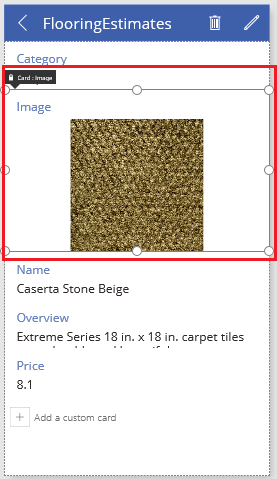
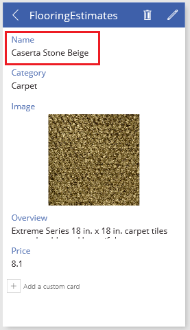

<properties
	pageTitle="Generate an app from Excel data | Microsoft PowerApps"
	description="Create an app automatically based on an Excel file in the cloud, customize the app, and then explore how it works."
	services=""
	suite="powerapps"
	documentationCenter="na"
	authors="sarafankit"
	manager="anneta"
	editor=""
	tags=""/>

<tags
   ms.service="powerapps"
   ms.devlang="na"
   ms.topic="get-started-article"
   ms.tgt_pltfrm="na"
   ms.workload="na"
   ms.date="10/16/2016"
   ms.author="ankitsar"/>

# Generate an app from Excel data #
You can automatically create an app to manage data that is stored in an Excel file in the cloud. After the app is generated, you can customize it and then test it to make sure it works the way you want.

This topic describes how to automatically create an app using PowerApps Studio for Windows, but the steps are similar if you are using [PowerApps Studio for web](create-app-browser.md).

Before you can create an app, you must [sign up](signup-for-powerapps.md) for PowerApps, and [install](http://aka.ms/powerappsinstall) it. When you open PowerApps, sign in using the same credentials that you used to sign up.

You have the option to use an Excel sample file provided by PowerApps to generate an app, or you can create your own Excel file. To use the sample file, download the [Flooring Estimates](https://az787822.vo.msecnd.net/documentation/get-started-from-data/FlooringEstimates.xlsx) sample file to a [cloud storage account](cloud-storage-blob-connections.md), such as OneDrive.

**Important**: If you decide to use your own Excel file, make sure that the data is formatted as a table. For more information, see [Create an Excel table in a worksheet](https://support.office.com/en-us/article/Create-an-Excel-table-in-a-worksheet-E81AA349-B006-4F8A-9806-5AF9DF0AC664).

By default, every app that PowerApps creates has three screens:

- The browse screen shows a subset of one or more fields, a search bar, and a sort button that lets users easily find a specific record.
- The details screen shows more or all fields for a specific record.
- The edit screen provides UI elements that let users create or update a record and save the changes.

## Create an app ##
1. In PowerApps Studio for Windows, click or tap **New** on the **File** menu (near the left edge).

	

2. Under **Start with your data**, on the tile where your cloud storage account appears, click or tap **Phone layout**.

 

3. If there is no tile for your cloud storage account under **Start with your data**, click the arrow at the end of the row of connection tiles, find your tile in the row, and then click or tap **Phone layout** on the tile.

	**Note** If you cannot find your cloud storage account in the row of connections, click or tap **New connection**, and then click or tap the entry for your cloud account. Click or tap **Connect** and configure the connection.

	

4. Under **Choose an Excel file**, browse to **FlooringEstimates.xlsx**, and then click or tap it. If you created your own Excel file, browse to the location of that file, and then click or tap to open it.

	  

5. Under **Choose a table**, click or tap **FlooringEstimates**.  

	

6. Click or tap **Connect** to generate the app.

7. If you're prompted to take an introductory tour, click or tap **Next** to get familiar with key areas of the PowerApps user interface (or click or tap **Skip**). You can always take the tour later by clicking or tapping the question-mark icon near the upper-right corner, and then clicking or tapping **Take the intro tour**.

## Customize the app layout ##
The new app is created using a layout determined by the Excel data you provided. You can always customize the layout of the app after it is created.

- In the right pane, under **Layout**, click or tap the layout you want to use. For example, you may want to select a layout that shows headers, pictures, and descriptions of each record.

	

	The layout changes to show a header, picture, and description for each record.

	

## Change the data displayed in the app ##
1.  Under the search box in the app created from FlooringEstimates.xlsx, click or tap **Carpet** to select the **Text box** control.

	

2. In the right pane, open the highlighted list, and then click or tap **Name** in the dropdown list.

	

3. Click or tap **Category**.

	

	The browse screen changes to show the name and category for each record.

	

4. Optional: If the users of this app won't have touchscreens or mouse wheels, click or tap the **Gallery** tab, and then click or tap **Show Scrollbar**. If the **Gallery** tab doesn't appear, make sure that the gallery is still selected.

## Change the order of fields in a form ##
1. If the details screen is not shown, click or tap the middle thumbnail in the left navigation bar.

	

2. Click or tap the image to show options that are available to customize the form.

	

3. In the right pane, drag the **Name** field to the top of the list.

	

	The details screen is updated to show the **Name** field at the top.

	

## Change a control ##
1. In the left navigation bar, click or tap the bottom thumbnail to open the edit screen.

	

2. Click or tap **Overview** to select the card.

	

3. In the right pane, click or tap the down arrow for the card, scroll down, and then click or tap **Edit multi-line text**. This shows an overview of each product in a control that's large enough to display the text.

	

**Note** For more information, see [Card control in PowerApps](controls/control-card.md).

## Run the app ##
As you customize an app, you can test your changes by running the app in Preview mode.

1. In the left navigation bar, click or tap the top thumbnail to open the browse screen.

2. Open Preview mode by pressing F5, or by clicking or tapping the **Play** button near the upper-right corner.

	

3. In the browse screen, click or tap the arrow to the right of a record to show the record on the details screen.

	

4. In upper-right corner, click or tap the pencil button to show the record on the edit screen.

	

5. Change the information in one or more fields, and then click or tap the check mark button to save your changes.

	

6. Close Preview mode by pressing Esc (or by clicking or tapping the close icon below the title bar).

	

## Next steps ##
- Make sure you save your app so you can run it from other devices.
- Make additional changes to your app, such as [creating an app from scratch](get-started-create-from-blank.md).
- [Share the app](share-app.md) so that other people can run it.
