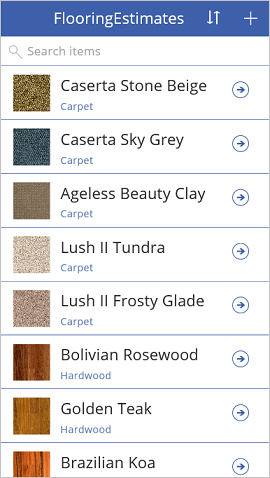

<properties
	pageTitle="Create an app from a set of data | Microsoft PowerApps"
	description="Create an app automatically based on an existing set of data that you specify and then customize the UI to better suit your needs."
	services=""
	suite="powerapps"
	documentationCenter="na"
	authors="AFTOwen"
	manager="dwrede"
	editor=""
	tags=""/>

<tags
   ms.service="powerapps"
   ms.devlang="na"
   ms.topic="get-started-article"
   ms.tgt_pltfrm="na"
   ms.workload="na"
   ms.date="01/06/2015"
   ms.author="anneta"/>

# Create an app from a set of data

Create an app automatically based on data that you specify, explore how the app works by default, and then customize it to better fit how you work.

**Prerequisites**

- Install [PowerApps](http://aka.ms/powerappsinstall), and learn how to [configure a control](add-configure-controls.md).
- If you don't have a Dropbox account, create one.
- Download this [spreadsheet](https://pwrappssamples.blob.core.windows.net/samples/FlooringEstimates.xlsx), and save it in your Dropbox account.

For this tutorial, the data source is a table, named **FlooringEstimates**, in an Excel workbook uploaded to a Dropbox account. You can just as easily create an app based on a [SharePoint list](app-from-sharepoint.md), [a Dynamics CRM table](app-from-dynamics.md), or [Salesforce data](app-from-saleforce.md).

## Specify your data ##

1. Open PowerApps.

	If you haven't opened PowerApps before, swipe left or click the right-pointing arrow near the lower-right corner to advance through the opening screens, and then sign in.

1. In PowerApps, click or tap **Connections** on the **File** menu (near the left edge of the screen).

	

1. Click or tap **Available connections**, click or tap **Dropbox**, and then click or tap **Connect**.

	

1. Provide your credentials, and then click or tap **Sign in**.

	

1. On the **File** menu, click or tap **New**.

	

1. Under **Start from your data**, click or tap **Get started**.

	

1. Under **My Connections**, click or tap **Dropbox**.  

	  

1. Under **Select an Excel file**, select the flooringestimates.xlsx file, and then select **Connect**.  

	  

	c. Under **Select a table**, select the **FlooringEstimates** table, and then select **Connect**.  

	  

Your app is built. Simple? Absolutely.

## Customize the app ##
When an app is built automatically, heuristics are used to suggest the best layout and content based on the data. You might need to adjust the default settings to optimize the app for your needs.

1. If **BrowseScreen1** isn't already showing, show it by clicking or tapping its thumbnail in the left navigation pane.

	

1. If the **Quick tools** pane isn't already showing, show it by clicking or tapping **Quick tools** near the lower-right corner.

	

1. In the **Quick tools** pane, click or tap the **Layout** tab, and then click or tap an option that includes icons.

	

	The layout of **BrowseScreen1** changes to reflect your selection.

	

	**Note:** If you open the **Layout** tab with **DetailScreen1** or **EditScreen1** showing, you can choose different options, which reflect the data on that screen.

1. In the first item in the list on the **BrowseScreen**, set the **Image** property of the image control to **ThisItem.ImageURL**.

	

1. Set the **Text** property of **Heading1** to **ThisItem.Name**, and set the **Text** property of **Subtitle1** to **ThisItem.Category**.

	The content of **BrowseScreen1** changes to reflect your selections.

	

	**Note:** By default, you can scroll through the list (called a gallery) by using a mousewheel or by swiping up and down. To show the scrollbar, [set the gallery's **ShowScrollbar** property](get-started-test-drive.md#configure-a-control) to **true**.

1. In the **Quick tools** pane, click or tap the **Theme** tab, and then click or tap a different theme, such as **Lavender**.

	

	As the thumbnails in the left navigation bar show, each screen in the app changes to reflect your selection.

	

1. (optional) To sort and filter the list by name instead of by category, set the **Items** property of the gallery to this formula:
 **Sort(If(IsBlank(TextSearchBox1.Text), FlooringEstimates, Filter(FlooringEstimates, TextSearchBox1.Text in Text(Name))), Name, If(SortDescending1, Descending, Ascending))**

## Run the app ##
1. With **BrowseScreen1** showing, open Preview by pressing F5 (or by clicking or tapping the Preview icon near the upper-right corner).

	

1. On **BrowseScreen1**, click or tap the arrow for a record to show details about that record.

	

1. On **DetailsScreen1**, click or tap the edit icon (in the upper-right corner) to edit the record.

	

1. On **EditScreen1**, change the information in one or more fields, and then select the checkmark in the upper-right corner to save your changes.

	

## Next steps ##

- You can further customize your app by performing similar tasks to those that [Create an app from scratch](get-started-) describes.
- [Save and share your app](get-started-test-drive.md#save-and-share-your-powerapp) with other people.
