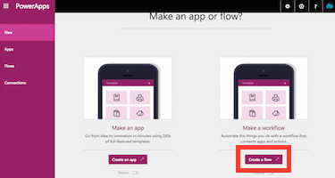
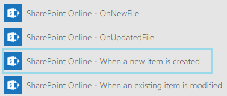

<properties
    pageTitle="PowerApps: Create a PowerFlow"
    description="Create a PowerFlow to automate routine tasks in your workflow, such as sending email when an item is added to a list in Excel or SharePoint."
    services="powerapps"
    documentationCenter="na"
    authors="AFTOwen"
    manager="dwrede"
    editor=""
    tags=""/>

<tags
    ms.service="powerapps"
    ms.devlang="na"
    ms.topic="get-started-article"
    ms.tgt_pltfrm="na"
    ms.workload="na"
    ms.date="10/21/2015"
    ms.author="anneta"/>

# Create a PowerFlow #
Create a PowerFlow to take action when something happens. For example, create a PowerFlow so that you get an email message whenever someone adds a row to a SharePoint list. In this example, the condition (or trigger) is that a row was added, and the action is that you were sent mail.

**Prerequisites**

- An account, such as Dropbox, OneDrive, or SharePoint, for storing files in the cloud
- An Office 365 account (from which you can send email)
- Chrome browser

## Create a trigger

1. In Chrome, open [the PowerApps portal](https://portal.kratosapps.com/), and then click **Create a flow**.

    

3. Click **Create from blank**.

    

4. In the text box that says **How would you like to start?**, type **SharePoint**.

1. In the list of actions, click **SharePoint Online - When a new Item is added in a List**

    

5. If you haven't already connected your SharePoint Online account to PowerApps, click **Sign in to SharePoint**, and then provide your credentials.

6. In the **SITE URL** box, type or paste the URL of the SharePoint site that contains the list you want to use.

  **Important:** Include only the site URL, not the full path of the list.

  

1. Under **LIST NAME**, click the down arrow to show the names of all lists in the site you specified.

  

  **Note:** If **Could not retrieve values** appears, correct your site URL.

8.  Click the name of a list, name your PowerFlow in the box near the bottom of the screen, and then click **Done**.

    

## Create the action ##
In this procedure, you'll add an action to send email in your PowerFlow, and then you'll test that action. By following these steps, you'll learn the basics of actions and how to pass parameters between steps in your PowerFlow to make it work the way you want.

1. In the list of PowerFlows, click the edit icon, which looks like a pencil, next to the PowerFlow that you created in the previous procedure.

2. Click the "+" button, and then click **Add action**

    

2. In the box that shows **What would you like to do next?**, type or paste **send email**, and then click **Office365 - Send Email**.

  

1. If prompted, provide your Office 365 credentials.

4. In the form that appears, type a subject in the **Subject** box and your email address in the **To** box.

    

5. In the **Body** box, type or paste **Item added to a list:**, and then click a parameter (such as **Title**) to add a placeholder for it to your message.

  **Note:** The available parameters reflect the column headings of whatever list you specify.

    

4. Type the end of your message, including any other parameters you want to include, and then click **Done** at the bottom of the screen.

    The list of flows reflects your changes.

## Test your PowerFlow ##

1. On the main page for the SharePoint Online list, click **new item**.

    

3. Specify data in each field, and then click **Save**.

    Within a minute, an email notifies you of the changes.

## Next Steps ##

- [Add steps](advanced-parameters-powerflow.md), such as different ways to be notified, to your PowerFlow.
