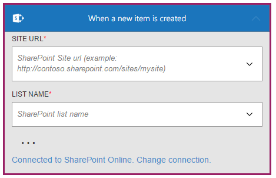

<properties
    pageTitle="KratosApps tutorial: Create a PowerFlow"
    description="Create a PowerFlow to take action when one or more conditions are met. For example, get an email whenever someone adds a row to a Sharepoint list."
    services="kratosapps"
    authors="aftowen"
 />

<tags
   ms.service="kratosapps"
   ms.devlang="na"
   ms.topic="get-started-article"
   ms.tgt_pltfrm="na"
   ms.workload="na"
   ms.date="10/06/2015"
   ms.author="anneta"/>

# Create a PowerFlow #
Create a PowerFlow to take action when something happens. For example, create a PowerFlow so that you get an email message whenever someone adds a row to a SharePoint List. In this example, the condition (or trigger) is that a row was added, and the action is that you were sent mail.

**Prerequisites**

- [KratosApps](https://www.kratosapps.com/)
- An account, such as Dropbox, OneDrive, or SharePoint, for storing files in the cloud
- An Office 365 account (from which you can send email)

## Create a trigger

1. Open KratosApps, and then click **Create a flow** in the landing page.

    

3. Click **Create from blank**.

    

4. In the text box that says **Start your logic**, type **SharePoint**, and then click **When a new item is added in a list** in the set of actions.

    

5. If you haven't already connected your SharePoint Online account to **PowerApps**, you'll need to click **Sign in to SharePoint** and provide your credentials. 

6. Paste in the URL of the SharePoint site that you want to connect to. Be sure to include just the site URL and not the full path of the list

    

7. Click in the **List name** box and the Lists in that SharePoint site will appear. If it says "**Could not retrieve values**", double check your site URL, it is not correct.

    

8. Enter a name for your flow in the **Flow name** text box near the bottom of the screen. 

7. Save your PowerFlow by clicking **Done** near the bottom of the screen.

    

## Create the action ##
In this procedure, you'll add an action to send email in your PowerFlow and then you'll test that action. By following these steps, you'll learn the basics of actions and how to pass parameters between steps in your PowerFlow to make it work the way you want.

1. In the list of PowerFlows, click the edit icon next to one that you created in the previous procedure (the *pencil* icon).

2. Click the "+" button and select **Add action**

    

2. In the list of actions, search for **Send email**, and click it. As with SharePoint, if you haven't already connected to Office 365, you will need to provide the credentials for your account too.

    

4. In the form that appears, type your email address in the **To** field and a subject in the **Subject** field.

    

5. Type **Item added to a list:** in the **Body** field, and then click **Title** in the list of parameters.

    A placeholder for the title of the SharePoint item appears in your message.

    

4. Type the end of your message, including any other fields you want to include, and then click **Done**.

    The list of flows reflects your changes.

## Test your PowerFlow ##

1. Open the SharePoint online list..
2. On the main page for the list, click **new item**

    

3. Specify data in each field of the list item, and click Save.

    Within a minute, you'll receive an email that notifies you of the changes in SharePoint.

## Next Steps ##

- [Add additional steps](advanced-parameters-powerflows.md) Add more steps, such as different ways to be notified, to your PowerFlow.