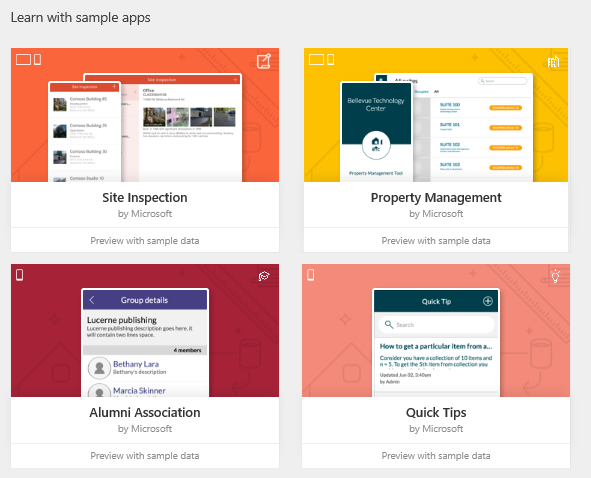

<properties
	pageTitle="Get started | Microsoft PowerApps"
	description="Quick ways to get started creating and using custom business apps with Microsoft PowerApps"
	services=""
	suite="powerapps"
	documentationCenter="na"
	authors="aftowen"
	manager="erikre"
	editor=""
	tags=""/>

<tags
   ms.service="powerapps"
   ms.devlang="na"
   ms.topic="hero-article"
   ms.tgt_pltfrm="na"
   ms.workload="na"
   ms.date="07/29/2016"
   ms.author="anneta"/>

# Get started with PowerApps #
Welcome! In PowerApps, you can run apps that others have created and shared with you, and you can create apps based on your own data.

## Run a shared app ##
If someone else created an app and shared it with you, open [powerapps.com](https://web.powerapps.com), follow the prompts to sign up, and then run the shared app in either of these ways:

- [in a browser](run-app-browser.md)
- [on a mobile device](run-app-client.md)

**Note**: You'll need a work or school account to sign up for PowerApps. If you have trouble, see [Sign up for PowerApps](signup-for-powerapps.md).

## Overview of app creation ##
If you want to create your own app, you can start by generating a simple app automatically based on a data source, such as one of these:

- the Microsoft Common Data Model
- SharePoint list
- SQL Server database
- Salesforce
- Dynamics CRM

After you specify your data source, PowerApps creates a mobile app that has three screens: one each for browsing a list of records, viewing details about a specific record, and adding or updating records.

For an overview of automatic app generation, **watch this video**  (fewer than three minutes). It introduces not only automatic app generation but also the Common Data Model, a data source that's built-in to PowerApps.

[AZURE.VIDEO nb:cid:UUID:e0d83908-aedd-4db3-8ea9-2dbd4695c662]

If a generated app doesn't meet your exact needs by default, you can customize it. You might, for example, want to show different data in a particular UI element (known as a control). For more information, **watch this video** (fewer than two minutes):

[AZURE.VIDEO nb:cid:UUID:4d7820d2-ecba-4e67-bec9-ab80cc6e4528]

After you've generated an app or two automatically and gained some experience with customization, you might want to move on to building an app from scratch. You have more flexibility in app design, flow, and controls, and you can incorporate a larger variety of [data sources](connections-list.md). To understand how you might build an app from scratch, **watch this video** (fewer than three minutes).

[AZURE.VIDEO nb:cid:UUID:5e58b2b8-44a0-467f-b6ec-58dee9fd925a]

## Open PowerApps ##
When you're ready to explore PowerApps in more depth, open [powerapps.com](https://web.powerapps.com), and then follow the prompts to sign up.

**Note**: You'll need a work or school account to sign up for PowerApps. If you have trouble, see [Sign up for PowerApps](signup-for-powerapps.md).

On the **Home** tab of [powerapps.com](https://web.powerapps.com), you can open any apps that others have created and shared with you. After you create one or more apps, they'll also appear on this page. If you're looking for inspiration, you can [open a sample app](open-and-run-a-sample-app.md) to get an idea what you can create in PowerApps with some creativity and a bit of experience.

For now, click or tap **New app** at the bottom of the left navigation bar, and then choose one of these options (depending on your operating system):

- Download and install PowerApps Studio for Windows.
- Open PowerApps Studio for web in a browser.

**Note**: You can do most things in either version, but the current release of PowerApps Studio for web has some [limitations](create-app-browser.md).

In PowerApps Studio, you can generate an app automatically, customize an app, and build an app from scratch, as described earlier. For step-by-step examples, see these topics:

- [Generate an app](app-from-sharepoint.md) (from SharePoint).
- [Customize an app](customize-card.md).
- [Build an app from scratch](get-started-create-from-blank.md)  (from Excel in the cloud).

## Get creative ##
As you gain experience, you might want to create more complex apps. To discover additional possibilities, you can [build an app from a template](get-started-test-drive.md) (PowerApps Studio for Windows only). Each template is based on fictitious data in a cloud account, such as Dropbox, OneDrive, or Google Drive. Explore specific screens and controls to understand how they're configured, and experiment with customization to build expertise that you can apply to your own apps.

Whether you open a sample app, create an app from a template, or just experiment with your own apps, you'll see a variety of concepts in action. These topics provide detailed explanations of those concepts:

- [formulas](formula-reference.md)
- [galleries and forms](working-with-forms.md)
- [tables and records](working-with-tables.md)
- [controls and their properties](reference-properties.md)

## Questions? Ideas? We're here to help ##
We're excited to see what you can do with PowerApps, and we want to make sure that you have a great experience. Check out the detailed tutorials here for more help, and [join our community](https://aka.ms/powerapps-community) to ask questions and share your ideas. [Contact support](https://aka.ms/pasupport) if you run into any issues.
