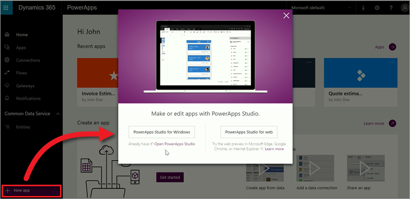
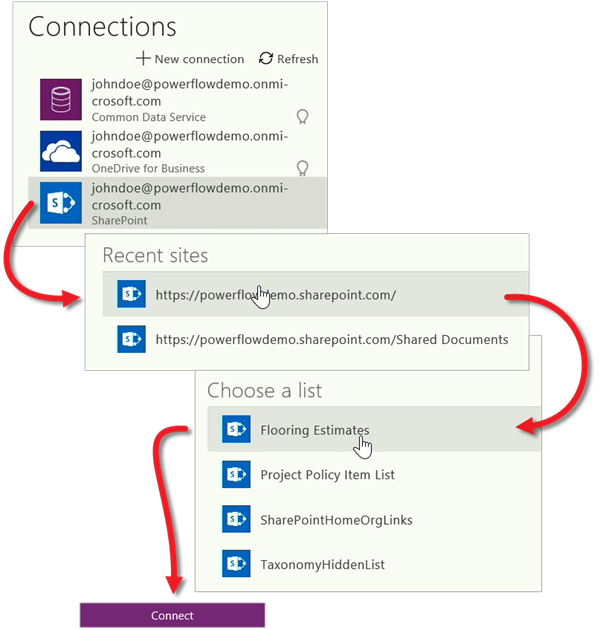

<properties
   pageTitle="Create your first app | Microsoft PowerApps"
   description="Generate an app from a SharePoint list"
   services=""
   suite="powerapps"
   documentationCenter="na"
   authors="mgblythe"
   manager="anneta"
   editor=""
   tags=""
   featuredVideoId="ixRpT48Z6IQ"
   courseDuration="5m"/>

<tags
   ms.service="powerapps"
   ms.devlang="na"
   ms.topic="get-started-article"
   ms.tgt_pltfrm="na"
   ms.workload="na"
   ms.date="12/09/2016"
   ms.author="mblythe"/>

# Create your first app in PowerApps
You are now familiar with all the parts of PowerApps and the options for creating apps, so it's time to actually build an app. For this topic, we'll generate a phone app from a SharePoint Online list, but you could use data from lots of other sources, including Excel, cloud services like SalesForce, and on-premises sources like SQL Server.

## Connect to a data source
The first step in generating an app from data is to choose which PowerApps Studio to use, then connect to your data source. In web.powerapps.com, click or tap **New app**, then choose whether to use PowerApps Studio for Windows or PowerApps Studio for web.

In PowerApps Studio you have the option of starting from data, from a template, or from scratch. We're building a phone app for a SharePoint list, so under **SharePoint** click or tap **Phone layout**. 

Generated apps are always based on a single list or table (you can add more data to the app later). The next three screens take you through the process of connecting to the **Flooring Estimates** list in SharePoint Online.

After you click **Connect**, PowerApps starts to generate the app. PowerApps makes all sorts of inferences about your data so that it generates a useful app as a starting point.

## Explore the generated app
Success! Your new three screen app opens in PowerApps Studio. All apps generated from data have the same set of screens:

- The **browse** screen: where you browse, sort, filter, and refresh the data pulled in from the list, as well as add items by clicking the (+) icon.
- The **details** screen: where you view more detail about an item, and can choose to delete or edit the item.
- The **edit/create** screen: where you edit an existing item or create a new one.

Click or tap on each screen in the left navigation bar.

Click or tap  in the top right to run the app. If you navigate through the app, you see that it includes all the data from the list and provides a good default experience.

Wow, that was pretty easy! In a few minutes you learned how to connect to a data source, generate an app, and get acquainted with PowerApps Studio and the three app screens. In later sections, you'll see how to customize generated apps. In the next topic we review this section of the course and get you ready for future lessons.

