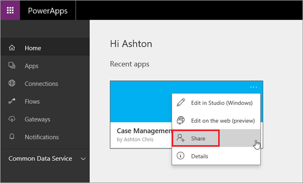
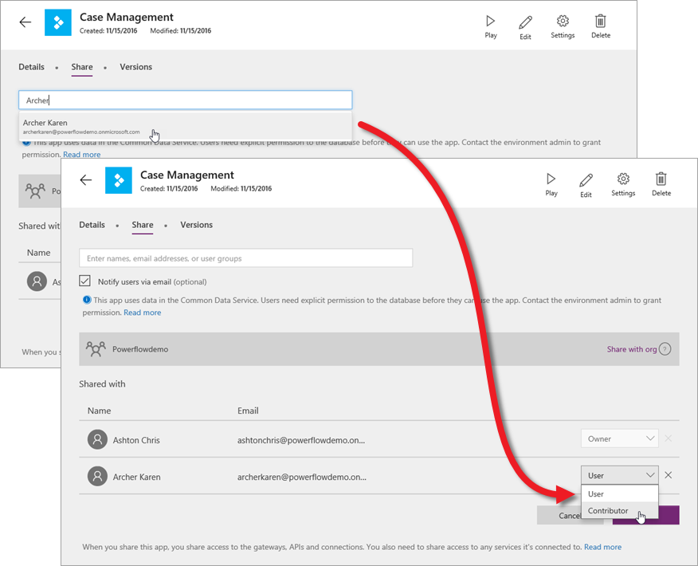
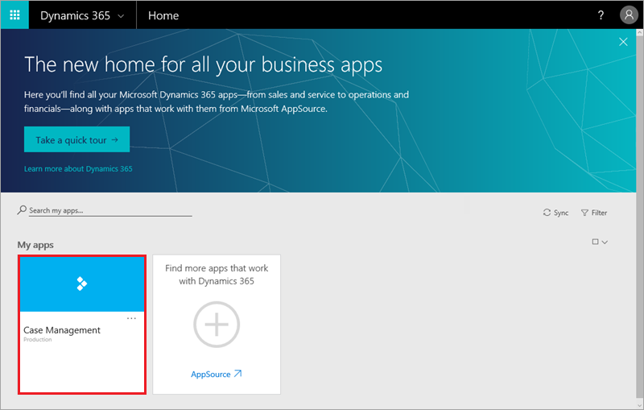

# Share your apps
It's great to build apps that address your own business needs, but the real magic of PowerApps comes from sharing those apps with others. Now that you know how to build an app, in this topic you will learn how to share it. You can share an app with specific users or groups, or you can share it with your entire organization. When you share an app with someone, they can run it from Dynamics 365 in a browser or in PowerApps Mobile for Windows, iOS, or Android. If you give someone contributor permissions, they can also update the app.

## Prepare to share an app
You must save an app to the cloud before you can share it with anyone. Give the app a meaningful name and description, so people know what your app is about and can easily pick it out from a list. In PowerApps Studio, click or tap **File**, then enter a description.

Be aware that any changes you make to a shared app will flow through to the people you shared it with as soon as you save the changes. This can be great if you improve the app, but can also impact others if you remove or significantly change features.

## Share an app
In web.powerapps.com, on an app tile, click the ellipsis (. . .), and then click **Share**.

From here, you can share an app and also control app versioning, which we'll cover in the next topic. Specify the users and groups to share the app with and what role they should each have - **User** or **Contributor**. Click or tap **Save**.

If you choose to notify users via email, everyone you shared the app with receives an email with a link to Dynamics 365. App contributors also receive a link to web.powerapps.com.  If someone doesn't follow the link to Dynamics 365, the app will not show up for them there. It will be in AppSource, but they'll have to add it to Dynamics 365 themselves.

## Permissions and licensing
We're not going to get into detail about permissions and licensing, but we want to cover a couple of basics related to sharing:

* Users and contributors need permissions to any data connections and gateways that a shared app uses. Some permissions come along implicitly with the app, but others must be explicitly granted.
* If the app uses Common Data Service entities, users and contributors need access to the Common Data Service database. Contributors also need a PowerApps "P2" license if they work directly with entities.

Sharing apps is easy, and it's a great way to take an app that you find useful and make it available to people across your organization. In the next topic we'll explain how to control which version of an app is active when you use and share the app.

