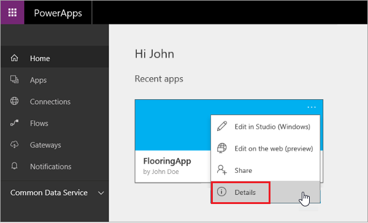
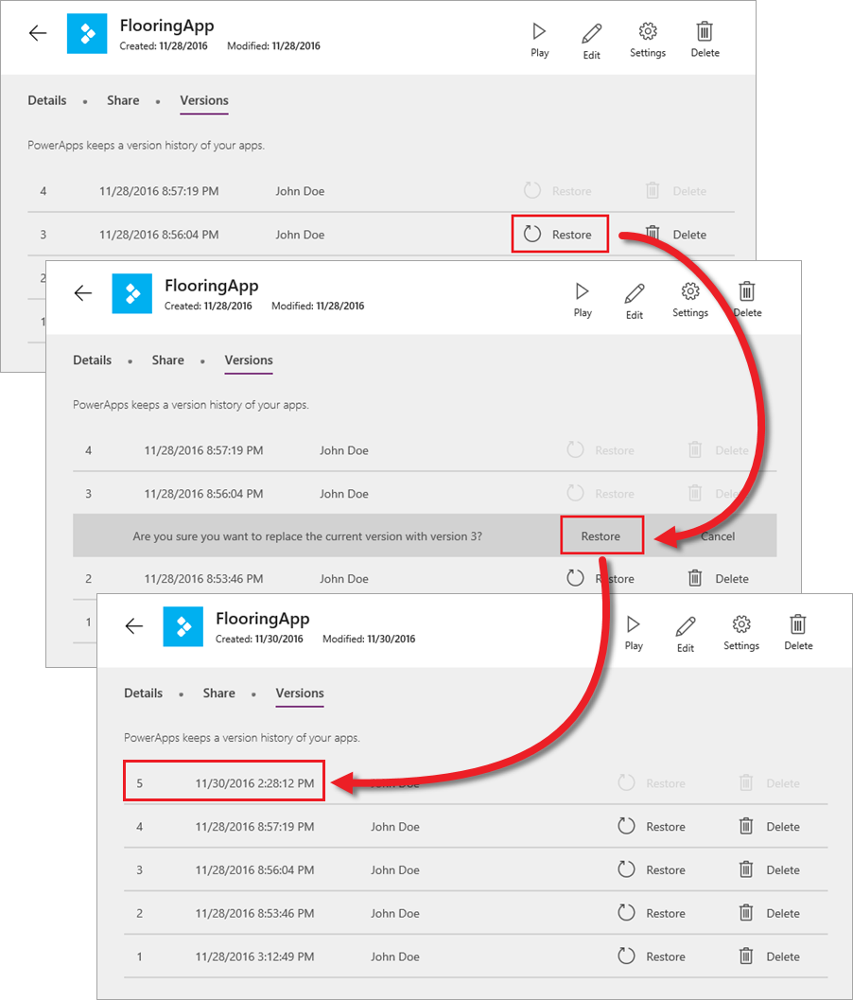

# Version your apps
If something goes wrong or you save a change to an app you shouldn't have, it's good to know that PowerApps can help you out. For apps that are saved in the cloud, PowerApps keeps a history of the changes that you make. You can view the versions that are saved and restore your app to a previous version if necessary. Be aware that if the app is shared, the people you shared with also receive the restored version.

## How to version an app
In web.powerapps.com, on an app tile, click the ellipsis (. . .), and then click **Details**.

From here, you can control app versioning and also share an app, which we covered in the previous topic. To move back to a previous version of an app, click **Restore** for the appropriate version (version 3 in the example), and click **Restore** again to confirm. As you see in the example, after you restore to version 3, PowerApps treats this as a new version (version 5 in the example), rather than just overwriting version 4.

Versioning can be very helpful if you need to restore a previous version of an app, so keep it in mind if you run into any issues with your apps. Now that know how to share your apps and restore them if necessary, we'll move on to the last aspect of app management in this course - managing environments.

