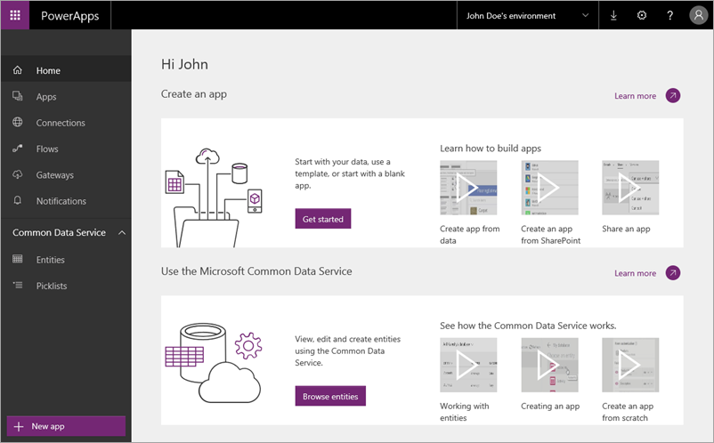
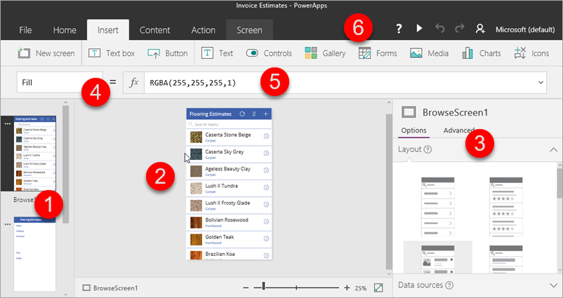
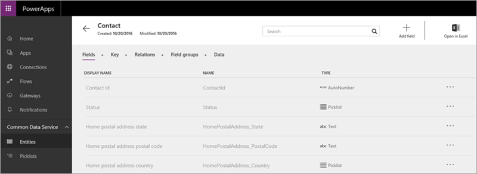
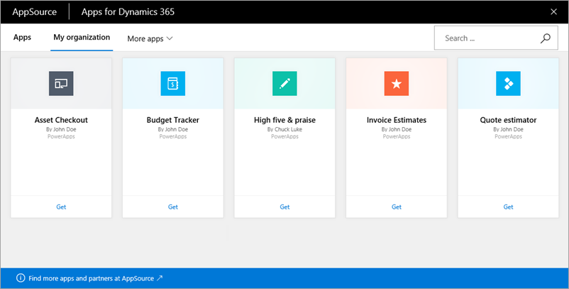
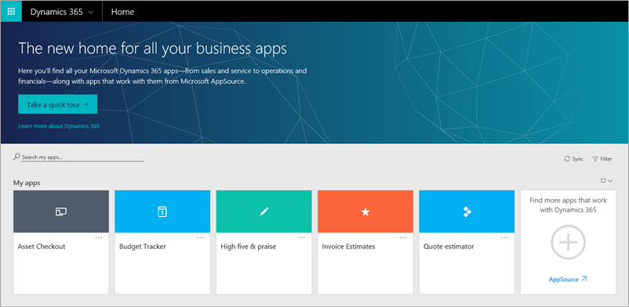

<properties
   pageTitle="Parts of PowerApps | Microsoft PowerApps"
   description="See the different parts of PowerApps, and how they relate"
   services=""
   suite="powerapps"
   documentationCenter="na"
   authors="mgblythe"
   manager="anneta"
   editor=""
   tags=""
   featuredVideoId=""
   courseDuration="5m"/>

<tags
   ms.service="powerapps"
   ms.devlang="na"
   ms.topic="get-started-article"
   ms.tgt_pltfrm="na"
   ms.workload="na"
   ms.date="10/04/2016"
   ms.author="mblythe"/>

# The Parts of PowerApps

In the first Guided Learning topic you read about the main parts of PowerApps, and in the topic that followed it, you saw different ways to start building apps. Now we're going to provide a little more detail on each of the parts. PowerApps is a set of software services, apps, and data connectors that work together, and there are related technologies that help make this a powerful ecosystem:

- **[web.powerapps.com]** - manage and share the apps you build
- **PowerApps Studio** - build powerful apps with easy to use visual tools
- **Data sources, connections and connectors, and gateways** - bring cloud and on-premises data into your apps
- **PowerApps Mobile** - run apps on Windows, iOS, and Android devices
- **PowerApps admin center** - administer PowerApps environments and other components
- **[business data platform]** - integrate business data using the common data model
- **Microsoft AppSource** - share your apps into this centralized place for Microsoft and our many partners
- **Microsoft Dynamics 365** - run all your business apps in the web

We don't expect you to take a ton of time just to learn what PowerApps _is_, but we think it's helpful to flesh things out a bit more.

## [web.powerapps.com]

If you build apps, this is where you spend most of your time. You learn from the **sample apps and templates** that are available here, and see all the apps you have created. You create apps in **PowerApps Studio for web**, and share those apps with individuals and organizations. You manage data: **connections**, **gateways**, and **entities** (all of which we'll cover shortly.) And you see all the **flows** created in **flows.microsoft.com**, which you can integrate with your apps.

## PowerApps Studio

**PowerApps Studio** is available as a web application that you can use in any modern browser, and as a Windows application. PowerApps Studio has three panes and a ribbon that make app creation feel similar to building a slide deck in PowerPoint:

1. The left navigation pane, which shows thumbnails of all the screens in your app
2. The canvas, which contains the app screen you are working on
3. The right pane, where you set options like layout and data sources
4. The formula bar, where you add formulas (like in Excel) that define app behavior
5. The ribbon, where you add controls and customize design elements

## Data sources, connections and connectors, and gateways

There are many **data sources** that you might care about, and PowerApps uses **connectors** to make **connections** to these data sources. Some of the most popular data sources are shown below—many of them are cloud services, like Salesforce. Connectors might not feel like the coolest part of app development, but they are essential to working with data that you, your colleagues, and your customers care about. For data that is stored on-premises rather than in the cloud, you use a **gateway** to provide a reliable connection between PowerApps and your data source.

## [business data platform]

The [business data platform] makes it easy to integrate business data from multiple sources. The [platform] features a **common data model** that includes many **entities** common to apps and business processes: entities like stores, customers, and sales. The platform stores the data in a scalable and reliable way, and makes the data available in a way that multiple applications can use it. The applications can be apps that you build in PowerApps, other Microsoft applications, or third party applications. The image below shows a portion of the **Contact** entity in web.powerapps.com.

## PowerApps Mobile

Find and use apps inside of **PowerApps Mobile for Windows, iOS, or Android**. When you use PowerApps Mobile, you'll see all the same apps there that are available to you on the web. Use apps in PowerApps Mobile to get the most out of your device's capabilities like camera controls, GPS location, and more.

## Admin center

The **PowerApps admin center** is the centralized place to administer PowerApps for an organization. This is where you define different **environments**, which house apps, data connections, and other elements. The admin center is also where you create [business data platform] databases and manage permissions and data policies.

## AppSource

**Microsoft AppSource** is the place to easily find and evaluate apps from Microsoft and our partners. When you share an app from PowerApps, you make it available in AppSource. You can choose to make it available just for people in your organization, or you can make it available publicly.

## Dynamics 365

Dynamics 365 is a cloud service with purpose-built apps that enable you to address specific business needs like sales automation, operations, or customer service. In PowerApps, you share apps into AppSource, then users you share with view and run those apps in Dynamics 365, as well as on mobile clients. The advantage of having the apps in Dynamics 365 is that you have one place to run all your business apps—from creators in your organization, from Microsoft, and from third parties.

Now you have a little more information about all the parts of PowerApps. Don't feel like you have to memorize the list, because we will continue to deepen your knowledge on each of the parts throughout this course. Next up is a quick review of this section and some resources, before we move on to creating apps.