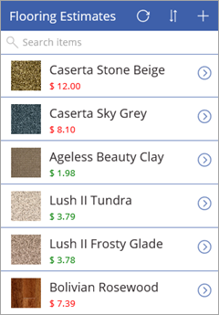
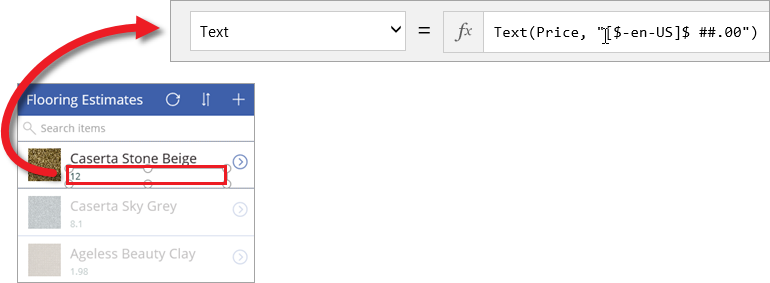
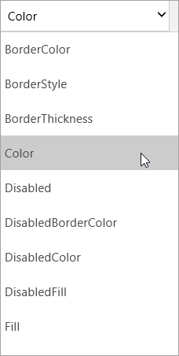
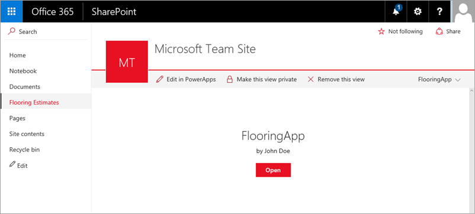

<properties
   pageTitle="Explore app formulas (SharePoint list) | Microsoft PowerApps"
   description="Use formulas to further customize app behavior"
   services=""
   suite="powerapps"
   documentationCenter="na"
   authors="mgblythe"
   manager="anneta"
   editor=""
   tags=""
   featuredVideoId=""
   courseDuration="6m"/>

<tags
   ms.service="powerapps"
   ms.devlang="na"
   ms.topic="get-started-article"
   ms.tgt_pltfrm="na"
   ms.workload="na"
   ms.date="11/28/2016"
   ms.author="mblythe"/>

# Explore app formulas (SharePoint list)
One of the major benefits of PowerApps is not having to write traditional application code - you don't have to be a developer to create apps! But you still need a way to express logic in an app and to control an app's navigation, filtering, sorting, and other functionality. This is where formulas come in. If you have used Excel formulas, the approach that PowerApps takes should feel familiar. In this topic, we'll show a couple of basic formulas for text formatting and then walk through three of the formulas that PowerApps includes in the generated app. You will get a taste of what formulas can do. Then you can spend some time looking at ones in the generated app and writing your own.

## Understanding formulas and properties
In the previous topic, we included the Price field in the browse screen gallery, but it showed up as a plain number without a currency symbol. Suppose we want to add a dollar sign, and also change the text color depending on how much the item costs (for example red if it's more than $5, otherwise green). The following image shows the idea.

Let's start with the currency formatting. By default PowerApps just pulls in a Price value for each item, which is set as the **Text** _property_ of the text box that displays the price.

To add the US currency symbol, click or tap the text box control, and then set the **Text** property to this formula in the formula bar.

The formula - `Text(Price, "[$-en-US]$ ##.00"` uses the **Text** _function_ to specify how the number should be formatted. The formula is like an Excel formula, but PowerApps formulas refer to controls and other app elements rather than cells in a spreadsheet. If you click or tap a control and then click or tap the property drop down list, you see a list of properties that are relevant to the control. For example, here is a partial list of the properties for a text box. Some properties are relevant across a broad range of controls and others only for a specific control.

To format the color conditionally based on the price, use a formula like the following for the **Color** property of the text box: `If(Price > 5, Color.Red, Color.Green)`.

## Formulas included in the generated app
Now that you understand how to use formulas in conjunction with properties, we'll look at three examples of formulas that PowerApps uses in the generated app. The examples are all from the browse screen and work with the OnSelect property, which defines what happens when a user clicks or taps an app control. In many cases, the property is set to false by default, which means "do nothing." But often you want to do something when the user click or taps a control.

- The first formula is associated with the **IconNewItem1** control: . You click or tap this control to go from the browse screen to the edit/create screen and create an item. 
  - The formula is `NewForm(EditForm1);Navigate(EditScreen1, ScreenTransition.None)`
  - The formula _instantiates_ a new edit form and then navigates to the edit/create screen so that you can create a new item. A value of `ScreenTransition.None` means there is no transition between screens (such as a fade).

- The second formula is associated with the **IconSortUpDown1** control: . You click or tap this control to sort the list of items in the browse screen gallery.
  - The formula is `UpdateContext({SortDescending1: !SortDescending1})`
  - The formula uses `UpdateContext` to update a _variable_ called `SortDescending1`. The value of the variable switches back and forth as you click the control. This tells the gallery on this screen how to sort the items (watch the video for more details). 

- The third formula is associated with the **NextArrow1** control: . You click or tap this control to go from the browse screen to the details screen.
  - The formula is `Navigate(DetailScreen1, ScreenTransition.None)`
  - The formula navigates to the details screen, again with no transition.

There are many other formulas in the app, so take some time to click on controls and see what formulas are set for various properties.

## Wrapping it all up
This brings us to the end of exploring the generated app, and taking a look behind the scenes at the screens, controls, properties, and formulas that give the app its capabilities. If you've followed along, you should have a better understanding of how a generated app works. Now you can take this understanding into creating your own apps. Before moving on to the next section, we want to loop back to SharePoint and show you how the app is now integrated with the list experience. As you can see **FlooringApp** now functions as a _view_ of the list, and you launch the app by clicking **Open**. This provides a simple way to manage your lists with a friendly customized experience.

Now that you've gone through the SharePoint app section, you have a choice about where to go next:

- [Manage apps](learning-manage-share-apps.md)
- [Create and customize an app from the Common Data Service](learning-case-app-generate.md)

The management section shows you how to share and version apps, and introduces environments, which are containers for apps, data, and other resources. We recommend that everyone go through the management section at some point, but the Common Data Service section has some great information too, including more app customizations. 