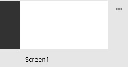
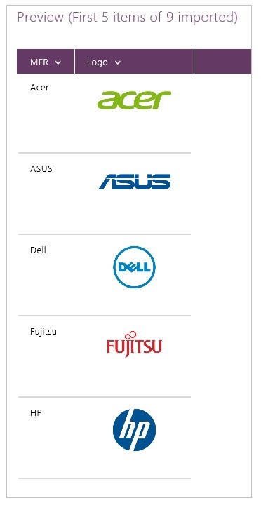
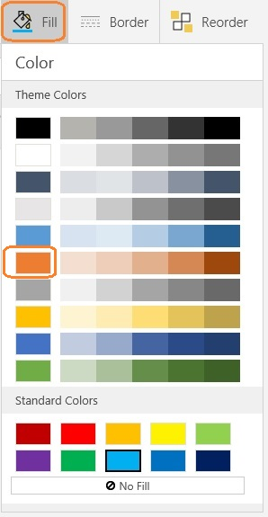
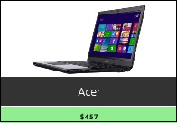

<properties
	pageTitle="KratosApps tutorial: Show and select items in a gallery"
	description="Create an app in which users can browse, filter, and choose tablets and other devices and then review the total cost of their choices."
	services="kratosapps"
	authors="AFTOwen"
 />

# Create a gallery-based app in KratosApps #
Create an app that shows sample data about tablets, laptops, and desktop computers from various manufacturers. Learn how to import a set of data from Excel, add and configure controls such as shapes and checkboxes, show images and other data in a gallery. Create a collection and perform mathematical calculations based on user choices.

The first screen of this app shows an image of each device, its manufacturer, and its price. Users can filter the list of devices by category or manufacturer and add one or more devices to a list of favorites.

*Screen shot*

The second screen of this app shows the list of favorite devices. Users can specify a quantity for each device, and the screen shows the total cost.

*Screen shot*

**Prerequisites**

- Download and install [KratosApps](https://www.kratosapps.com/downloads).

## Import sample data
1. Download the [executable file]() that contains sample data for this app, and then double-click it to install the data onto your device.

	The sample data includes an Excel file, named **Win8devices.xlsx**, and three folders of graphics. When you run the executable file, the Excel file and the graphics are installed in C:\Users\Public\Pictures\SienaAssets\PcSelector.
1. In C:\Users\Public\Pictures\, right-click **SienaAssets**, choose **Include in library**, and then select **Pictures**.

	

2. Open KratosApps.

	

	KratosApps opens and shows a blank screen by default.

	Above the top of the screen, a ribbon contains tabs that you can click to show groups of options. For example, the **Data** tab shows options for adding data to your app.

	

	A list of properties and the Function Bar appear betweeen the ribbon and the screen. For example, the **Background Image** property appears by default, so that you can add a background image to the default screen.

	

	A thumbnail view of each screen appears near the left edge of the screen.

	
3. On the **File** menu, click **Data Sources** (or press Alt-D).

	

	(Want to discover more [keyboard shortcuts]()?)
4. In the list of data sources, click **Excel**.

	

5. Browse to the Excel file that you downloaded at the start of this procedure, and then click it.

	

6. Click **Open**, confirm that all three checkboxes are selected, and then click **Import Data**.

	

	(Want to find out how to [import data]() from another source?)

	The three tables that you just imported appear under **Existing sources**.

	

	You can click each table to display a preview of the data that it contains. For example, the **OEM** table contains the logos that will appear along the left edge of the first screen of your app.

	

7. Return to the design workspace by clicking the Back arrow in the upper-left corner of the screen (or by pressing Esc).

	

## Create a banner ##

2. On the ribbon, click the **Insert** tab.

	
3. On the **Insert** tab, click **Shapes**, and then click the rectangle shape to add it to the first screen of your app.

	

	(Want to find out how to [add other controls]() to your app?)

	The rectangle appears near the upper-left corner of the screen.

	

	By default, a thick, gray box surrounds the rectangle to indicate that it's selected.

	**Important:** To change the property of a control, click it so that it's selected, and then update the property. To change a property of a screen, click a blank area of that screen to select it, and then update the property. To delete a control, click it, and then press Delete.
4. On the **Home** tab of the ribbon, click **Fill**, and then click the orange option in the middle of the left column.

	

	The list of properties automatically shows **Fill**, and the Function Bar shows the RGBA values for the color you chose.
	
	(Want to find out how to [change other properties]() of a control?)
5. Move the rectangle to the upper-left corner of the screen by dragging the selection box that surrounds it.
	
	

6. In the selection box around the rectangle, drag the white square on the right edge to the right, and drag the white square on the left edge to the left until the rectangle becomes a banner across the top of the screen.
	
	The thumbnail view of your screen reflects your changes.

	
## Show the device categories ##

1. On the **Insert** tab, click **Gallery**, and then click the horizontal **Image Only** gallery to add it to your screen.

	*Screen shot*

	(Don't know what a [gallery]() is?)

1. Set the **Items** property of the gallery to **PcCategory**.

	*Screen shot*

2. Move the gallery to the center of the orange banner, and resize the gallery to fit inside the banner.

	
4. With the gallery selected, click **Gallery1** in the box in the lower-left corner of the screen.
 
	*Screen shot*

	**Note:** If you've added and deleted a gallery before adding this one, the number at the end of the name will be higher.

6. Rename the gallery by typing **CategoryGallery** in the box.
7. Click an empty area of the screen to select it, and then rename it by typing **MainScreen** in the box near the lower-left corner of the screen.

8. Save your changes by opening the **File** menu and then clicking **Save** (or by pressing Ctrl-S).

## Show the OEM logos ##
6. Add a vertical image gallery, name it **OemGallery**, and set its **Items** property to **OEM**.
7. Move the **OemGallery** to the left edge of the screen (under the orange banner), and resize the gallery so that it shows four logos.
8. [Select the template](nameoffile.md) of the **OemGallery**, select the image in that template, and then set the **ImagePosition** property of the image to **Fit**.

	

## Show the devices ##
1. Add a horizontal image gallery with text, name it **DevicesGallery**, and set its **Items** property to **Devices**.
2. Position the **DevicesGallery** so that it touches the center of the right edge of the **OemGallery**.
3. [Set the **Width** property](nameoffile.md) of the **DevicesGallery** to 250, and set its **Height** property to 200.
3. In the template of the **DevicesGallery**, select the image, and then set its **ImagePosition** property to **Fit**.
4. In the template of the **DevicesGallery**, select the bottom label, and then set its **Text** property to this expression, so that the price of each device appears:

	**"$" & ThisItem!Price**

	

## Filter the devices ##
1. Set the **Items** property of the **DevicesGallery** to this expression:

	**[Filter](nameoffile.md)(Devices, MFR = OemGallery!Selected!MFR && DeviceType = CategoryGallery!Selected!PcCategory)**

2. (optional) [Open Preview](nameoffile.md), click a category and an OEM logo to show only devices in that category from that manufacturer, and then return to the workspace.

## Highlight devices by price##
1. In the template of the **DevicesGallery**, select the bottom label, and then set its **Fill** property to this expression:

	**[If](nameoffile.md)(Price<700,LightGreen,LightGray)**
2. Set the **Color** property of the same label to **Black**, and set its **FontWeight** property to **Bold**.
3. (optional) Find a device that costs less than $700, and verify that its price appears in a green, not gray, box.
	
