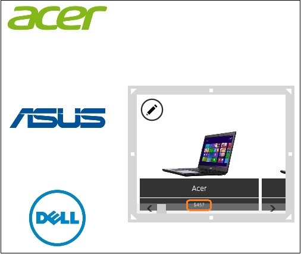

<properties
	pageTitle="KratosApps tutorial: Show and select items in a gallery"
	description="Create an app in which users can browse, filter, and choose tablets and other devices and then review the total cost of their choices."
	services="kratosapps"
	authors="AFTOwen"
 />

# Create a gallery-based app in KratosApps #
Create an app that shows descriptions and images of desktop computers and mobile devices from various manufacturers. In this app, users can choose one or more devices, specify quantities, and automatically calculate the total cost.

**Prerequisites**

- Download and install [KratosApps](https://www.kratosapps.com/downloads).

- Download and run the file that contains sample data for this app.

## Create the banner ##

1. [Add a rectangle](nameoffile.md), and then [set its **Fill** property](nameoffile.md) to **Color!Orange**.

	
2. [Move the rectangle](nameoffile.md) to the top of the screen, and widen it to span the entire screen.

## Show the device categories ##

3. [Add a horizontal image gallery](nameoffile.md), set its **Items** property to **PcCategory**, and then resize and position the gallery in the center of the orange rectangle.

	
4. [Name the gallery](nameoffile.md) **CategoryGallery**, name the screen **MainScreen**, and then [save the app](nameoffile.md).

## Show the OEM logos ##
6. Add a vertical image gallery, name it **OemGallery**, and set its **Items** property to **OEM**.
7. Move the **OemGallery** to the left edge of the screen (under the orange rectangle), and resize the gallery so that it shows four logos.
8. [Select the template](nameoffile.md) of the **OemGallery**, select the image in that template, and then set the **ImagePosition** property of the image to **Fit**.

	

## Show the devices ##
1. Add a horizontal image gallery with text, name it **DevicesGallery**, and set its **Items** property to **Devices**.
2. Position the **DevicesGallery** so that it touches the center of the right edge of the **OemGallery**.
3. [Set the **Width** property](nameoffile.md) of the **DevicesGallery** to 250, and set its **Height** property to 200.
3. In the template of the **DevicesGallery**, select the image, and then set its **ImagePosition** property to **Fit**.
4. In the template of the **DevicesGallery**, select the bottom label, and then set its **Text** property to this expression:

	**"$" & ThisItem!Price**

	

## Filter the devices ##
1. Set the **Items** property of the **DevicesGallery** to this expression:

	**[Filter](nameoffile.md)(Devices, MFR = OemGallery!Selected!MFR && DeviceType = CategoryGallery!Selected!PcCategory)**

2. (optional) [Open Preview](nameoffile.md), click a category and an OEM logo to show only devices in that category from that manufacturer, and then return to the workspace.

## Highlight devices by price##
1. In the template of the **DevicesGallery**, select the bottom label, and then set its **Fill** property to this expression:

	**[If](nameoffile.md)(Price<700,LightGreen,LightGray)**
2. Set the **Color** property of the same label to **Black**, and set its **FontWeight** property to **Bold**.
3. (optional) Find a device that costs less than $700, and verify that its price appears in a green, not gray, box.
	
