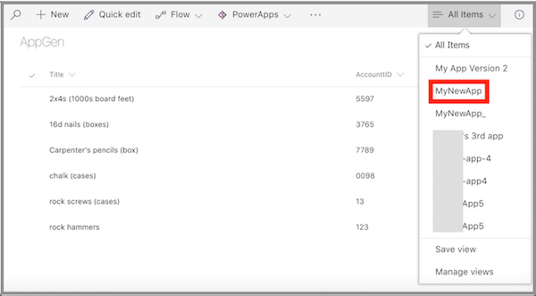
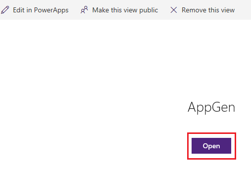
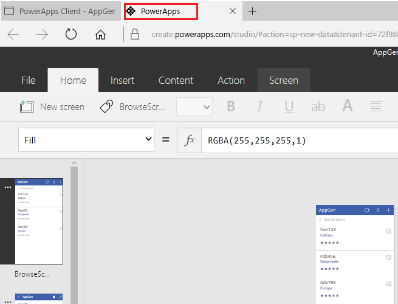
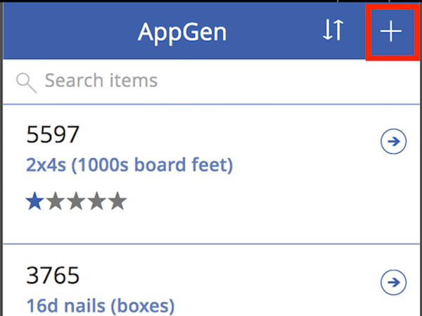
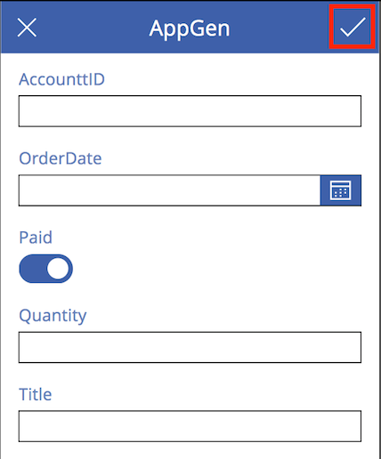
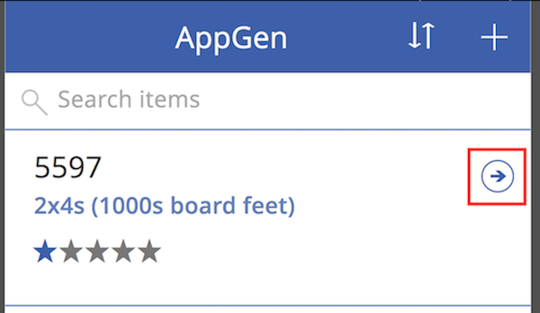

<properties
	pageTitle="Open an app in SharePoint Online | Microsoft PowerApps"
	description="Open an existing app in SharePoint Online to manage a list."
	services=""
	suite="powerapps"
	documentationCenter="na"
	authors="RickSaling"
	manager="anneta"
	editor=""
	tags=""/>

<tags
   ms.service="powerapps"
   ms.devlang="na"
   ms.topic="article"
   ms.tgt_pltfrm="na"
   ms.workload="na"
   ms.date="10/11/2016"
   ms.author="ricksal"/>

# Open app from a SharePoint Online list

You can open an existing app inside SharePoint Online and manage a list.

For information about what types of SharePoint data PowerApps supports, see [Known issues](connection-sharepoint-online.md#known-issues).

## Prerequisites ##
[Create an app in the SharePoint interface](generate-app-from-sharepoint-list-interface.md).

## Open the app

1. Open your SharePoint Online list, and select an app from the list.

	

2. Click or tap **Open**.

	

	The app opens in a separate browser tab.

	

## Manage the app ##

- If you click or tap **Edit in PowerApps**, the app opens in a separate browser tab so that you can update the app in PowerApps Studio for the web.
- If you click or tap **Make this view public**, other people in your organization will be able to see it. By default, only you can see views that you create. If you want other people to be able to edit this app, you need to [share it with them](share-app.md) and grant **Contributor** permissions.
- If you click or tap **Remove this view**, you'll remove the view from SharePoint, but the app will still be in PowerApps unless you [delete it](delete-app.md).

## Manage the list using the app

> [AZURE.NOTE] This topic describes how to open and run an app that is automatically generated from a SharePoint list. The more common scenario is where the generated app has been extensively customized to meet your organization's needs, and in this case, usage may be more complex than what is described here.

1. Open the app as the previous procedure describes.

1. To add an item to the list, click or tap the "+" sign.

	

2. A form appears where you can enter values in the fields of the list. When done, click or tap the check mark.

	

3. To view details for an item, click or tap the arrow.

	

4. To edit the item, on the form that appears, click or tap the "pencil".

	

5. Make your changes, then click or tap the check mark.

	

6. To delete an item, from the detail view screen, click or tap the trash can.

	
