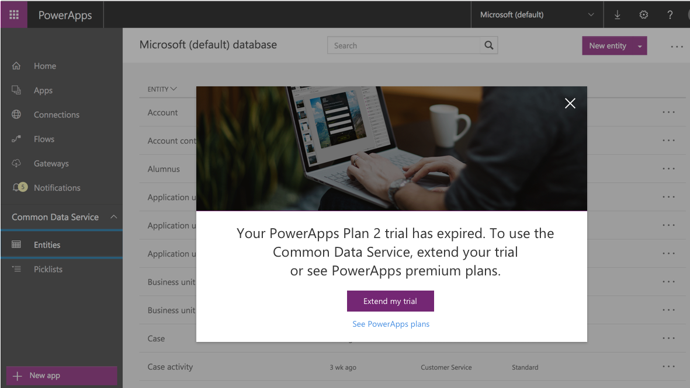
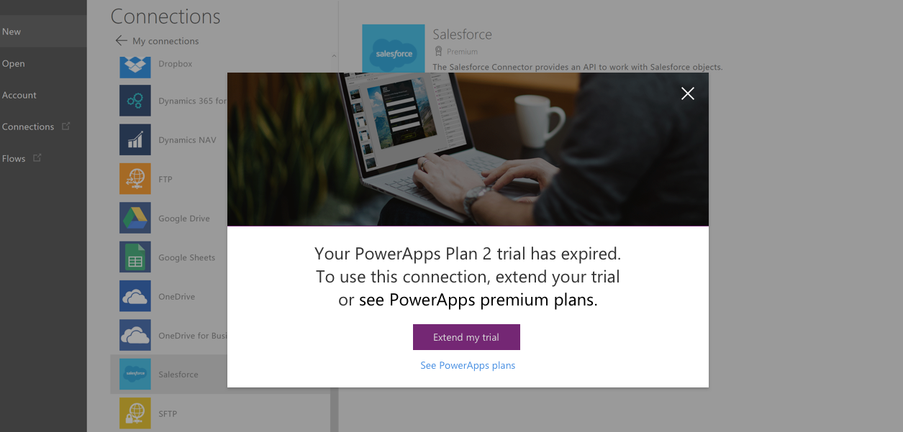

<properties
	pageTitle="PowerApps Trial | Microsoft PowerApps"
	description="PowerApps trial sign-up and expiration"
	services=""
	suite="powerapps"
	documentationCenter="na"
	authors="manasma"
	manager="anneta"
	editor=""
	tags=""/>

<tags
   ms.service="powerapps"
   ms.devlang="na"
   ms.topic="article"
   ms.tgt_pltfrm="na"
   ms.workload="na"
   ms.date="04/18/2017"
   ms.author="manasma"/>

# PowerApps Trial #
PowerApps offers a free trial for its full-functionality Plan 2 for 90 days. ‘PowerApps for Office 365 and Dynamics 365’ are included in many Office 365 and Dynamics 365 plans. With PowerApps Plan 2 Trial you not only get all the PowerApps functionalities which are available with Office 365 and Dynamics 365 plans, but also get access to premium functionalities and higher capacity as well. Premium functionalities include:

1. Access to Common Data Service: The Common Data Service is a secure business data platform built into PowerApps. It comes with hundreds of standard business entities already defined, which means that now all your apps can share the same definition of “customer,” “product,” “lead,” and more. [Learn more][1]

2. Access to Premium connections: With PowerApps, you can connect to data sources with the help of connectors. With Office 365 and Dynamics 365 plans you get access to Standard connectors which includes connectors to data sources like Office 365, Dynamics 365, Dropbox, Twitter, etc. With PowerApps Plan 2 Trial you as well get access to Premium connectors like Salesforce, Common Data Service, DB2, Zendesk, etc.
Here are some of the examples of Premium connectors

	

	You can read about the complete list of premium connectors [here][2]. They are marked with a premium badge:

	

3. Access to PowerApps admin center:  You can manage your environment, database, user permissions, data policies using PowerApps admin center. Learn more about the details [here][3].

And more. You can learn about details on functionality and capacity on [PowerApps Pricing page][4].

**Who can sign up for PowerApps Free Trial?**
1.	If you already have Office 365, Dynamics 365 or PowerApps Plan 1, you already have a license to access PowerApps. You can sign-up for the PowerApps Free trial, to try out premium functionalities. You will be notified to sign-up for the trial while trying out the premium functionalities OR you can as well sign-up from [PowerApps site][5].

2.	If you are trying to use PowerApps for the first time and don’t have any license to access PowerApps, you can sign-up for the PowerApps free trial from [PowerApps site][5]

## PowerApps Trial expiration ##
PowerApps offers a free trial of its full-functionality. This trial provides Plan 2 for 90 days, which includes using premium functionalities like [Common Data Service][1], using [premium connections][2], or accessing [admin center][3].

**What happens when Trial expires?**  
When trial expires, you might be restricted on using functionalities for which you were given access with the full-featured PowerApps Plan 2 trial. There can be two scenarios here:

1. After your PowerApps trial expires you have a valid license to PowerApps through Office 365 or Dynamics 365:

	This scenario can happen if the you had any other valid PowerApps plan and signed-up for the PowerApps trial or vice-versa. You can read about the details of all valid plan [here][4]. When trial expires after 90 days, the user can continue using PowerApps with Office 365 or Dynamics 365,  but might get restricted on using specific premium functionalities e.g. using Common Data Service, premium connectors, or access to admin center.

2. After your PowerApps trial expires you have no other valid license to PowerApps through Office 365 or Dynamics 365:

	This scenario can happen if you signed-up from [PowerApps site][5] or from [PowerApps Pricing page][4]. In such scenario, you were given PowerApps Plan 2 Trial to start using PowerApps. This trial would have expired after 90 days of you signing-up, leading to no more valid PowerApps license. With this, you will not have access to PowerApps and will see an experience like below while signing-in to any of the PowerApps web portal or clients.

**How do I see how many days are left for my trial expiration?**
We are working on the feature on how many days are left with your PowerApps free trial. This is coming soon

**What happens to my data while my trial is expired?**

If you still have access to PowerApps via Office 365 or Dynamics 365 then you can continue using PowerApps but will lose access to the following functionalities:

	a.	Common Data Service:
	•	The data in Common Data Service database will remain as is.
	•	You will not be able to modify the schema or entities from web.powerapps.com and will be shown screen as shown below, as you no more have Plan 2 Trial with you.
	
	•	For the apps and flows which were using Common Data Service as one of their data source, will continue to run as is. It’s just that you will not be able to use them, as you don’t have Plan 2 or Plan 2 Trial.

	b.	Premium Connections:
	Accessing [Premium connections][2] is only available with Plan 1 and Plan 2 (and Plan 2 Trial). If you have any other valid PowerApps license (not Plan 1 or Plan 2) along with expired Plan 2 Trial, you cannot use these connections.   You will be prompted with the message on either extending your trial or purchase a plan.

	If you are creating a new connection:
	

**What should you do next?**
There are two options for you to continue using the premium functionalities or access to PowerApps based on the above two scenarios mentioned. You can either request for extending the trial for next 90 days or purchase a PowerApps plan.
•	Request for extending your trial: When using PowerApps, you will be given option on extending the trial. Many of the examples are shown in the images in this document. You can fill out the form with details and request for an extension for next 90 days.
•	Purchase a valid PowerApps plan: You will see the option of viewing the PowerApps plans OR you can directly visit PowerApps pricing page. [Learn more][6] on how to purchase a plan.

<!--Reference links in article-->
[1]: https://powerapps.microsoft.com/tutorials/data-platform-intro/
[2]: https://powerapps.microsoft.com/tutorials/connections-list/
[3]: https://powerapps.microsoft.com/tutorials/introduction-to-the-admin-center/
[4]: https://powerapps.microsoft.com/pricing/
[5]: http://powerapps.microsoft.com/
[6]: https://powerapps.microsoft.com/tutorials/signup-for-powerapps-admin/
