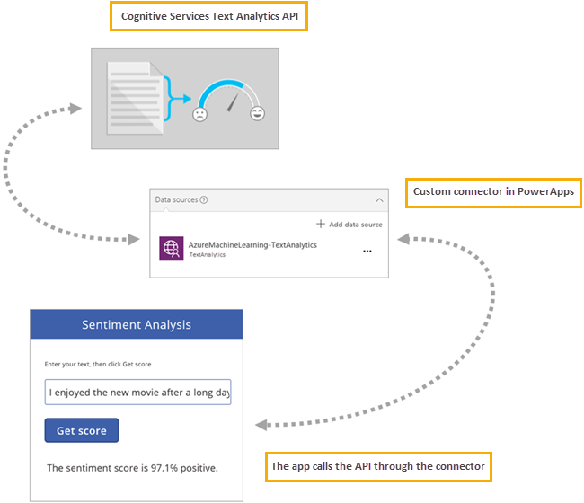
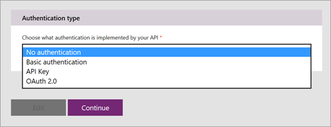
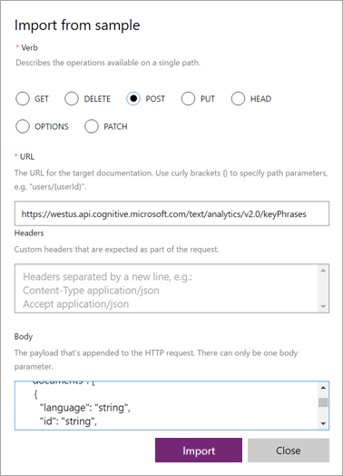
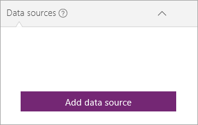
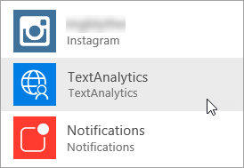
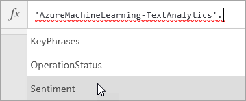
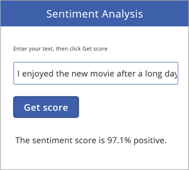
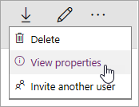

<properties
	pageTitle="Register and use custom connectors | Microsoft PowerApps"
	description="Register and use custom connectors in PowerApps, using OpenAPI and Postman."
	services=""
    suite="powerapps"
	documentationCenter=""
	authors="archnair"
	manager="anneta"
	editor=""/>

<tags
   ms.service="powerapps"
   ms.devlang="na"
   ms.topic="article"
   ms.tgt_pltfrm="na"
   ms.workload="na"
   ms.date="05/05/2017"
   ms.author="archanan"/>

# Register and use custom connectors in PowerApps
PowerApps enables you to build full-featured apps with no traditional application code. But in some cases you need to extend PowerApps capabilites, and web services are a natual fit for this. Your app can connect to a service, perform operations, and get data back. When you have a web service you want to connect to with PowerApps, you register the service as a custom connector. This process enables PowerApps to understand the characteristics of your web API, including the authentication that it requires, the operations that it supports, and the parameters and outputs for each of those operations.

In this topic, we'll look at the steps required to register and use a custom connector, and we'll use the Azure Cognitive Services [Text Analytics API](https://www.microsoft.com/cognitive-services/en-us/text-analytics-api) as an example. This API identifies the language, sentiment, and key phrases in text that you pass to it. The following image shows the interaction between the service, the custom connector we create from it, and the app that calls the API.




## Prerequisites

- A [PowerApps account](https://powerapps.microsoft.com).
- An OpenAPI file in JSON format, a URL to an OpenAPI definition, or a Postman Collection for your API. If you don't have any of these, we'll provide guidance for you.
- An image to use as an icon for your custom connector (optional).


## Steps in the custom connector process

The custom connector process has several steps, which we describe briefly below. This article assumes you already have a RESTful API with some type of authenticated access, so we'll focus on steps 3-6 in the rest of the article. For an example of steps 1 and 2, see [Create a custom Web API for PowerApps](customapi-web-api-tutorial.md).

1. **Build a RESTful API** in the language and platform of your choice. For Microsoft technologies, we recommend one of the following.

	- Azure Functions
	- Azure Web Apps
	- Azure API Apps

2. **Secure your API** using one of the following authentication mechanisms. You can allow unauthenticated access to your APIs, but we don't recommend it.

	- Azure Active Directory
	- OAuth 2.0 for specific services like Dropbox, Facebook, and SalesForce
	- Generic OAuth 2.0
	- API Key
	- Basic Authentication

3. **Describe your API** in one of two industry-standard ways, so that PowerApps can connect to it.

	- An OpenAPI file (also known as a Swagger file)
	- A Postman Collection

	You can also build an OpenAPI file in step 4 as part of the registration process.

4. **Register your custom connector** using a wizard in PowerApps, where you specify an API description, security details, and other information.
5. **Use your custom connector** in an app. Create a connection to the API in your app, and call any operations that the API provides, just like you call native functions in PowerApps.
6. **Share your custom connector** like you do other data connections in PowerApps. This step is optional, but it often makes sense to share custom connectors across multiple app creators.


## Describe your API

Assuming you have an API with some type of authenticated access, you need a way to describe the API so that PowerApps can connect to it. To do this, you create an OpenAPI file or a Postman Collection – which you can do from _any_ REST API endpoint, including:

- Publicly available APIs. Some examples include [Spotify](https://developer.spotify.com/), [Uber](https://developer.uber.com/), [Slack](https://api.slack.com/), [Rackspace](http://docs.rackspace.com/), and more.
- An API that you create and deploy to any cloud hosting provider, including Azure, Amazon Web Services (AWS), Heroku, Google Cloud, and more.
- A custom line-of-business API deployed on your network as long as the API is exposed on the public internet.

OpenAPI files and Postman Collections use different formats, but both are language-agnostic machine-readable documents that describe your API's operations and parameters:
- You can generate these documents using a variety of tools depending on the language and platform that your API is built on. See the [Text Analytics API documentation](https://westus.dev.cognitive.microsoft.com/docs/services/TextAnalytics.V2.0/export?DocumentFormat=Swagger&ApiName=Azure) for an example of an OpenAPI file.
- If you don't already have an OpenAPI file for your API and don't want to create one, you can still easily create a custom connector by using a Postman Collection. See [Create a Postman Collection](postman-collection.md) for more information.
- PowerApps ultimately uses OpenAPI behind the scenes, so a Postman Collection is parsed and translated into an OpenAPI definition file.

**Note**: Your file size must be less than 1MB.


### Getting started with OpenAPI and Postman

- If you're new to OpenAPI, see [Getting Started with OpenAPI](http://swagger.io/getting-started/) on the swagger.io site.
- If you're new to Postman, install the [Postman app](https://www.getpostman.com/apps) from their site.
- If your API is built with Azure API Apps or Azure Functions, see [Exporting an Azure hosted API to PowerApps and Microsoft Flow](https://docs.microsoft.com/azure/app-service/app-service-export-api-to-powerapps-and-flow) for more information.


## Register your custom connector

You will now use the OpenAPI file or Postman Collection to register your custom connector in PowerApps.

1. In [powerapps.com](https://web.powerapps.com), in the left menu, select **Connections**. Select the ellipsis (**...**), then select **Manage custom connectors** in the upper right corner.

	 **Tip**: If you can't find where to manage custom connectors in a mobile browser, it might be under a menu in the upper left corner.

	  

2. Select **Create custom connector**.

	

3. In the **General** tab, choose how you want to create the custom connector.
	- Upload an OpenAPI file
	- Use an OpenAPI URL
	- Upload Postman Collection V1

	

	Upload an icon for your custom connector. Description, Host, and Base URL fields are typically auto-populated with the information from the OpenAPI file. If they are not auto-populated, you can add information to those fields. Select **Continue**.

4. In the **Security** tab, enter any authentication properties.

	

	- The authentication type is auto-populated based on what is defined in your OpenAPI `securityDefinitions` object. Below is an OAuth2.0 example.

		```
		"securityDefinitions": {
			"AAD": {
			"type": "oauth2",
			"flow": "accessCode",
			"authorizationUrl": "https://login.windows.net/common/oauth2/authorize",
			"scopes": {}
			}
		},
		```

	- If the OpenAPI file does not use the `securityDefintions` object, then no additional values are needed.
	- When using a Postman Collection, authentication type is auto-populated only when using supported authentication types, such as OAuth 2.0 or Basic.
	- For an example of setting up Azure Active Directory (AAD) authenthication, see [Create a custom Web API for PowerApps](customapi-web-api-tutorial.md#set-up-azure-active-directory-authentication).

5. In the **Definitions** tab, all the operations defined in your OpenAPI file or Postman Collection, along with request and response values, are auto-populated. If all your required operations are defined, you can go to step 6 in the registration process without making changes on this screen.

	

	If you want to edit existing actions or add new actions to your custom connector, continue reading below.

	1. If you want to add a new action that was not already in your OpenAPI file or Postman Collection, select **New action** in the left pane and fill in the **General** section with the name, description, and visibility of your operation.

	2. In the **Request** section, select **Import from sample** on the top right. In the form on the right, paste in a sample request. Sample requests are usually available in the API documentation, where you can get information to fill out the **Verb**, **Request URL**, **Headers**, and **Body** fields. See the [Text Analytics API documentation](https://westus.dev.cognitive.microsoft.com/docs/services/TextAnalytics.V2.0/operations/56f30ceeeda5650db055a3c6) for an example.

		

	3. Select **Import** to complete the request definition. Define the response in a similar way.

6. Once you have all your operations defined, select **Create** to create your custom connector.

7. Once you have created your custom connector, go to the **Test** tab to test the operations defined in the API. Choose a connection, and provide input parameters to test an operation.

	

	If the call is successful, you get a valid response.

	


## Use your custom connector
Now that you've registered your API, add the custom connector to your app like you would any other data source. We'll go through a brief example here. For more information about data connections, see [Add a data connection in PowerApps](add-data-connection.md).

1. In PowerApps Studio, in the right pane, click or tap **Add data source**.

	

2. Click or tap the custom connector that you created.

	

3. Complete any steps necessary to sign in to the service you're connecting to. If your API uses OAuth authentication, you might be presented a sign-in screen. For API key authentication, you might be prompted for a key value.

4. Call the API in your app. For our example, we created an app that submits text to Cognitive Services and gets back a sentiment score of 0 to 1, which the app shows as a percentage. 

	- With this connector, if you start typing "Az" in the formula bar, you see the API and the operations that it makes available.

		

	- The complete call looks like this, where we pass in text from the `TextInput` control and get back a score to display in the app: 

		```
		'AzureMachineLearning-TextAnalytics'.Sentiment({documents:Table({language:"en",id:"1",text:TextInput.Text})}).documents.score)
		```

	- We do a little more work in the app to handle the data that comes back, but it's not too complicated.

The finished app looks like the following image. It's a simple app, but it gains powerful functionality by being able to call Cognitive Services through a custom connector.




### Quota and throttling

- See the [PowerApps Pricing](https://powerapps.microsoft.com/pricing/) page for details about custom connector creation quotas. Custom connectors that are shared with you don't count against this quota.
- For each connection created on a custom connector, users can make up to 500 requests per minute.

## Share your custom connector
Now that you have a custom connector, you can share it with other users in your organization. Keep in mind that when you share an API, others might start to depend on it, and deleting a custom connector deletes all the connections to the API. If you want to provide a connector for users outside your organization, see [Overview of certifying custom connectors in PowerApps](api-connector-overview.md).

1. In [powerapps.com](https://web.powerapps.com), in the left menu, select **Connections**. Select the ellipsis (**...**), then select **Manage custom connectors** in the upper right corner.

	

2. Select the ellipsis (**. . .**) button for your connector, then select **View properties**.  

	

3. Select your API, select **Share**, and then enter the users or groups to whom you want to grant access to your API.  

	

4. Select **Save**.


## Next steps

[Learn how to create a Postman Collection](postman-collection.md)

[Use an ASP.NET Web API](customapi-web-api-tutorial.md).

[Register an Azure Resource Manager API](customapi-azure-resource-manager-tutorial.md).
