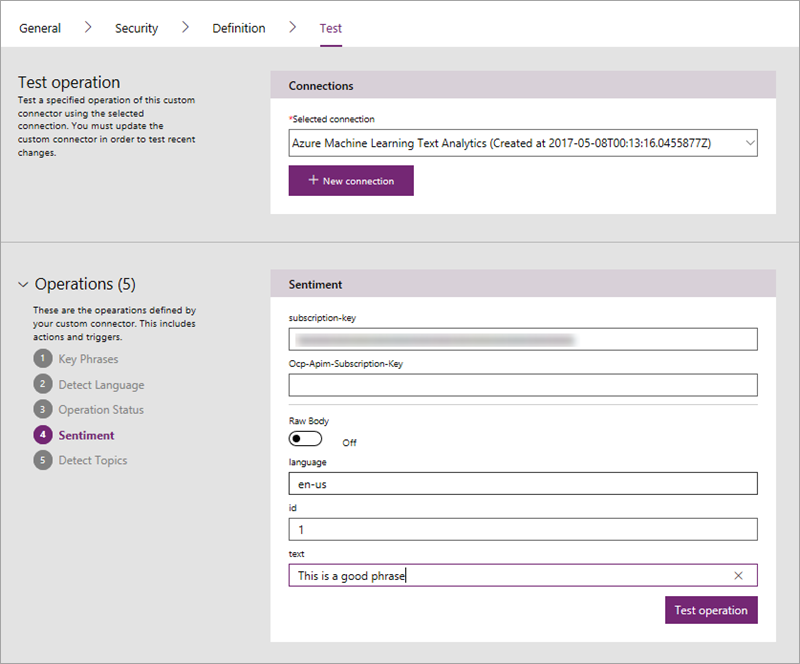
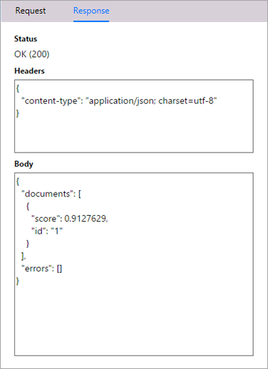

<properties
	pageTitle="Register and use custom APIs | Microsoft PowerApps"
	description="Register custom APIs in PowerApps using Swagger and OAuth."
	services=""
    suite="powerapps"
	documentationCenter=""
	authors="archnair"
	manager="anneta"
	editor=""/>

<tags
   ms.service="powerapps"
   ms.devlang="na"
   ms.topic="article"
   ms.tgt_pltfrm="na"
   ms.workload="na"
   ms.date="04/28/2017"
   ms.author="archanan"/>

# Register and use custom APIs in PowerApps

{TODO: search for - ' | &lt; | &gt; | & | collection | en-us | AZURE.NOTE | {}}

{TODO} Why you should care + graphic that shows an Azure Function for calling a COGSERVICES API--
When you have a web service that you want to be able to automate with Microsoft Flow, you'll first need to build a custom API. By registering a custom API, you teach Microsoft Flow about the characteristics of your web API, including the authentication that it requires, the triggers and actions that it supports, and the parameters and outputs for each of those actions.
You can use custom APIs in PowerApps to extend the capabilities of your app, enabli it to do things that are not ossible or are mor difficult in PA.
For example COGSERVICESGraphic calling COGSERVICES app
PowerApps can leverage any RESTful APIs hosted anywhere. This tutorial demonstrates registering and using a custom API.
{/TODO}


## Prerequisites

- A [PowerApps account](https://powerapps.microsoft.com).
- A Swagger file in JSON format, a URL to a Swagger definition, or a Postman Collection for your API. If you don't have any of these, we'll provide guidance for you.
- An image to use as an icon for your custom API (optional).


## Steps in the custom API process

The custom API process has several steps, which we describe briefly below. This article assumes you already have a RESTful API with some type of authenticated access, so we'll focus on steps 3-6 in the rest of the article. For an example of steps 1 and 2, see [Create a custom Web API for PowerApps](customapi-web-api-tutorial.md).

1. **Build a RESTful API** in the language and platform of your choice. For Microsoft technologies, we recommend one of the following.

	- Azure Functions
	- Azure Web Apps
	- Azure API Apps

2. **Secure your API** using one of the following authentication mechanisms. You can allow unauthenticated access to your APIs, but we don't recommend it.

	- Azure Active Directory
	- OAuth 2.0 for specific services like Dropbox, Facebook, and SalesForce
	- Generic OAuth 2.0
	- API Key
	- Basic Authentication

3. **Describe your API** in one of two industry-standard ways, so that PowerApps can connect to it. You can also build a Swagger file in step 4 as part of the registration process. {TODO: verify step / include Postman}

	- A Swagger file
	- A Postman Collection

4. **Register your API** using a wizard in PowerApps, where you specify an API description, security details, and other information.
5. **Use your API** in an app. Create a connection to the API in your app, and call any operations that the API provides, just like you call native functions in PowerApps.
6. **Share your API** like you do other data connections in PowerApps. This step is optional, but it often makes sense to share custom APIs across multiple app creators.


## Describe your API

Assuming you have an API with some type of authenticated access, you need a way to describe the API so that PowerApps can connect to it.  To do this, you create a Swagger file or a Postman Collection – which you can do from _any_ REST API endpoint, including:

- Publicly available APIs. Some examples include [Spotify](https://developer.spotify.com/), [Uber](https://developer.uber.com/), [Slack](https://api.slack.com/), [Rackspace](http://docs.rackspace.com/), and more.
- An API that you create and deploy to any cloud hosting provider, including Azure, Amazon Web Services (AWS), Heroku, Google Cloud, and more.
- A custom line-of-business API deployed on your network as long as the API is exposed on the public internet.

Swagger files and Postman Collections use different formats, but both are language-agnostic machine-readable documents that describe your API's operations and parameters. You can generate these documents using a variety of tools depending on the language and platform that your API is built on. **Note** : The file size must be less than 1MB.

The following Swagger snippet is from the **GetTemperature** function we showed in the introduction:

{TODO: Add snippet here}

If you don't already have or want to create a Swagger file for your API, you can still easily create a custom API by using a [Postman](https://www.getpostman.com/) collection. {TODO: last sentence OK here?} The following Postman snippet is from the same **GetTemperature** function. You can see that the formats are different, but they both describe the function in a way that PowerApps understands.

{TODO: Add snippet here}


### Getting started with Swagger and Postman

- If you're new to Swagger, see [Getting Started with Swagger](http://swagger.io/getting-started/) on the swagger.io site.
- If you're new to Postman, install the [Postman app](https://www.getpostman.com/apps) and See [Create a Postman Collection](postman-collection.md) to learn more details.
- If your API is built with Azure API Apps or Azure Functions, see [Exporting an Azure hosted API to PowerApps](https://docs.microsoft.com/azure/app-service/app-service-export-api-to-powerapps-and-flow) and Microsoft Flow to learn more.


## Register your API

Use the Swagger file (JSON file) or the Postman Collection to register the custom API in PowerApps.

1. In [powerapps.com](https://web.powerapps.com), in the menu on the left, click **Connections**. Then click **...** and select **Manage custom APIs** in the upper right corner.

	 **Tip**: If you can't find the menu in a mobile browser, it might be under a menu in the upper left corner.

	  

2. Select **Create custom API**:  

	

3. In the **General** tab, choose how you want to create the custom API
	- Upload Swagger
	- Paste Swagger URL
	- Upload a PostMan Collection V1

	**Note**: The Postman Collection will be parsed and translated into a Swagger definition file.

	

	Upload an icon for your custom API. Description, Host and Base URL fields will be auto populated with the information from the Swagger file. If not, you can add information to those fields. Select **Continue**.

4. In the **Security** tab, enter any authentication properties. The Authentication type will be auto selected based on what is defined in your Swagger ```securityDefintions``` object. {TODO: check against table in original topic}

	

	Refer to [Azure Resource Manager](customapi-azure-resource-manager-tutorial.md) and [Azure WebApp](customapi-web-api-tutorial.md) examples to learn how to configure AAD authentication values. {TODO: add info inline here?}

	If the JSON file does not use the ```securityDefintions``` object, then no additional values may be needed.

	**Note**: When using a Postman Collection, Authentication type will be auto populated only when using supported authentication types such as OAuth 2.0 or Basic.

5. In the **Definitions** tab, all the operations defined in your Swagger file or Postman Collection, along with the Request and Response, will be auto populated. At this stage, if you have all your required operations defined, you can proceed to the next step.

	

	If you want to edit existing actions or add new actions to your custom API, continue reading below.

	- If you want to add a new action that was not already in your Swagger file or Postman Collection, select **New action** in the left pane and fill in the General section with the name, description and visibility of your operation.

	- In the Request section, select **Import from sample** on the top right. You will see a form where you can paste in a sample request. These sample requests are usually available on the API documentation. For example, for the [Cognitive Services Text Analytics API](https://www.microsoft.com/cognitive-services/text-analytics-api), you can get information about the HTTP Verb, Request URL, Headers, Body [here](https://westus.dev.cognitive.microsoft.com/docs/services/TextAnalytics.V2.0/operations/56f30ceeeda5650db055a3c6).{TODO: no "here" links}

		

	- Select **Import** to complete the Request definition. You can similarly define the Response too.

6. Once you have all your operations defined, select **Create** to create your custom API.

7. Once you have created your custom API, you can go to the **Test** tab, to test the operations defined in the custom API. Choose a connection and provide input parameters to test the operation.

	

	If the call was successful, you will see a valid response.

	

## Use your API

{TODO: Make these steps}

Now that the custom API is registered, you next create a connection to the custom API so it can be used in your apps. Click the + to the right of the Modified date of your custom API and then complete any necessary steps to sign in to your API's data source. If you're using OAuth authentication with your API, you might be presented a sign-in screen. For API Key authentication, you might be prompted for a key value.

{TODO: Use COGSERVICES function}

[Add the custom API to an app](https://powerapps.microsoft.com/tutorials/add-data-connection/) as you would any other data source, and then use the API within the function bar, a text box, and more. For example, in the function bar, you can start typing **MySampleWebAPI** to see the available functions. [Office 365 Outlook](https://powerapps.microsoft.com/tutorials/connection-office365-outlook/) is an example of using the Office 365 API.

### Quota and throttling

- See the [PowerApps Pricing](https://powerapps.microsoft.com/pricing/) page for details about custom API creation quotas. Custom APIs that are shared with you don't count against this quota.
- For each connection created on a custom API, users can make up to 500 requests per minute.

## Share your API
Users can also share custom APIs with each other.

1. In [powerapps.com](https://web.powerapps.com), in the menu on the left, click **Connections**. Then click **...** and select **Manage custom APIs** in the upper-right corner.

	

2. Select your API, select **Share**, and then enter the users or groups to whom you want to grant access to your API.  

	

3. Select **Save**.

> [AZURE.NOTE] You can share custom APIs only with other users in your organization. Keep in mind that deleting a custom API deletes all the connections to the API.


## Next steps

[Learn how to create a Postman Collection](postman-collection.md)

[Learn about custom Swagger extensions](customapi-how-to-swagger.md). {TODO: Remove for PowerApps}

[Use an ASP.NET Web API](customapi-web-api-tutorial.md).

[Register an Azure Resource Manager API](customapi-azure-resource-manager-tutorial.md).
