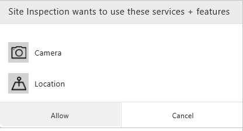

<properties
    pageTitle="Use apps in a web browser | Microsoft PowerApps"
    description="Walkthrough of how to use apps in the web browser"
    services=""
    suite="powerapps"
    documentationCenter="na"
    authors="fikaradz"
    manager="anneta"
    editor=""
    tags=""
 />
<tags
    ms.service="powerapps"
    ms.devlang="na"
    ms.topic="article"
    ms.tgt_pltfrm="na"
    ms.workload="na"
    ms.date="10/12/2016"
    ms.author="fikaradz"/>

# Using PowerApps in a web browser #
You can run all your apps in a web browser by opening Microsoft Dynamics 365. Access your apps quickly through the homepage or the task pane.

PowerApps supports these browser versions:
* Microsoft Edge
* Internet Explorer 11 and above
* Chrome 47.x and above
* Safari on iOS 9.3 and above
* Firefox 47 and above

When someone shares an app with you, you will receive an email message that contains a link for the app. Click or tap the link to open the app in a browser.

## Microsoft Dynamics 365 homepage portal ##
The homepage portal is the home to all your Microsoft Dynamics 365 apps. You can access that page by clicking or tapping a button in your Office 365 waffle.  

On the home page, you can see your pinned apps, in addition to all apps that you have installed or that an administrator has pushed to you. Click or tap an app tile to open the app, or click or tap the ellipsis (...) to display details about the app.

If you are having trouble finding an app, filter the list of apps by typing at least part of the app name in the **search box**. You can also filter by app environment in the **Filter** pane.

If you have recently installed an app, it may not appear in your app list immediately. Click or tap **Refresh** to show all your apps, but this process may take up to a minute.

## Task pane ##
The task pane gives you quick access to all your apps. You access it by clicking or tapping the Dynamics 365 toggle-button on the Dynamics 365 header, which appears on top of all your Dynamics 365 apps.

You can quickly open a pinned app from the task pane or find any of your apps through the "My apps" sub-menu.

## Pin an app ##
Pin an app to quickly access it from either the homepage or the task pane. To pin an app, open the ellipsis (...) menu on the app tile either in the task pane or the homepage, and then select **Pin app**.

## Open an app ##
To open an app, click or tap its tile in either the Dynamics 365 homepage or the task pane.

You can also access an app directly via its URL. This allows you to share an app by sending a link in email as well as bookmark an app in your web browser.

If your browser does not support all controls in an app, open it in a browser, choose the download option in the Dynamics 365 header, and then open the app in PowerApps Mobile.  

## Sign in to PowerApps ##
If you open an app from dynamics.com, you're probably already signed in to Dynamics 365. If you open the app from a web link, you will be prompted to sign in using your Azure Active Directory credentials.

## Give consent ##
If the app requires a connection to a data source or requires consent to use device capabilities, you will be prompted for configuration before you use the app:  

Typically, you are prompted only the first time.

## Exit PowerApps ##
Exit or close the app in either of these ways:
- Click or tap **Sign out** in the upper-right corner of the app header for Microsoft Dynamics 365.
- Open the Dynamics 365 navigation menu to navigate to home or run another app.
