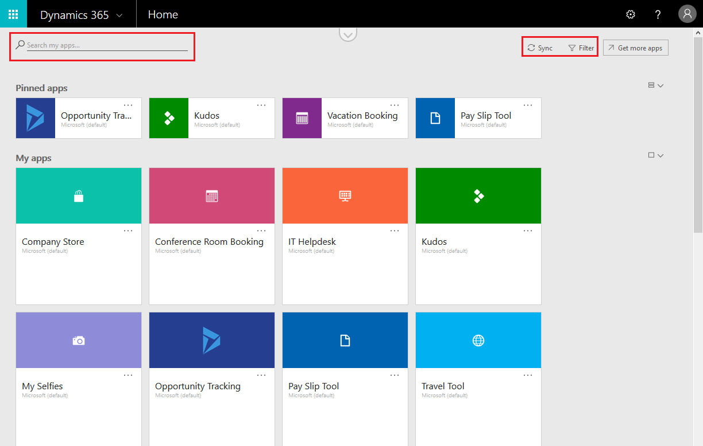
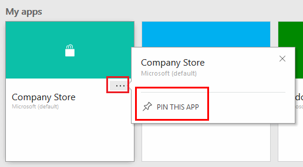
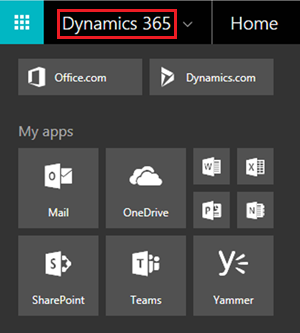
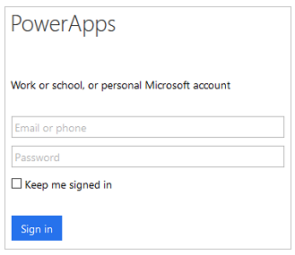

# Use PowerApps in a web browser
If you create an app in PowerApps, you can run that app in a browser by opening [Dynamics 365](https://home.dynamics.com) and then clicking or tapping the tile for the app on the home page.

**Note**: You can find general information about [Microsoft Dynamics 365](https://docs.microsoft.com/en-us/dynamics365/) or [contact support](https://www.microsoft.com/en-us/dynamics365/contact-us) if you have a question about a Dynamics 365 app, such as Sales.

The following browsers and operating systems are supported:

| **Browser** | **Operating system** |
| --- | --- |
| Google Chrome (latest version) |Windows 7 SP1, 8.1, and 10  macOS  iOS 8 or later Android |
| Microsoft Edge |Windows 10 |
| Microsoft Internet Explorer 11 (with Compatibility View off) |Windows 7 SP1, 8.1, and 10 |
| Mozilla Firefox (latest version) |Windows 7 SP1, 8.1, and 10   Android  macOS |
| Apple Safari (latest version) |macOS   iOS 8 or later |

If your browser doesn't support all the controls used in the app, use it on a mobile device (such as a phone) by downloading PowerApps Mobile for iOS, Android, or Windows.

## Find an app on the home page
The home page may show several types of business apps, but you can find a specific app by typing at least part of its name in the search box. You can also filter the list to show only those apps that were created in PowerApps.

If you've recently installed an app, it might not immediately appear in the list of apps. Click or tap **Sync** to show all your apps, but this process may take up to a minute.

## Open an app from the task pane
After you find the app, you can pin it to the task pane for easier access. To pin an app, click or tap the ellipsis (...) on the app tile, and then click or tap **Pin this app**.

The app will then appear under **My apps** in the task pane, which you open by clicking or tapping **Dynamics 365** in the upper-left corner.

## Open an app from a URL
You can also save the app's URL as a bookmark in your browser, or send the URL as a link over email. If someone else created an app in PowerApps and shared that app with you, you can run that app by clicking or tapping the link in the mail that you receive. In any of these cases, you might be prompted to sign in using your Azure Active Directory credentials.

## Connect to data
If the app requires a connection to a data source or requires consent to use device capabilities, you will be prompted before you use the app:  

Typically, you are prompted only the first time.

## Close an app
To close the app, sign out of the Dynamics 365 home page, or open another app.

