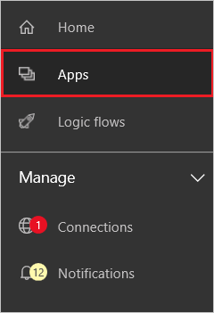

<properties
    pageTitle="Use apps in a web browser | Microsoft PowerApps"
    description="Walkthrough of how to run PowerApps in the web browser"
    services=""
    suite="powerapps"
    documentationCenter="na"
    authors="karthik-1"
    manager="erikre"
    editor=""
    tags=""
 />
<tags
    ms.service="powerapps"
    ms.devlang="na"
    ms.topic="article"
    ms.tgt_pltfrm="na"
    ms.workload="na"
    ms.date="04/27/2016"
    ms.author="karthikb"/>

# Using apps in a web browser #
PowerApps can run on iOS, Android, and a web browser. Apps running in a browser match the experience as apps running on phones and tablets. Running apps in a browser may be the only option when the store app is not available on a specific platform, or cannot be accessed due to your organization policies. 

## What you need to get started ##
- Either of the following: 
	- An app that you built from a [template](get-started-test-drive.md), from [data](get-started-create-from-data.md), or from [scratch](get-started-create-from-blank.md).  
	- An app that someone else created and shared with view permissions.
- A supported browser: 
	- Internet Explorer 11 and above
	- Chrome v47 and above
	- Safari on iOS 9 and above

## Launching an app ##
To run PowerApps inside a browser, do either of the following:

**Option 1: Launch apps from the web portal**

1. Sign-in to [powerapps.com](http://web.powerapps.com). Select **Apps** from the left navigation of the screen:  
	  
2. Select the app. The app details page opens.
3. In the right top view, select the **Play** icon to run the app in the browser:  
	

**Option 2: Launch apps directly from web URLs shared in email**

1. For Apps shared with you, you get an email with the link to the app
2. Select the link to launch the app in the browser
	 
## Sign-in to PowerApps ##
If the app is opened from the web portal, chances are you already signed-in to PowerApps. If you are launching the app from the web link, you are prompted to sign-in using your Azure Active Directory credentials:  

## Give consent ##
If the app requires a connection to a data sources, or required consent to use the device, you are prompted for the configuration before running the app:  

Typically, you are only prompted the first time.

## Exit the app ##
There are several ways you can exit or close the app:

- Close the browser tab or navigating to a different website URL
- Or, select the Home icon from the navigation bar

	

## Error and Warnings ##
If the app contains controls that aren't supported in the browser, then a warning header on the top of the app window displays a link to download the mobile app.

If the app cannot be launched due to invalid links or permission issues, then the error message telling you why is displayed. 
