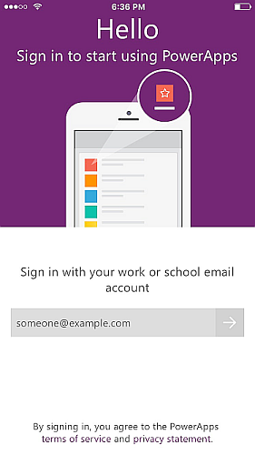

<properties
    pageTitle="Run apps in client | Microsoft PowerApps"
    description="Walkthrough - run apps in the client"
    services=""
    suite="powerapps"
    documentationCenter="na"
    authors="karthik-1"
    manager=""
    editor="AFTOwen"
    tags=""
 />
<tags
    ms.service="powerapps"
    ms.devlang="na"
    ms.topic="article"
    ms.tgt_pltfrm="na"
    ms.workload="na"
    ms.date="04/13/2016"
    ms.author="karthikb"/>

# Using apps in client #
PowerApps can run on Windows, iOS, Android and the browser. Apps running in a client can take advantage of the device capabilities like location and camera. Apps for Android, iOS and Windows can be downloaded from their respective app stores. 

## Prerequisites ##
- Either of the following:
	- An app that you built (from a [template](get-started-test-drive.md), from [data](get-started-create-from-data.md), or from [scratch](get-started-create-from-blank.md)).
	- An app that someone else built and shared with view permissions.
- PowerApps installed on iPhone, iPad, Windows or Android devices. Here are the specific versions supported:
	- iOS versions 9 and above
	- Android versions 5 and above
	- Windows 8.1 and above

## Login ##
For the first time login, you will be prompted to sign-in to PowerApps using your Azure Active Directory credentials.

## Launching an app ##
To run PowerApps in a client:

1. Launch the app by tapping on the app icon.
2. For Apps shared with you, you will get a notification when clicked also launches the app

## Connection ##
For the first time, if the app requires connections to data sources or consent to use device capabilities, you will be prompted for configuration before running the app.

## Exiting App ##
From within the app, swipe the screen to the right to partially reveal the list of apps. Slide the screen to the right completely to exit the app.

## Reshare App ##
User with apps that have been shared with "can view and share" permissions can share the app with other users in your organization even if they are not the author of the app. The share experience is no different if the user were the author of the app.

App authors can also share apps with the entire organization without in 1-click. Apps shared using this option will be shared with view permissions only. For more details on sharing refer to [share app](share-app.md)

## Pin App to Home screen ##
Apps that have be downloaded and run atleast once can be pinned to the device home screen for quick access. Tap on the ... option for each app to access the Pin option. Follow the device specific instructions to pin the app tile on your homescreen.

