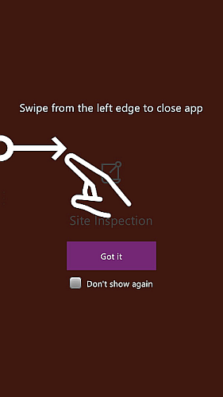

<properties
    pageTitle="Using PowerApps on tablets and phones | Microsoft PowerApps"
    description="Walkthrough of using PowerApps on tablets and phones"
    services=""
    suite="powerapps"
    documentationCenter="na"
    authors="karthik-1"
    manager="anneta"
    editor=""
    tags=""
 />
<tags
    ms.service="powerapps"
    ms.devlang="na"
    ms.topic="article"
    ms.tgt_pltfrm="na"
    ms.workload="na"
    ms.date="10/18/2016"
    ms.author="karthikb"/>

# Using PowerApps on phones and tablets #
Apps built using PowerApps can run on Windows, iOS, Android, Windows Phone, or in a web browser. Apps running on mobile can take advantage of the device capabilities, such as location and camera. You can download PowerApps mobile client from the app store of each platform.

## What you need to get started ##
- One of the following:
	- An app that you built from a [template](get-started-test-drive.md), from [data](get-started-create-from-data.md), or from [blank canvas](get-started-create-from-blank.md).
	- An app that someone else built and shared with you, granting user permissions.
- PowerApps installed on iPhone, iPad, Windows Phone, or Android devices. Here are the specific versions supported:  
	- iOS versions 9.3 and above
	- Android versions 5 and above
	- Windows 10 Mobile**

If you're unfamiliar with PowerApps, see [Introduction to PowerApps](getting-started.md).

** PowerApps client for Windows 10 Mobile is in limited preview.  

## Sign in to PowerApps ##
The first time you sign in, you are prompted to sign in to PowerApps using your Azure Active Directory credentials:  

## App filters and sorting options ##
Apps have been categorized in four lists to help users find a specific app quickly.

* All: All apps users have access to including apps created by the user, shared by other users are available in this list.
* My Apps: apps that user ran at least once.
* Samples: sample apps provided by Microsoft. Sample apps use fictitious data to showcase many real application scenarios and let users explore design possibilities.
* Favorites: apps marked as favorite by users. In the "…" option of each app, users can favorite the entry, and those apps show up in the Favorites list. You can unfavorite the app to remove the app from this list.

Besides filters, there are sorting options for every app list. Users can sort apps by modified date or opened date. The app list option and sorting option are persisted across client launches, so you don't have to set it each time you launch PowerApps.  

## Open an app ##
To use an app on a tablet or a phone:

1. Launch the app by tapping the app icon.
2. For apps shared with you, you will get a push notification on the device. Selecting the notification will also open the app.

If this is the first time you are using PowerApps, you will see a screen indicating swipe gesture to exit PowerApps.

## Give consent ##
If the app requires a connection to a data source or requires consent to use device capabilities, you will be prompted for the configuration before you use the app:  

Typically, you are only prompted the first time.

## Exit the app ##
- On an Android phone, exit the app by sliding to the right or by pressing the back button.
- On an iPhone, exit the app by sliding to the right.
- On the Windows 10 Mobile, exit the app using the back button.

Note: if you are entering data inside your app and accidently hit the back button on Android, PowerApps will prompt you if you really intended to exit the app to prevent data loss.

## Share the app ##
Apps are shared from the powerapps.com portal. [Sharing an app](share-app.md) provides more details on sharing apps with other users.

## Pin the app to the home screen ##
If you've downloaded an app and used it at least once, you can pin it to the device home screen for quick access. Tap the **...** option for each app to access the **Pin** option. Follow the device-specific instructions to pin the app tile on your home screen:  

