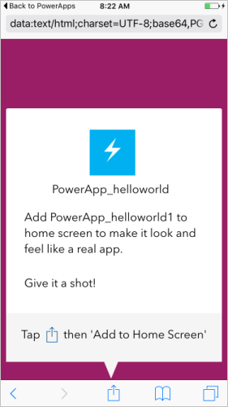

<properties
    pageTitle="Using PowerApps on tablets and phones | Microsoft PowerApps"
    description="Walkthrough of using PowerApps on tablets and phones"
    services=""
    suite="powerapps"
    documentationCenter="na"
    authors="karthik-1"
    manager="anneta"
    editor=""
    tags=""
 />
<tags
    ms.service="powerapps"
    ms.devlang="na"
    ms.topic="article"
    ms.tgt_pltfrm="na"
    ms.workload="na"
    ms.date="10/18/2016"
    ms.author="karthikb"/>

# Using PowerApps on phones and tablets #
If you build an app in PowerApps, you can run that app on Windows, iOS, Android, Windows Phone, and in a web browser. Apps running on mobile can take advantage of the device capabilities, such as location and a camera. You can download PowerApps Mobile from the app store of each platform.

## What you need to get started ##
- Either of the following:
	- An app that you built from a [template](get-started-test-drive.md), from [data](get-started-create-from-data.md), or from [scratch](get-started-create-from-blank.md).
	- An app that someone else built and shared with you, granting view permissions.
- PowerApps installed on iPhone, iPad, Windows, Windows Phone, or Android devices. Here are the specific versions supported:  
	- iOS versions 9 and above
	- Android versions 5 and above
	- Windows 10 and above

If you're unfamiliar with PowerApps, see [Introduction to PowerApps](getting-started.md).

## Sign in to PowerApps ##
The first time you sign in, you are prompted to sign in to PowerApps using your Azure Active Directory credentials:  

## Open an app ##
To use an app on a tablet or a phone:

1. Launch the app by tapping the app icon.
2. For apps that are shared with you, you get a notification. Select the notification to open the app.

## Give consent ##
If the app requires a connection to a data source or requires consent to use the device, you are prompted for the configuration before you use the app:  

Typically, you are only prompted the first time.

## Exit the app ##
- On an Android phone, exit the app by sliding to the right or by pressing the back button.
- On an iPhone, exit the app by sliding to the right.
- On a Windows Phone, exit the app by pressing the back button.

## Share the app ##
App users who have the "can view and share" permissions can share the app with other users in their organization, even though they didn't create the app. The share experience is the same as if the user is the author of the app.

App authors can also share apps with the entire organization with a simple checkbox. Apps shared using this option have only "view" permissions:  

[Sharing an app](share-app.md) provides more details on sharing.

## Pin the app to the home screen ##
If you've downloaded an app and used it at least once, you can pin it to the device home screen for quick access. Tap the **...** option for each app to access the **Pin** option. Follow the device-specific instructions to pin the app tile on your home screen:  

