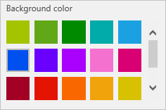
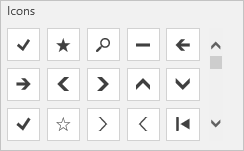

<properties
	pageTitle="Change app name and tile | Microsoft PowerApps"
	description="Step-by-step instructions for changing settings such the app name and icon"
	services=""
	suite="powerapps"
	documentationCenter="na"
	authors="lonu"
	manager="anneta"
	editor=""
	tags=""/>

<tags
   ms.service="powerapps"
   ms.devlang="na"
   ms.topic="article"
   ms.tgt_pltfrm="na"
   ms.workload="na"
   ms.date="10/16/2016"
   ms.author="lonu"/>

# Change app name and icon in PowerApps #
Customize an app by changing its name and tile.

## Prerequisites ##

1. Create an app, or open one for editing.
1. On the **File** menu, click or tap **App settings**.

## Rename an app ##
- Under **App name**, click or tap **Rename this app**, and then type a different name.

	

## Change an app tile ##
Follow one or more of these steps:

- Click or tap a different background color from the list of options.

	

- Click or tap an icon from the list of default icons.

	

- Click or tap **Browse file**, click or tap the image that you want to use, and then click or tap **Open**.

## Next step ##

On the **File** menu, click or tap **Save** to republish your app with the new settings.

## More resources ##
- [Share an app](share-app.md)
- [Delete an app](delete-app.md)
- [Restore an app to a previous version](restore-an-app.md)
